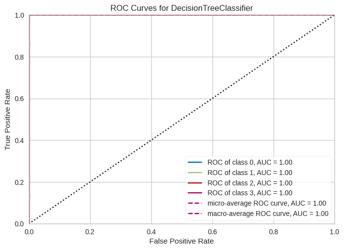
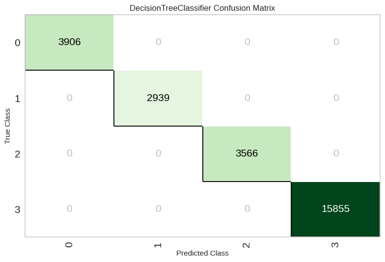
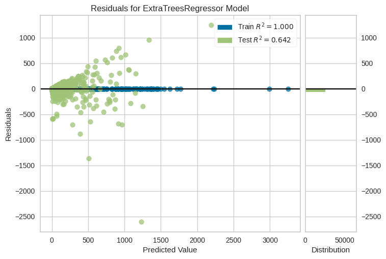
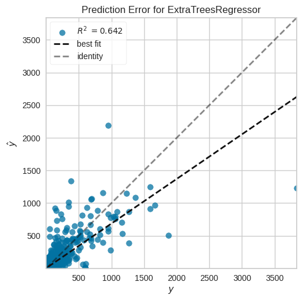
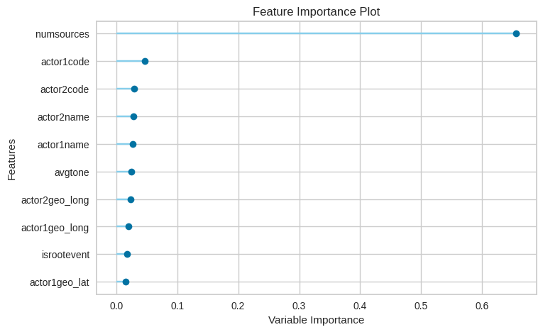

# GDelt Project


# How low code can speed up your Machine Learning project

We use GDELT dataset with Pycaret to demonstrate how low code machine learning library to quickly prototype machine learning models.


## Introduction
The GDELT Project is an initiative to construct a catalog of human societal-scale behavior and beliefs across all countries of the world, connecting every person, organization, location, count, theme, news source, and event across the planet into a single massive network that captures what's happening around the world, what its context is and who's involved, and how the world is feeling about it, every single day.
## Data
The data is available in the following link: https://www.gdeltproject.org/data.html#rawdatafiles.
And the data dictionary is available in the following link: http://data.gdeltproject.org/documentation/GDELT-Event_Codebook-V2.0.pdf.


<details>
<summary markdown="span"><h2>Exploratory Data Analysis</h2></summary>

[Automated EDA](analysis.ipynb)  

```python
from typing import List  
import pandas as pd

from utils import transform_data, int_to_datetime, get_null_values

pd.set_option('display.max_columns', None)
pd.set_option('display.max_rows', None)
```

### Load and Transform data


```python
data = pd.read_csv("230722.csv")

column_names = [
    'GlobalEventID',
            'Day',
            'MonthYear',
            'Year',
            'FractionDate',
            'Actor1Code',
            'Actor1Name',
            'Actor1CountryCode',
            'Actor1KnownGroupCode',
            'Actor1EthnicCode',
            'Actor1Religion1Code',
            'Actor1Religion2Code',
            'Actor1Type1Code',
            'Actor1Type2Code',
            'Actor1Type3Code',
            'Actor2Code',
            'Actor2Name',
            'Actor2CountryCode',
            'Actor2KnownGroupCode',
            'Actor2EthnicCode',
            'Actor2Religion1Code',
            'Actor2Religion2Code',
            'Actor2Type1Code',
            'Actor2Type2Code',
            'Actor2Type3Code',
            'IsRootEvent',
            'EventCode',
            'EventBaseCode',
            'EventRootCode',
            'QuadClass',
            'GoldsteinScale',
            'NumMentions',
            'NumSources',
            'NumArticles',
            'AvgTone',
            'Actor1Geo_Type',
            'Actor1Geo_FullName',
            'Actor1Geo_CountryCode',
            'Actor1Geo_ADM1Code',
            'Actor1Geo_Lat',
            'Actor1Geo_Long',
            'Actor1Geo_FeatureID',
            'Actor2Geo_Type',
            'Actor2Geo_FullName',
            'Actor2Geo_CountryCode',
            'Actor2Geo_ADM1Code',
            'Actor2Geo_Lat',
            'Actor2Geo_Long',
            'Actor2Geo_FeatureID',
            'DateAdded',
            'SourceURL'
        ]


data = transform_data(data, column_names)

data = int_to_datetime(data, "day")
data = int_to_datetime(data, "dateadded")

# Let use small segment of the dataset
data_sm = data[data['year']==2022]

data_lm = data[data['year']!=2022]

# columns = data_sm.columns.tolist()
# columns.remove('quadclass')
# columns.append('quadclass')

# data_sm = data_sm[columns]

data_lm.head()
```


<div>
<style scoped>
    .dataframe tbody tr th:only-of-type {
        vertical-align: middle;
    }

    .dataframe tbody tr th {
        vertical-align: top;
    }

    .dataframe thead th {
        text-align: right;
    }
</style>
<table border="1" class="dataframe">
  <thead>
    <tr style="text-align: right;">
      <th></th>
      <th>globaleventid</th>
      <th>day</th>
      <th>monthyear</th>
      <th>year</th>
      <th>fractiondate</th>
      <th>actor1code</th>
      <th>actor1name</th>
      <th>actor1countrycode</th>
      <th>actor1knowngroupcode</th>
      <th>actor1ethniccode</th>
      <th>actor1religion1code</th>
      <th>actor1religion2code</th>
      <th>actor1type1code</th>
      <th>actor1type2code</th>
      <th>actor1type3code</th>
      <th>actor2code</th>
      <th>actor2name</th>
      <th>actor2countrycode</th>
      <th>actor2knowngroupcode</th>
      <th>actor2ethniccode</th>
      <th>actor2religion1code</th>
      <th>actor2religion2code</th>
      <th>actor2type1code</th>
      <th>actor2type2code</th>
      <th>actor2type3code</th>
      <th>isrootevent</th>
      <th>eventcode</th>
      <th>eventbasecode</th>
      <th>eventrootcode</th>
      <th>quadclass</th>
      <th>goldsteinscale</th>
      <th>nummentions</th>
      <th>numsources</th>
      <th>numarticles</th>
      <th>avgtone</th>
      <th>actor1geo_type</th>
      <th>actor1geo_fullname</th>
      <th>actor1geo_countrycode</th>
      <th>actor1geo_adm1code</th>
      <th>actor1geo_lat</th>
      <th>actor1geo_long</th>
      <th>actor1geo_featureid</th>
      <th>actor2geo_type</th>
      <th>actor2geo_fullname</th>
      <th>actor2geo_countrycode</th>
      <th>actor2geo_adm1code</th>
      <th>actor2geo_lat</th>
      <th>actor2geo_long</th>
      <th>actor2geo_featureid</th>
      <th>dateadded</th>
      <th>sourceurl</th>
    </tr>
  </thead>
  <tbody>
    <tr>
      <th>13</th>
      <td>1116435795</td>
      <td>2023-06-22</td>
      <td>202306</td>
      <td>2023</td>
      <td>2023.4712</td>
      <td>NaN</td>
      <td>NaN</td>
      <td>NaN</td>
      <td>NaN</td>
      <td>NaN</td>
      <td>NaN</td>
      <td>NaN</td>
      <td>NaN</td>
      <td>NaN</td>
      <td>NaN</td>
      <td>BUS</td>
      <td>COMPANY</td>
      <td>NaN</td>
      <td>NaN</td>
      <td>NaN</td>
      <td>NaN</td>
      <td>NaN</td>
      <td>BUS</td>
      <td>NaN</td>
      <td>NaN</td>
      <td>0</td>
      <td>40</td>
      <td>40</td>
      <td>4</td>
      <td>Verbal Cooperation</td>
      <td>1.0</td>
      <td>5</td>
      <td>1</td>
      <td>5</td>
      <td>1.118963</td>
      <td>0</td>
      <td>NaN</td>
      <td>NaN</td>
      <td>NaN</td>
      <td>NaN</td>
      <td>NaN</td>
      <td>NaN</td>
      <td>3</td>
      <td>Fort Smith, Arkansas, United States</td>
      <td>US</td>
      <td>USAR</td>
      <td>35.3859</td>
      <td>-94.3985</td>
      <td>76952</td>
      <td>2023-07-22</td>
      <td>https://www.kuaf.com/show/ozarks-at-large/2023...</td>
    </tr>
    <tr>
      <th>14</th>
      <td>1116435796</td>
      <td>2023-06-22</td>
      <td>202306</td>
      <td>2023</td>
      <td>2023.4712</td>
      <td>AFR</td>
      <td>AFRICA</td>
      <td>AFR</td>
      <td>NaN</td>
      <td>NaN</td>
      <td>NaN</td>
      <td>NaN</td>
      <td>NaN</td>
      <td>NaN</td>
      <td>NaN</td>
      <td>NaN</td>
      <td>NaN</td>
      <td>NaN</td>
      <td>NaN</td>
      <td>NaN</td>
      <td>NaN</td>
      <td>NaN</td>
      <td>NaN</td>
      <td>NaN</td>
      <td>NaN</td>
      <td>1</td>
      <td>43</td>
      <td>43</td>
      <td>4</td>
      <td>Verbal Cooperation</td>
      <td>2.8</td>
      <td>4</td>
      <td>1</td>
      <td>4</td>
      <td>0.790514</td>
      <td>1</td>
      <td>Russia</td>
      <td>RS</td>
      <td>RS</td>
      <td>60.0000</td>
      <td>100.0000</td>
      <td>RS</td>
      <td>1</td>
      <td>Russia</td>
      <td>RS</td>
      <td>RS</td>
      <td>60.0000</td>
      <td>100.0000</td>
      <td>RS</td>
      <td>2023-07-22</td>
      <td>https://www.beijingbulletin.com/news/273906652...</td>
    </tr>
    <tr>
      <th>15</th>
      <td>1116435797</td>
      <td>2023-06-22</td>
      <td>202306</td>
      <td>2023</td>
      <td>2023.4712</td>
      <td>AFR</td>
      <td>AFRICA</td>
      <td>AFR</td>
      <td>NaN</td>
      <td>NaN</td>
      <td>NaN</td>
      <td>NaN</td>
      <td>NaN</td>
      <td>NaN</td>
      <td>NaN</td>
      <td>RUS</td>
      <td>RUSSIAN</td>
      <td>RUS</td>
      <td>NaN</td>
      <td>NaN</td>
      <td>NaN</td>
      <td>NaN</td>
      <td>NaN</td>
      <td>NaN</td>
      <td>NaN</td>
      <td>1</td>
      <td>43</td>
      <td>43</td>
      <td>4</td>
      <td>Verbal Cooperation</td>
      <td>2.8</td>
      <td>10</td>
      <td>3</td>
      <td>10</td>
      <td>-0.491013</td>
      <td>4</td>
      <td>Pretoria, Gauteng, South Africa</td>
      <td>SF</td>
      <td>SF06</td>
      <td>-25.7069</td>
      <td>28.2294</td>
      <td>-1273769</td>
      <td>4</td>
      <td>Pretoria, Gauteng, South Africa</td>
      <td>SF</td>
      <td>SF06</td>
      <td>-25.7069</td>
      <td>28.2294</td>
      <td>-1273769</td>
      <td>2023-07-22</td>
      <td>https://www.beijingbulletin.com/news/273906652...</td>
    </tr>
    <tr>
      <th>16</th>
      <td>1116435798</td>
      <td>2023-06-22</td>
      <td>202306</td>
      <td>2023</td>
      <td>2023.4712</td>
      <td>AFR</td>
      <td>AFRICA</td>
      <td>AFR</td>
      <td>NaN</td>
      <td>NaN</td>
      <td>NaN</td>
      <td>NaN</td>
      <td>NaN</td>
      <td>NaN</td>
      <td>NaN</td>
      <td>RUS</td>
      <td>RUSSIAN</td>
      <td>RUS</td>
      <td>NaN</td>
      <td>NaN</td>
      <td>NaN</td>
      <td>NaN</td>
      <td>NaN</td>
      <td>NaN</td>
      <td>NaN</td>
      <td>0</td>
      <td>43</td>
      <td>43</td>
      <td>4</td>
      <td>Verbal Cooperation</td>
      <td>2.8</td>
      <td>2</td>
      <td>1</td>
      <td>2</td>
      <td>0.790514</td>
      <td>1</td>
      <td>Russia</td>
      <td>RS</td>
      <td>RS</td>
      <td>60.0000</td>
      <td>100.0000</td>
      <td>RS</td>
      <td>1</td>
      <td>Russia</td>
      <td>RS</td>
      <td>RS</td>
      <td>60.0000</td>
      <td>100.0000</td>
      <td>RS</td>
      <td>2023-07-22</td>
      <td>https://www.beijingbulletin.com/news/273906652...</td>
    </tr>
    <tr>
      <th>17</th>
      <td>1116435799</td>
      <td>2023-06-22</td>
      <td>202306</td>
      <td>2023</td>
      <td>2023.4712</td>
      <td>AFR</td>
      <td>AFRICA</td>
      <td>AFR</td>
      <td>NaN</td>
      <td>NaN</td>
      <td>NaN</td>
      <td>NaN</td>
      <td>NaN</td>
      <td>NaN</td>
      <td>NaN</td>
      <td>RUSGOV</td>
      <td>RUSSIAN</td>
      <td>RUS</td>
      <td>NaN</td>
      <td>NaN</td>
      <td>NaN</td>
      <td>NaN</td>
      <td>GOV</td>
      <td>NaN</td>
      <td>NaN</td>
      <td>1</td>
      <td>43</td>
      <td>43</td>
      <td>4</td>
      <td>Verbal Cooperation</td>
      <td>2.8</td>
      <td>18</td>
      <td>3</td>
      <td>18</td>
      <td>-0.491013</td>
      <td>4</td>
      <td>Pretoria, Gauteng, South Africa</td>
      <td>SF</td>
      <td>SF06</td>
      <td>-25.7069</td>
      <td>28.2294</td>
      <td>-1273769</td>
      <td>4</td>
      <td>Pretoria, Gauteng, South Africa</td>
      <td>SF</td>
      <td>SF06</td>
      <td>-25.7069</td>
      <td>28.2294</td>
      <td>-1273769</td>
      <td>2023-07-22</td>
      <td>https://www.beijingbulletin.com/news/273906652...</td>
    </tr>
  </tbody>
</table>
</div>


### Identify Total number of NULL of each feature 


```python
get_null_values(data_lm)
```


    actor2type3code          87517
    actor1type3code          87517
    actor2religion2code      87351
    actor1religion2code      87289
    actor2ethniccode         87168
    actor1ethniccode         87011
    actor2knowngroupcode     86724
    actor1knowngroupcode     86627
    actor2religion1code      86621
    actor1religion1code      86523
    actor2type2code          86025
    actor1type2code          85240
    actor2type1code          58516
    actor1type1code          50638
    actor2countrycode        48626
    actor1countrycode        37956
    actor2code               25351
    actor2name               25351
    actor1geo_fullname       11051
    actor1geo_long           11051
    actor1geo_lat            11051
    actor1geo_featureid      11044
    actor1geo_adm1code       11044
    actor1geo_countrycode    11044
    actor1name                8630
    actor1code                8630
    actor2geo_lat             2723
    actor2geo_fullname        2723
    actor2geo_long            2723
    actor2geo_adm1code        2718
    actor2geo_countrycode     2718
    actor2geo_featureid       2718
    actor2geo_type               0
    dateadded                    0
    globaleventid                0
    isrootevent                  0
    actor1geo_type               0
    avgtone                      0
    numarticles                  0
    numsources                   0
    nummentions                  0
    goldsteinscale               0
    quadclass                    0
    eventrootcode                0
    eventbasecode                0
    eventcode                    0
    day                          0
    fractiondate                 0
    year                         0
    monthyear                    0
    sourceurl                    0
    dtype: int64


```python
new_data = data_lm[
[      'fractiondate',
       'year',
       'monthyear',
       'actor1code', 
        'actor1name', 
        'actor1geo_type',
        'actor1geo_long',
        'actor1geo_lat',
        'actor2code', 
        'actor2name', 
        'actor2geo_type',
        'actor2geo_long',
        'actor2geo_lat',
        'isrootevent',
        'eventcode',
        'eventrootcode',
        'goldsteinscale',
        'nummentions',
        'numsources',
        'avgtone',
        'quadclass'
  ]
]
new_data.head() 

```


<div>
<style scoped>
    .dataframe tbody tr th:only-of-type {
        vertical-align: middle;
    }

    .dataframe tbody tr th {
        vertical-align: top;
    }

    .dataframe thead th {
        text-align: right;
    }
</style>
<table border="1" class="dataframe">
  <thead>
    <tr style="text-align: right;">
      <th></th>
      <th>fractiondate</th>
      <th>year</th>
      <th>monthyear</th>
      <th>actor1code</th>
      <th>actor1name</th>
      <th>actor1geo_type</th>
      <th>actor1geo_long</th>
      <th>actor1geo_lat</th>
      <th>actor2code</th>
      <th>actor2name</th>
      <th>actor2geo_type</th>
      <th>actor2geo_long</th>
      <th>actor2geo_lat</th>
      <th>isrootevent</th>
      <th>eventcode</th>
      <th>eventrootcode</th>
      <th>goldsteinscale</th>
      <th>nummentions</th>
      <th>numsources</th>
      <th>avgtone</th>
      <th>quadclass</th>
    </tr>
  </thead>
  <tbody>
    <tr>
      <th>13</th>
      <td>2023.4712</td>
      <td>2023</td>
      <td>202306</td>
      <td>NaN</td>
      <td>NaN</td>
      <td>0</td>
      <td>NaN</td>
      <td>NaN</td>
      <td>BUS</td>
      <td>COMPANY</td>
      <td>3</td>
      <td>-94.3985</td>
      <td>35.3859</td>
      <td>0</td>
      <td>40</td>
      <td>4</td>
      <td>1.0</td>
      <td>5</td>
      <td>1</td>
      <td>1.118963</td>
      <td>Verbal Cooperation</td>
    </tr>
    <tr>
      <th>14</th>
      <td>2023.4712</td>
      <td>2023</td>
      <td>202306</td>
      <td>AFR</td>
      <td>AFRICA</td>
      <td>1</td>
      <td>100.0000</td>
      <td>60.0000</td>
      <td>NaN</td>
      <td>NaN</td>
      <td>1</td>
      <td>100.0000</td>
      <td>60.0000</td>
      <td>1</td>
      <td>43</td>
      <td>4</td>
      <td>2.8</td>
      <td>4</td>
      <td>1</td>
      <td>0.790514</td>
      <td>Verbal Cooperation</td>
    </tr>
    <tr>
      <th>15</th>
      <td>2023.4712</td>
      <td>2023</td>
      <td>202306</td>
      <td>AFR</td>
      <td>AFRICA</td>
      <td>4</td>
      <td>28.2294</td>
      <td>-25.7069</td>
      <td>RUS</td>
      <td>RUSSIAN</td>
      <td>4</td>
      <td>28.2294</td>
      <td>-25.7069</td>
      <td>1</td>
      <td>43</td>
      <td>4</td>
      <td>2.8</td>
      <td>10</td>
      <td>3</td>
      <td>-0.491013</td>
      <td>Verbal Cooperation</td>
    </tr>
    <tr>
      <th>16</th>
      <td>2023.4712</td>
      <td>2023</td>
      <td>202306</td>
      <td>AFR</td>
      <td>AFRICA</td>
      <td>1</td>
      <td>100.0000</td>
      <td>60.0000</td>
      <td>RUS</td>
      <td>RUSSIAN</td>
      <td>1</td>
      <td>100.0000</td>
      <td>60.0000</td>
      <td>0</td>
      <td>43</td>
      <td>4</td>
      <td>2.8</td>
      <td>2</td>
      <td>1</td>
      <td>0.790514</td>
      <td>Verbal Cooperation</td>
    </tr>
    <tr>
      <th>17</th>
      <td>2023.4712</td>
      <td>2023</td>
      <td>202306</td>
      <td>AFR</td>
      <td>AFRICA</td>
      <td>4</td>
      <td>28.2294</td>
      <td>-25.7069</td>
      <td>RUSGOV</td>
      <td>RUSSIAN</td>
      <td>4</td>
      <td>28.2294</td>
      <td>-25.7069</td>
      <td>1</td>
      <td>43</td>
      <td>4</td>
      <td>2.8</td>
      <td>18</td>
      <td>3</td>
      <td>-0.491013</td>
      <td>Verbal Cooperation</td>
    </tr>
  </tbody>
</table>
</div>


### Initialise Startup


```python
from pycaret.classification import ClassificationExperiment

exp = ClassificationExperiment()

exp.setup(data=new_data,
          target='quadclass', 
           session_id=123
         )
```


<style type="text/css">
#T_20d8e_row12_col1 {
  background-color: lightgreen;
}
</style>
<table id="T_20d8e">
  <thead>
    <tr>
      <th class="blank level0" >&nbsp;</th>
      <th id="T_20d8e_level0_col0" class="col_heading level0 col0" >Description</th>
      <th id="T_20d8e_level0_col1" class="col_heading level0 col1" >Value</th>
    </tr>
  </thead>
  <tbody>
    <tr>
      <th id="T_20d8e_level0_row0" class="row_heading level0 row0" >0</th>
      <td id="T_20d8e_row0_col0" class="data row0 col0" >Session id</td>
      <td id="T_20d8e_row0_col1" class="data row0 col1" >123</td>
    </tr>
    <tr>
      <th id="T_20d8e_level0_row1" class="row_heading level0 row1" >1</th>
      <td id="T_20d8e_row1_col0" class="data row1 col0" >Target</td>
      <td id="T_20d8e_row1_col1" class="data row1 col1" >quadclass</td>
    </tr>
    <tr>
      <th id="T_20d8e_level0_row2" class="row_heading level0 row2" >2</th>
      <td id="T_20d8e_row2_col0" class="data row2 col0" >Target type</td>
      <td id="T_20d8e_row2_col1" class="data row2 col1" >Multiclass</td>
    </tr>
    <tr>
      <th id="T_20d8e_level0_row3" class="row_heading level0 row3" >3</th>
      <td id="T_20d8e_row3_col0" class="data row3 col0" >Target mapping</td>
      <td id="T_20d8e_row3_col1" class="data row3 col1" >Material Conflict: 0, Material Cooperation: 1, Verbal Conflict: 2, Verbal Cooperation: 3</td>
    </tr>
    <tr>
      <th id="T_20d8e_level0_row4" class="row_heading level0 row4" >4</th>
      <td id="T_20d8e_row4_col0" class="data row4 col0" >Original data shape</td>
      <td id="T_20d8e_row4_col1" class="data row4 col1" >(87552, 21)</td>
    </tr>
    <tr>
      <th id="T_20d8e_level0_row5" class="row_heading level0 row5" >5</th>
      <td id="T_20d8e_row5_col0" class="data row5 col0" >Transformed data shape</td>
      <td id="T_20d8e_row5_col1" class="data row5 col1" >(87552, 31)</td>
    </tr>
    <tr>
      <th id="T_20d8e_level0_row6" class="row_heading level0 row6" >6</th>
      <td id="T_20d8e_row6_col0" class="data row6 col0" >Transformed train set shape</td>
      <td id="T_20d8e_row6_col1" class="data row6 col1" >(61286, 31)</td>
    </tr>
    <tr>
      <th id="T_20d8e_level0_row7" class="row_heading level0 row7" >7</th>
      <td id="T_20d8e_row7_col0" class="data row7 col0" >Transformed test set shape</td>
      <td id="T_20d8e_row7_col1" class="data row7 col1" >(26266, 31)</td>
    </tr>
    <tr>
      <th id="T_20d8e_level0_row8" class="row_heading level0 row8" >8</th>
      <td id="T_20d8e_row8_col0" class="data row8 col0" >Ordinal features</td>
      <td id="T_20d8e_row8_col1" class="data row8 col1" >1</td>
    </tr>
    <tr>
      <th id="T_20d8e_level0_row9" class="row_heading level0 row9" >9</th>
      <td id="T_20d8e_row9_col0" class="data row9 col0" >Numeric features</td>
      <td id="T_20d8e_row9_col1" class="data row9 col1" >13</td>
    </tr>
    <tr>
      <th id="T_20d8e_level0_row10" class="row_heading level0 row10" >10</th>
      <td id="T_20d8e_row10_col0" class="data row10 col0" >Categorical features</td>
      <td id="T_20d8e_row10_col1" class="data row10 col1" >7</td>
    </tr>
    <tr>
      <th id="T_20d8e_level0_row11" class="row_heading level0 row11" >11</th>
      <td id="T_20d8e_row11_col0" class="data row11 col0" >Rows with missing values</td>
      <td id="T_20d8e_row11_col1" class="data row11 col1" >40.5%</td>
    </tr>
    <tr>
      <th id="T_20d8e_level0_row12" class="row_heading level0 row12" >12</th>
      <td id="T_20d8e_row12_col0" class="data row12 col0" >Preprocess</td>
      <td id="T_20d8e_row12_col1" class="data row12 col1" >True</td>
    </tr>
    <tr>
      <th id="T_20d8e_level0_row13" class="row_heading level0 row13" >13</th>
      <td id="T_20d8e_row13_col0" class="data row13 col0" >Imputation type</td>
      <td id="T_20d8e_row13_col1" class="data row13 col1" >simple</td>
    </tr>
    <tr>
      <th id="T_20d8e_level0_row14" class="row_heading level0 row14" >14</th>
      <td id="T_20d8e_row14_col0" class="data row14 col0" >Numeric imputation</td>
      <td id="T_20d8e_row14_col1" class="data row14 col1" >mean</td>
    </tr>
    <tr>
      <th id="T_20d8e_level0_row15" class="row_heading level0 row15" >15</th>
      <td id="T_20d8e_row15_col0" class="data row15 col0" >Categorical imputation</td>
      <td id="T_20d8e_row15_col1" class="data row15 col1" >mode</td>
    </tr>
    <tr>
      <th id="T_20d8e_level0_row16" class="row_heading level0 row16" >16</th>
      <td id="T_20d8e_row16_col0" class="data row16 col0" >Maximum one-hot encoding</td>
      <td id="T_20d8e_row16_col1" class="data row16 col1" >25</td>
    </tr>
    <tr>
      <th id="T_20d8e_level0_row17" class="row_heading level0 row17" >17</th>
      <td id="T_20d8e_row17_col0" class="data row17 col0" >Encoding method</td>
      <td id="T_20d8e_row17_col1" class="data row17 col1" >None</td>
    </tr>
    <tr>
      <th id="T_20d8e_level0_row18" class="row_heading level0 row18" >18</th>
      <td id="T_20d8e_row18_col0" class="data row18 col0" >Fold Generator</td>
      <td id="T_20d8e_row18_col1" class="data row18 col1" >StratifiedKFold</td>
    </tr>
    <tr>
      <th id="T_20d8e_level0_row19" class="row_heading level0 row19" >19</th>
      <td id="T_20d8e_row19_col0" class="data row19 col0" >Fold Number</td>
      <td id="T_20d8e_row19_col1" class="data row19 col1" >10</td>
    </tr>
    <tr>
      <th id="T_20d8e_level0_row20" class="row_heading level0 row20" >20</th>
      <td id="T_20d8e_row20_col0" class="data row20 col0" >CPU Jobs</td>
      <td id="T_20d8e_row20_col1" class="data row20 col1" >-1</td>
    </tr>
    <tr>
      <th id="T_20d8e_level0_row21" class="row_heading level0 row21" >21</th>
      <td id="T_20d8e_row21_col0" class="data row21 col0" >Use GPU</td>
      <td id="T_20d8e_row21_col1" class="data row21 col1" >False</td>
    </tr>
    <tr>
      <th id="T_20d8e_level0_row22" class="row_heading level0 row22" >22</th>
      <td id="T_20d8e_row22_col0" class="data row22 col0" >Log Experiment</td>
      <td id="T_20d8e_row22_col1" class="data row22 col1" >False</td>
    </tr>
    <tr>
      <th id="T_20d8e_level0_row23" class="row_heading level0 row23" >23</th>
      <td id="T_20d8e_row23_col0" class="data row23 col0" >Experiment Name</td>
      <td id="T_20d8e_row23_col1" class="data row23 col1" >clf-default-name</td>
    </tr>
    <tr>
      <th id="T_20d8e_level0_row24" class="row_heading level0 row24" >24</th>
      <td id="T_20d8e_row24_col0" class="data row24 col0" >USI</td>
      <td id="T_20d8e_row24_col1" class="data row24 col1" >b912</td>
    </tr>
  </tbody>
</table>


    <pycaret.classification.oop.ClassificationExperiment at 0x7fffbbcbba60>


### Automated Exploratory Data Analysis 


```python
exp.eda()
```


    Imported v0.1.58. After importing, execute '%matplotlib inline' to display charts in Jupyter.
        AV = AutoViz_Class()
        dfte = AV.AutoViz(filename, sep=',', depVar='', dfte=None, header=0, verbose=1, lowess=False,
                   chart_format='svg',max_rows_analyzed=150000,max_cols_analyzed=30, save_plot_dir=None)
    Update: verbose=0 displays charts in your local Jupyter notebook.
            verbose=1 additionally provides EDA data cleaning suggestions. It also displays charts.
            verbose=2 does not display charts but saves them in AutoViz_Plots folder in local machine.
            chart_format='bokeh' displays charts in your local Jupyter notebook.
            chart_format='server' displays charts in your browser: one tab for each chart type
            chart_format='html' silently saves interactive HTML files in your local machine
    Shape of your Data Set loaded: (87552, 31)
    #######################################################################################
    ######################## C L A S S I F Y I N G  V A R I A B L E S  ####################
    #######################################################################################
    Classifying variables in data set...
    Data cleaning improvement suggestions. Complete them before proceeding to ML modeling.


<style type="text/css">
#T_3faa3_row0_col0, #T_3faa3_row0_col4 {
  background-color: #67000d;
  color: #f1f1f1;
  font-family: Segoe UI;
}
#T_3faa3_row0_col1, #T_3faa3_row0_col6, #T_3faa3_row1_col1, #T_3faa3_row1_col6, #T_3faa3_row2_col1, #T_3faa3_row2_col6, #T_3faa3_row3_col1, #T_3faa3_row3_col6, #T_3faa3_row4_col1, #T_3faa3_row4_col6, #T_3faa3_row5_col1, #T_3faa3_row5_col6, #T_3faa3_row6_col1, #T_3faa3_row6_col6, #T_3faa3_row7_col1, #T_3faa3_row7_col6, #T_3faa3_row8_col1, #T_3faa3_row8_col6, #T_3faa3_row9_col1, #T_3faa3_row9_col6, #T_3faa3_row10_col1, #T_3faa3_row10_col6, #T_3faa3_row11_col1, #T_3faa3_row11_col6, #T_3faa3_row12_col1, #T_3faa3_row12_col6, #T_3faa3_row13_col1, #T_3faa3_row13_col6, #T_3faa3_row14_col1, #T_3faa3_row14_col6, #T_3faa3_row15_col1, #T_3faa3_row15_col6, #T_3faa3_row16_col1, #T_3faa3_row16_col6, #T_3faa3_row17_col1, #T_3faa3_row17_col6, #T_3faa3_row18_col1, #T_3faa3_row18_col6, #T_3faa3_row19_col1, #T_3faa3_row19_col6, #T_3faa3_row20_col1, #T_3faa3_row20_col6, #T_3faa3_row21_col1, #T_3faa3_row21_col6, #T_3faa3_row22_col1, #T_3faa3_row22_col6, #T_3faa3_row23_col1, #T_3faa3_row23_col6, #T_3faa3_row24_col1, #T_3faa3_row24_col6, #T_3faa3_row25_col1, #T_3faa3_row25_col6, #T_3faa3_row26_col1, #T_3faa3_row26_col6, #T_3faa3_row27_col1, #T_3faa3_row27_col6, #T_3faa3_row28_col1, #T_3faa3_row28_col6, #T_3faa3_row29_col1, #T_3faa3_row29_col6 {
  font-family: Segoe UI;
}
#T_3faa3_row0_col2, #T_3faa3_row0_col3, #T_3faa3_row0_col5, #T_3faa3_row1_col2, #T_3faa3_row1_col3, #T_3faa3_row1_col5, #T_3faa3_row2_col2, #T_3faa3_row2_col3, #T_3faa3_row2_col5, #T_3faa3_row3_col2, #T_3faa3_row3_col3, #T_3faa3_row3_col5, #T_3faa3_row4_col2, #T_3faa3_row4_col3, #T_3faa3_row4_col5, #T_3faa3_row5_col2, #T_3faa3_row5_col3, #T_3faa3_row5_col5, #T_3faa3_row6_col2, #T_3faa3_row6_col3, #T_3faa3_row6_col5, #T_3faa3_row7_col2, #T_3faa3_row7_col3, #T_3faa3_row7_col5, #T_3faa3_row8_col2, #T_3faa3_row8_col3, #T_3faa3_row8_col5, #T_3faa3_row9_col2, #T_3faa3_row9_col3, #T_3faa3_row9_col5, #T_3faa3_row10_col2, #T_3faa3_row10_col3, #T_3faa3_row10_col5, #T_3faa3_row11_col2, #T_3faa3_row11_col3, #T_3faa3_row11_col5, #T_3faa3_row12_col0, #T_3faa3_row12_col2, #T_3faa3_row12_col3, #T_3faa3_row12_col4, #T_3faa3_row12_col5, #T_3faa3_row13_col0, #T_3faa3_row13_col2, #T_3faa3_row13_col3, #T_3faa3_row13_col4, #T_3faa3_row13_col5, #T_3faa3_row14_col0, #T_3faa3_row14_col2, #T_3faa3_row14_col3, #T_3faa3_row14_col4, #T_3faa3_row14_col5, #T_3faa3_row15_col0, #T_3faa3_row15_col2, #T_3faa3_row15_col3, #T_3faa3_row15_col4, #T_3faa3_row15_col5, #T_3faa3_row16_col0, #T_3faa3_row16_col2, #T_3faa3_row16_col3, #T_3faa3_row16_col4, #T_3faa3_row16_col5, #T_3faa3_row17_col0, #T_3faa3_row17_col2, #T_3faa3_row17_col3, #T_3faa3_row17_col4, #T_3faa3_row17_col5, #T_3faa3_row18_col0, #T_3faa3_row18_col2, #T_3faa3_row18_col3, #T_3faa3_row18_col4, #T_3faa3_row18_col5, #T_3faa3_row19_col0, #T_3faa3_row19_col2, #T_3faa3_row19_col3, #T_3faa3_row19_col4, #T_3faa3_row19_col5, #T_3faa3_row20_col0, #T_3faa3_row20_col2, #T_3faa3_row20_col3, #T_3faa3_row20_col4, #T_3faa3_row20_col5, #T_3faa3_row21_col0, #T_3faa3_row21_col2, #T_3faa3_row21_col3, #T_3faa3_row21_col4, #T_3faa3_row21_col5, #T_3faa3_row22_col0, #T_3faa3_row22_col2, #T_3faa3_row22_col3, #T_3faa3_row22_col4, #T_3faa3_row22_col5, #T_3faa3_row23_col0, #T_3faa3_row23_col2, #T_3faa3_row23_col3, #T_3faa3_row23_col4, #T_3faa3_row23_col5, #T_3faa3_row24_col0, #T_3faa3_row24_col2, #T_3faa3_row24_col3, #T_3faa3_row24_col4, #T_3faa3_row24_col5, #T_3faa3_row25_col0, #T_3faa3_row25_col2, #T_3faa3_row25_col3, #T_3faa3_row25_col4, #T_3faa3_row25_col5, #T_3faa3_row26_col0, #T_3faa3_row26_col2, #T_3faa3_row26_col3, #T_3faa3_row26_col4, #T_3faa3_row26_col5, #T_3faa3_row27_col0, #T_3faa3_row27_col2, #T_3faa3_row27_col3, #T_3faa3_row27_col4, #T_3faa3_row27_col5, #T_3faa3_row28_col0, #T_3faa3_row28_col2, #T_3faa3_row28_col3, #T_3faa3_row28_col4, #T_3faa3_row28_col5, #T_3faa3_row29_col0, #T_3faa3_row29_col2, #T_3faa3_row29_col3, #T_3faa3_row29_col4, #T_3faa3_row29_col5 {
  background-color: #fff5f0;
  color: #000000;
  font-family: Segoe UI;
}
#T_3faa3_row1_col0, #T_3faa3_row1_col4 {
  background-color: #fcb79c;
  color: #000000;
  font-family: Segoe UI;
}
#T_3faa3_row2_col0, #T_3faa3_row2_col4 {
  background-color: #fcb99f;
  color: #000000;
  font-family: Segoe UI;
}
#T_3faa3_row3_col0, #T_3faa3_row3_col4 {
  background-color: #fcbba1;
  color: #000000;
  font-family: Segoe UI;
}
#T_3faa3_row4_col0, #T_3faa3_row4_col4 {
  background-color: #fcbda4;
  color: #000000;
  font-family: Segoe UI;
}
#T_3faa3_row5_col0, #T_3faa3_row5_col4 {
  background-color: #feeae1;
  color: #000000;
  font-family: Segoe UI;
}
#T_3faa3_row6_col0, #T_3faa3_row6_col4 {
  background-color: #ffece3;
  color: #000000;
  font-family: Segoe UI;
}
#T_3faa3_row7_col0, #T_3faa3_row7_col4 {
  background-color: #ffeee7;
  color: #000000;
  font-family: Segoe UI;
}
#T_3faa3_row8_col0, #T_3faa3_row8_col4 {
  background-color: #ffefe8;
  color: #000000;
  font-family: Segoe UI;
}
#T_3faa3_row9_col0, #T_3faa3_row9_col4 {
  background-color: #fff1ea;
  color: #000000;
  font-family: Segoe UI;
}
#T_3faa3_row10_col0, #T_3faa3_row10_col4, #T_3faa3_row11_col0, #T_3faa3_row11_col4 {
  background-color: #fff4ee;
  color: #000000;
  font-family: Segoe UI;
}
</style>
<table id="T_3faa3">
  <thead>
    <tr>
      <th class="blank level0" >&nbsp;</th>
      <th id="T_3faa3_level0_col0" class="col_heading level0 col0" >Nuniques</th>
      <th id="T_3faa3_level0_col1" class="col_heading level0 col1" >dtype</th>
      <th id="T_3faa3_level0_col2" class="col_heading level0 col2" >Nulls</th>
      <th id="T_3faa3_level0_col3" class="col_heading level0 col3" >Nullpercent</th>
      <th id="T_3faa3_level0_col4" class="col_heading level0 col4" >NuniquePercent</th>
      <th id="T_3faa3_level0_col5" class="col_heading level0 col5" >Value counts Min</th>
      <th id="T_3faa3_level0_col6" class="col_heading level0 col6" >Data cleaning improvement suggestions</th>
    </tr>
  </thead>
  <tbody>
    <tr>
      <th id="T_3faa3_level0_row0" class="row_heading level0 row0" >avgtone</th>
      <td id="T_3faa3_row0_col0" class="data row0 col0" >19394</td>
      <td id="T_3faa3_row0_col1" class="data row0 col1" >float64</td>
      <td id="T_3faa3_row0_col2" class="data row0 col2" >0</td>
      <td id="T_3faa3_row0_col3" class="data row0 col3" >0.000000</td>
      <td id="T_3faa3_row0_col4" class="data row0 col4" >22.151407</td>
      <td id="T_3faa3_row0_col5" class="data row0 col5" >0</td>
      <td id="T_3faa3_row0_col6" class="data row0 col6" ></td>
    </tr>
    <tr>
      <th id="T_3faa3_level0_row1" class="row_heading level0 row1" >actor2geo_long</th>
      <td id="T_3faa3_row1_col0" class="data row1 col0" >5121</td>
      <td id="T_3faa3_row1_col1" class="data row1 col1" >float64</td>
      <td id="T_3faa3_row1_col2" class="data row1 col2" >0</td>
      <td id="T_3faa3_row1_col3" class="data row1 col3" >0.000000</td>
      <td id="T_3faa3_row1_col4" class="data row1 col4" >5.849095</td>
      <td id="T_3faa3_row1_col5" class="data row1 col5" >0</td>
      <td id="T_3faa3_row1_col6" class="data row1 col6" ></td>
    </tr>
    <tr>
      <th id="T_3faa3_level0_row2" class="row_heading level0 row2" >actor1geo_long</th>
      <td id="T_3faa3_row2_col0" class="data row2 col0" >4968</td>
      <td id="T_3faa3_row2_col1" class="data row2 col1" >float64</td>
      <td id="T_3faa3_row2_col2" class="data row2 col2" >0</td>
      <td id="T_3faa3_row2_col3" class="data row2 col3" >0.000000</td>
      <td id="T_3faa3_row2_col4" class="data row2 col4" >5.674342</td>
      <td id="T_3faa3_row2_col5" class="data row2 col5" >0</td>
      <td id="T_3faa3_row2_col6" class="data row2 col6" ></td>
    </tr>
    <tr>
      <th id="T_3faa3_level0_row3" class="row_heading level0 row3" >actor2geo_lat</th>
      <td id="T_3faa3_row3_col0" class="data row3 col0" >4904</td>
      <td id="T_3faa3_row3_col1" class="data row3 col1" >float64</td>
      <td id="T_3faa3_row3_col2" class="data row3 col2" >0</td>
      <td id="T_3faa3_row3_col3" class="data row3 col3" >0.000000</td>
      <td id="T_3faa3_row3_col4" class="data row3 col4" >5.601243</td>
      <td id="T_3faa3_row3_col5" class="data row3 col5" >0</td>
      <td id="T_3faa3_row3_col6" class="data row3 col6" >skewed: cap or drop outliers</td>
    </tr>
    <tr>
      <th id="T_3faa3_level0_row4" class="row_heading level0 row4" >actor1geo_lat</th>
      <td id="T_3faa3_row4_col0" class="data row4 col0" >4759</td>
      <td id="T_3faa3_row4_col1" class="data row4 col1" >float64</td>
      <td id="T_3faa3_row4_col2" class="data row4 col2" >0</td>
      <td id="T_3faa3_row4_col3" class="data row4 col3" >0.000000</td>
      <td id="T_3faa3_row4_col4" class="data row4 col4" >5.435627</td>
      <td id="T_3faa3_row4_col5" class="data row4 col5" >0</td>
      <td id="T_3faa3_row4_col6" class="data row4 col6" >skewed: cap or drop outliers</td>
    </tr>
    <tr>
      <th id="T_3faa3_level0_row5" class="row_heading level0 row5" >actor1name</th>
      <td id="T_3faa3_row5_col0" class="data row5 col0" >1242</td>
      <td id="T_3faa3_row5_col1" class="data row5 col1" >float64</td>
      <td id="T_3faa3_row5_col2" class="data row5 col2" >0</td>
      <td id="T_3faa3_row5_col3" class="data row5 col3" >0.000000</td>
      <td id="T_3faa3_row5_col4" class="data row5 col4" >1.418586</td>
      <td id="T_3faa3_row5_col5" class="data row5 col5" >0</td>
      <td id="T_3faa3_row5_col6" class="data row5 col6" >skewed: cap or drop outliers</td>
    </tr>
    <tr>
      <th id="T_3faa3_level0_row6" class="row_heading level0 row6" >actor2name</th>
      <td id="T_3faa3_row6_col0" class="data row6 col0" >1077</td>
      <td id="T_3faa3_row6_col1" class="data row6 col1" >float64</td>
      <td id="T_3faa3_row6_col2" class="data row6 col2" >0</td>
      <td id="T_3faa3_row6_col3" class="data row6 col3" >0.000000</td>
      <td id="T_3faa3_row6_col4" class="data row6 col4" >1.230126</td>
      <td id="T_3faa3_row6_col5" class="data row6 col5" >0</td>
      <td id="T_3faa3_row6_col6" class="data row6 col6" >skewed: cap or drop outliers</td>
    </tr>
    <tr>
      <th id="T_3faa3_level0_row7" class="row_heading level0 row7" >actor1code</th>
      <td id="T_3faa3_row7_col0" class="data row7 col0" >804</td>
      <td id="T_3faa3_row7_col1" class="data row7 col1" >float64</td>
      <td id="T_3faa3_row7_col2" class="data row7 col2" >0</td>
      <td id="T_3faa3_row7_col3" class="data row7 col3" >0.000000</td>
      <td id="T_3faa3_row7_col4" class="data row7 col4" >0.918311</td>
      <td id="T_3faa3_row7_col5" class="data row7 col5" >0</td>
      <td id="T_3faa3_row7_col6" class="data row7 col6" >skewed: cap or drop outliers</td>
    </tr>
    <tr>
      <th id="T_3faa3_level0_row8" class="row_heading level0 row8" >actor2code</th>
      <td id="T_3faa3_row8_col0" class="data row8 col0" >715</td>
      <td id="T_3faa3_row8_col1" class="data row8 col1" >float64</td>
      <td id="T_3faa3_row8_col2" class="data row8 col2" >0</td>
      <td id="T_3faa3_row8_col3" class="data row8 col3" >0.000000</td>
      <td id="T_3faa3_row8_col4" class="data row8 col4" >0.816658</td>
      <td id="T_3faa3_row8_col5" class="data row8 col5" >0</td>
      <td id="T_3faa3_row8_col6" class="data row8 col6" >skewed: cap or drop outliers</td>
    </tr>
    <tr>
      <th id="T_3faa3_level0_row9" class="row_heading level0 row9" >nummentions</th>
      <td id="T_3faa3_row9_col0" class="data row9 col0" >507</td>
      <td id="T_3faa3_row9_col1" class="data row9 col1" >float64</td>
      <td id="T_3faa3_row9_col2" class="data row9 col2" >0</td>
      <td id="T_3faa3_row9_col3" class="data row9 col3" >0.000000</td>
      <td id="T_3faa3_row9_col4" class="data row9 col4" >0.579084</td>
      <td id="T_3faa3_row9_col5" class="data row9 col5" >0</td>
      <td id="T_3faa3_row9_col6" class="data row9 col6" >highly skewed: drop outliers or do box-cox transform</td>
    </tr>
    <tr>
      <th id="T_3faa3_level0_row10" class="row_heading level0 row10" >eventcode</th>
      <td id="T_3faa3_row10_col0" class="data row10 col0" >194</td>
      <td id="T_3faa3_row10_col1" class="data row10 col1" >float64</td>
      <td id="T_3faa3_row10_col2" class="data row10 col2" >0</td>
      <td id="T_3faa3_row10_col3" class="data row10 col3" >0.000000</td>
      <td id="T_3faa3_row10_col4" class="data row10 col4" >0.221583</td>
      <td id="T_3faa3_row10_col5" class="data row10 col5" >0</td>
      <td id="T_3faa3_row10_col6" class="data row10 col6" >highly skewed: drop outliers or do box-cox transform</td>
    </tr>
    <tr>
      <th id="T_3faa3_level0_row11" class="row_heading level0 row11" >numsources</th>
      <td id="T_3faa3_row11_col0" class="data row11 col0" >172</td>
      <td id="T_3faa3_row11_col1" class="data row11 col1" >float64</td>
      <td id="T_3faa3_row11_col2" class="data row11 col2" >0</td>
      <td id="T_3faa3_row11_col3" class="data row11 col3" >0.000000</td>
      <td id="T_3faa3_row11_col4" class="data row11 col4" >0.196455</td>
      <td id="T_3faa3_row11_col5" class="data row11 col5" >0</td>
      <td id="T_3faa3_row11_col6" class="data row11 col6" >highly skewed: drop outliers or do box-cox transform</td>
    </tr>
    <tr>
      <th id="T_3faa3_level0_row12" class="row_heading level0 row12" >goldsteinscale</th>
      <td id="T_3faa3_row12_col0" class="data row12 col0" >42</td>
      <td id="T_3faa3_row12_col1" class="data row12 col1" >float64</td>
      <td id="T_3faa3_row12_col2" class="data row12 col2" >0</td>
      <td id="T_3faa3_row12_col3" class="data row12 col3" >0.000000</td>
      <td id="T_3faa3_row12_col4" class="data row12 col4" >0.047971</td>
      <td id="T_3faa3_row12_col5" class="data row12 col5" >0</td>
      <td id="T_3faa3_row12_col6" class="data row12 col6" ></td>
    </tr>
    <tr>
      <th id="T_3faa3_level0_row13" class="row_heading level0 row13" >eventrootcode</th>
      <td id="T_3faa3_row13_col0" class="data row13 col0" >20</td>
      <td id="T_3faa3_row13_col1" class="data row13 col1" >float64</td>
      <td id="T_3faa3_row13_col2" class="data row13 col2" >0</td>
      <td id="T_3faa3_row13_col3" class="data row13 col3" >0.000000</td>
      <td id="T_3faa3_row13_col4" class="data row13 col4" >0.022844</td>
      <td id="T_3faa3_row13_col5" class="data row13 col5" >0</td>
      <td id="T_3faa3_row13_col6" class="data row13 col6" ></td>
    </tr>
    <tr>
      <th id="T_3faa3_level0_row14" class="row_heading level0 row14" >fractiondate</th>
      <td id="T_3faa3_row14_col0" class="data row14 col0" >5</td>
      <td id="T_3faa3_row14_col1" class="data row14 col1" >float64</td>
      <td id="T_3faa3_row14_col2" class="data row14 col2" >0</td>
      <td id="T_3faa3_row14_col3" class="data row14 col3" >0.000000</td>
      <td id="T_3faa3_row14_col4" class="data row14 col4" >0.005711</td>
      <td id="T_3faa3_row14_col5" class="data row14 col5" >0</td>
      <td id="T_3faa3_row14_col6" class="data row14 col6" >highly skewed: drop outliers or do box-cox transform</td>
    </tr>
    <tr>
      <th id="T_3faa3_level0_row15" class="row_heading level0 row15" >monthyear</th>
      <td id="T_3faa3_row15_col0" class="data row15 col0" >3</td>
      <td id="T_3faa3_row15_col1" class="data row15 col1" >float64</td>
      <td id="T_3faa3_row15_col2" class="data row15 col2" >0</td>
      <td id="T_3faa3_row15_col3" class="data row15 col3" >0.000000</td>
      <td id="T_3faa3_row15_col4" class="data row15 col4" >0.003427</td>
      <td id="T_3faa3_row15_col5" class="data row15 col5" >0</td>
      <td id="T_3faa3_row15_col6" class="data row15 col6" >highly skewed: drop outliers or do box-cox transform</td>
    </tr>
    <tr>
      <th id="T_3faa3_level0_row16" class="row_heading level0 row16" >year</th>
      <td id="T_3faa3_row16_col0" class="data row16 col0" >2</td>
      <td id="T_3faa3_row16_col1" class="data row16 col1" >float64</td>
      <td id="T_3faa3_row16_col2" class="data row16 col2" >0</td>
      <td id="T_3faa3_row16_col3" class="data row16 col3" >0.000000</td>
      <td id="T_3faa3_row16_col4" class="data row16 col4" >0.002284</td>
      <td id="T_3faa3_row16_col5" class="data row16 col5" >0</td>
      <td id="T_3faa3_row16_col6" class="data row16 col6" >highly skewed: drop outliers or do box-cox transform</td>
    </tr>
    <tr>
      <th id="T_3faa3_level0_row17" class="row_heading level0 row17" >actor2geo_type_4.0</th>
      <td id="T_3faa3_row17_col0" class="data row17 col0" >2</td>
      <td id="T_3faa3_row17_col1" class="data row17 col1" >float64</td>
      <td id="T_3faa3_row17_col2" class="data row17 col2" >0</td>
      <td id="T_3faa3_row17_col3" class="data row17 col3" >0.000000</td>
      <td id="T_3faa3_row17_col4" class="data row17 col4" >0.002284</td>
      <td id="T_3faa3_row17_col5" class="data row17 col5" >0</td>
      <td id="T_3faa3_row17_col6" class="data row17 col6" ></td>
    </tr>
    <tr>
      <th id="T_3faa3_level0_row18" class="row_heading level0 row18" >actor2geo_type_3.0</th>
      <td id="T_3faa3_row18_col0" class="data row18 col0" >2</td>
      <td id="T_3faa3_row18_col1" class="data row18 col1" >float64</td>
      <td id="T_3faa3_row18_col2" class="data row18 col2" >0</td>
      <td id="T_3faa3_row18_col3" class="data row18 col3" >0.000000</td>
      <td id="T_3faa3_row18_col4" class="data row18 col4" >0.002284</td>
      <td id="T_3faa3_row18_col5" class="data row18 col5" >0</td>
      <td id="T_3faa3_row18_col6" class="data row18 col6" >skewed: cap or drop outliers</td>
    </tr>
    <tr>
      <th id="T_3faa3_level0_row19" class="row_heading level0 row19" >actor2geo_type_2.0</th>
      <td id="T_3faa3_row19_col0" class="data row19 col0" >2</td>
      <td id="T_3faa3_row19_col1" class="data row19 col1" >float64</td>
      <td id="T_3faa3_row19_col2" class="data row19 col2" >0</td>
      <td id="T_3faa3_row19_col3" class="data row19 col3" >0.000000</td>
      <td id="T_3faa3_row19_col4" class="data row19 col4" >0.002284</td>
      <td id="T_3faa3_row19_col5" class="data row19 col5" >0</td>
      <td id="T_3faa3_row19_col6" class="data row19 col6" >skewed: cap or drop outliers</td>
    </tr>
    <tr>
      <th id="T_3faa3_level0_row20" class="row_heading level0 row20" >actor2geo_type_0.0</th>
      <td id="T_3faa3_row20_col0" class="data row20 col0" >2</td>
      <td id="T_3faa3_row20_col1" class="data row20 col1" >float64</td>
      <td id="T_3faa3_row20_col2" class="data row20 col2" >0</td>
      <td id="T_3faa3_row20_col3" class="data row20 col3" >0.000000</td>
      <td id="T_3faa3_row20_col4" class="data row20 col4" >0.002284</td>
      <td id="T_3faa3_row20_col5" class="data row20 col5" >0</td>
      <td id="T_3faa3_row20_col6" class="data row20 col6" >highly skewed: drop outliers or do box-cox transform</td>
    </tr>
    <tr>
      <th id="T_3faa3_level0_row21" class="row_heading level0 row21" >actor2geo_type_5.0</th>
      <td id="T_3faa3_row21_col0" class="data row21 col0" >2</td>
      <td id="T_3faa3_row21_col1" class="data row21 col1" >float64</td>
      <td id="T_3faa3_row21_col2" class="data row21 col2" >0</td>
      <td id="T_3faa3_row21_col3" class="data row21 col3" >0.000000</td>
      <td id="T_3faa3_row21_col4" class="data row21 col4" >0.002284</td>
      <td id="T_3faa3_row21_col5" class="data row21 col5" >0</td>
      <td id="T_3faa3_row21_col6" class="data row21 col6" >highly skewed: drop outliers or do box-cox transform</td>
    </tr>
    <tr>
      <th id="T_3faa3_level0_row22" class="row_heading level0 row22" >actor1geo_type_5.0</th>
      <td id="T_3faa3_row22_col0" class="data row22 col0" >2</td>
      <td id="T_3faa3_row22_col1" class="data row22 col1" >float64</td>
      <td id="T_3faa3_row22_col2" class="data row22 col2" >0</td>
      <td id="T_3faa3_row22_col3" class="data row22 col3" >0.000000</td>
      <td id="T_3faa3_row22_col4" class="data row22 col4" >0.002284</td>
      <td id="T_3faa3_row22_col5" class="data row22 col5" >0</td>
      <td id="T_3faa3_row22_col6" class="data row22 col6" >highly skewed: drop outliers or do box-cox transform</td>
    </tr>
    <tr>
      <th id="T_3faa3_level0_row23" class="row_heading level0 row23" >actor1geo_type_2.0</th>
      <td id="T_3faa3_row23_col0" class="data row23 col0" >2</td>
      <td id="T_3faa3_row23_col1" class="data row23 col1" >float64</td>
      <td id="T_3faa3_row23_col2" class="data row23 col2" >0</td>
      <td id="T_3faa3_row23_col3" class="data row23 col3" >0.000000</td>
      <td id="T_3faa3_row23_col4" class="data row23 col4" >0.002284</td>
      <td id="T_3faa3_row23_col5" class="data row23 col5" >0</td>
      <td id="T_3faa3_row23_col6" class="data row23 col6" >skewed: cap or drop outliers</td>
    </tr>
    <tr>
      <th id="T_3faa3_level0_row24" class="row_heading level0 row24" >isrootevent</th>
      <td id="T_3faa3_row24_col0" class="data row24 col0" >2</td>
      <td id="T_3faa3_row24_col1" class="data row24 col1" >float64</td>
      <td id="T_3faa3_row24_col2" class="data row24 col2" >0</td>
      <td id="T_3faa3_row24_col3" class="data row24 col3" >0.000000</td>
      <td id="T_3faa3_row24_col4" class="data row24 col4" >0.002284</td>
      <td id="T_3faa3_row24_col5" class="data row24 col5" >0</td>
      <td id="T_3faa3_row24_col6" class="data row24 col6" ></td>
    </tr>
    <tr>
      <th id="T_3faa3_level0_row25" class="row_heading level0 row25" >actor1geo_type_4.0</th>
      <td id="T_3faa3_row25_col0" class="data row25 col0" >2</td>
      <td id="T_3faa3_row25_col1" class="data row25 col1" >float64</td>
      <td id="T_3faa3_row25_col2" class="data row25 col2" >0</td>
      <td id="T_3faa3_row25_col3" class="data row25 col3" >0.000000</td>
      <td id="T_3faa3_row25_col4" class="data row25 col4" >0.002284</td>
      <td id="T_3faa3_row25_col5" class="data row25 col5" >0</td>
      <td id="T_3faa3_row25_col6" class="data row25 col6" ></td>
    </tr>
    <tr>
      <th id="T_3faa3_level0_row26" class="row_heading level0 row26" >actor1geo_type_0.0</th>
      <td id="T_3faa3_row26_col0" class="data row26 col0" >2</td>
      <td id="T_3faa3_row26_col1" class="data row26 col1" >float64</td>
      <td id="T_3faa3_row26_col2" class="data row26 col2" >0</td>
      <td id="T_3faa3_row26_col3" class="data row26 col3" >0.000000</td>
      <td id="T_3faa3_row26_col4" class="data row26 col4" >0.002284</td>
      <td id="T_3faa3_row26_col5" class="data row26 col5" >0</td>
      <td id="T_3faa3_row26_col6" class="data row26 col6" >skewed: cap or drop outliers</td>
    </tr>
    <tr>
      <th id="T_3faa3_level0_row27" class="row_heading level0 row27" >actor1geo_type_3.0</th>
      <td id="T_3faa3_row27_col0" class="data row27 col0" >2</td>
      <td id="T_3faa3_row27_col1" class="data row27 col1" >float64</td>
      <td id="T_3faa3_row27_col2" class="data row27 col2" >0</td>
      <td id="T_3faa3_row27_col3" class="data row27 col3" >0.000000</td>
      <td id="T_3faa3_row27_col4" class="data row27 col4" >0.002284</td>
      <td id="T_3faa3_row27_col5" class="data row27 col5" >0</td>
      <td id="T_3faa3_row27_col6" class="data row27 col6" >skewed: cap or drop outliers</td>
    </tr>
    <tr>
      <th id="T_3faa3_level0_row28" class="row_heading level0 row28" >actor1geo_type_1.0</th>
      <td id="T_3faa3_row28_col0" class="data row28 col0" >2</td>
      <td id="T_3faa3_row28_col1" class="data row28 col1" >float64</td>
      <td id="T_3faa3_row28_col2" class="data row28 col2" >0</td>
      <td id="T_3faa3_row28_col3" class="data row28 col3" >0.000000</td>
      <td id="T_3faa3_row28_col4" class="data row28 col4" >0.002284</td>
      <td id="T_3faa3_row28_col5" class="data row28 col5" >0</td>
      <td id="T_3faa3_row28_col6" class="data row28 col6" >skewed: cap or drop outliers</td>
    </tr>
    <tr>
      <th id="T_3faa3_level0_row29" class="row_heading level0 row29" >actor2geo_type_1.0</th>
      <td id="T_3faa3_row29_col0" class="data row29 col0" >2</td>
      <td id="T_3faa3_row29_col1" class="data row29 col1" >float64</td>
      <td id="T_3faa3_row29_col2" class="data row29 col2" >0</td>
      <td id="T_3faa3_row29_col3" class="data row29 col3" >0.000000</td>
      <td id="T_3faa3_row29_col4" class="data row29 col4" >0.002284</td>
      <td id="T_3faa3_row29_col5" class="data row29 col5" >0</td>
      <td id="T_3faa3_row29_col6" class="data row29 col6" >skewed: cap or drop outliers</td>
    </tr>
  </tbody>
</table>


        30 Predictors classified...
            No variables removed since no ID or low-information variables found in data set
    
    ################ Multi_Classification problem #####################
    Number of variables = 30 exceeds limit, finding top 30 variables through XGBoost
        No categorical feature reduction done. All 14 Categorical vars selected 
        Removing correlated variables from 16 numerics using SULO method
    
    After removing highly correlated variables, following 11 numeric vars selected: ['actor1code', 'actor1name', 'actor2code', 'actor2name', 'eventcode', 'avgtone', 'eventrootcode', 'actor2geo_long', 'actor2geo_lat', 'fractiondate', 'numsources']
        Adding 14 categorical variables to reduced numeric variables  of 11
    ############## F E A T U R E   S E L E C T I O N  ####################
    Current number of predictors = 25 
        Finding Important Features using Boosted Trees algorithm...
            using 25 variables...
            using 20 variables...
            using 15 variables...
            using 10 variables...
            using 5 variables...
    Found 22 important features
    #######################################################################################
    ######################## C L A S S I F Y I N G  V A R I A B L E S  ####################
    #######################################################################################
    Classifying variables in data set...
    Data cleaning improvement suggestions. Complete them before proceeding to ML modeling.


<style type="text/css">
#T_3c68c_row0_col0, #T_3c68c_row0_col4 {
  background-color: #67000d;
  color: #f1f1f1;
  font-family: Segoe UI;
}
#T_3c68c_row0_col1, #T_3c68c_row0_col6, #T_3c68c_row1_col1, #T_3c68c_row1_col6, #T_3c68c_row2_col1, #T_3c68c_row2_col6, #T_3c68c_row3_col1, #T_3c68c_row3_col6, #T_3c68c_row4_col1, #T_3c68c_row4_col6, #T_3c68c_row5_col1, #T_3c68c_row5_col6, #T_3c68c_row6_col1, #T_3c68c_row6_col6, #T_3c68c_row7_col1, #T_3c68c_row7_col6, #T_3c68c_row8_col1, #T_3c68c_row8_col6, #T_3c68c_row9_col1, #T_3c68c_row9_col6, #T_3c68c_row10_col1, #T_3c68c_row10_col6, #T_3c68c_row11_col1, #T_3c68c_row11_col6, #T_3c68c_row12_col1, #T_3c68c_row12_col6, #T_3c68c_row13_col1, #T_3c68c_row13_col6, #T_3c68c_row14_col1, #T_3c68c_row14_col6, #T_3c68c_row15_col1, #T_3c68c_row15_col6, #T_3c68c_row16_col1, #T_3c68c_row16_col6, #T_3c68c_row17_col1, #T_3c68c_row17_col6, #T_3c68c_row18_col1, #T_3c68c_row18_col6, #T_3c68c_row19_col1, #T_3c68c_row19_col6, #T_3c68c_row20_col1, #T_3c68c_row20_col6, #T_3c68c_row21_col1, #T_3c68c_row21_col6 {
  font-family: Segoe UI;
}
#T_3c68c_row0_col2, #T_3c68c_row0_col3, #T_3c68c_row0_col5, #T_3c68c_row1_col2, #T_3c68c_row1_col3, #T_3c68c_row1_col5, #T_3c68c_row2_col2, #T_3c68c_row2_col3, #T_3c68c_row2_col5, #T_3c68c_row3_col2, #T_3c68c_row3_col3, #T_3c68c_row3_col5, #T_3c68c_row4_col2, #T_3c68c_row4_col3, #T_3c68c_row4_col5, #T_3c68c_row5_col2, #T_3c68c_row5_col3, #T_3c68c_row5_col5, #T_3c68c_row6_col2, #T_3c68c_row6_col3, #T_3c68c_row6_col5, #T_3c68c_row7_col2, #T_3c68c_row7_col3, #T_3c68c_row7_col5, #T_3c68c_row8_col0, #T_3c68c_row8_col2, #T_3c68c_row8_col3, #T_3c68c_row8_col4, #T_3c68c_row8_col5, #T_3c68c_row9_col0, #T_3c68c_row9_col2, #T_3c68c_row9_col3, #T_3c68c_row9_col4, #T_3c68c_row9_col5, #T_3c68c_row10_col0, #T_3c68c_row10_col2, #T_3c68c_row10_col3, #T_3c68c_row10_col4, #T_3c68c_row10_col5, #T_3c68c_row11_col0, #T_3c68c_row11_col2, #T_3c68c_row11_col3, #T_3c68c_row11_col4, #T_3c68c_row11_col5, #T_3c68c_row12_col0, #T_3c68c_row12_col2, #T_3c68c_row12_col3, #T_3c68c_row12_col4, #T_3c68c_row12_col5, #T_3c68c_row13_col0, #T_3c68c_row13_col2, #T_3c68c_row13_col3, #T_3c68c_row13_col4, #T_3c68c_row13_col5, #T_3c68c_row14_col0, #T_3c68c_row14_col2, #T_3c68c_row14_col3, #T_3c68c_row14_col4, #T_3c68c_row14_col5, #T_3c68c_row15_col0, #T_3c68c_row15_col2, #T_3c68c_row15_col3, #T_3c68c_row15_col4, #T_3c68c_row15_col5, #T_3c68c_row16_col0, #T_3c68c_row16_col2, #T_3c68c_row16_col3, #T_3c68c_row16_col4, #T_3c68c_row16_col5, #T_3c68c_row17_col0, #T_3c68c_row17_col2, #T_3c68c_row17_col3, #T_3c68c_row17_col4, #T_3c68c_row17_col5, #T_3c68c_row18_col0, #T_3c68c_row18_col2, #T_3c68c_row18_col3, #T_3c68c_row18_col4, #T_3c68c_row18_col5, #T_3c68c_row19_col0, #T_3c68c_row19_col2, #T_3c68c_row19_col3, #T_3c68c_row19_col4, #T_3c68c_row19_col5, #T_3c68c_row20_col0, #T_3c68c_row20_col2, #T_3c68c_row20_col3, #T_3c68c_row20_col4, #T_3c68c_row20_col5, #T_3c68c_row21_col0, #T_3c68c_row21_col2, #T_3c68c_row21_col3, #T_3c68c_row21_col4, #T_3c68c_row21_col5 {
  background-color: #fff5f0;
  color: #000000;
  font-family: Segoe UI;
}
#T_3c68c_row1_col0, #T_3c68c_row1_col4 {
  background-color: #fcb79c;
  color: #000000;
  font-family: Segoe UI;
}
#T_3c68c_row2_col0, #T_3c68c_row2_col4 {
  background-color: #fcbba1;
  color: #000000;
  font-family: Segoe UI;
}
#T_3c68c_row3_col0, #T_3c68c_row3_col4 {
  background-color: #feeae1;
  color: #000000;
  font-family: Segoe UI;
}
#T_3c68c_row4_col0, #T_3c68c_row4_col4 {
  background-color: #ffece3;
  color: #000000;
  font-family: Segoe UI;
}
#T_3c68c_row5_col0, #T_3c68c_row5_col4 {
  background-color: #ffeee7;
  color: #000000;
  font-family: Segoe UI;
}
#T_3c68c_row6_col0, #T_3c68c_row6_col4 {
  background-color: #ffefe8;
  color: #000000;
  font-family: Segoe UI;
}
#T_3c68c_row7_col0, #T_3c68c_row7_col4 {
  background-color: #fff4ee;
  color: #000000;
  font-family: Segoe UI;
}
</style>
<table id="T_3c68c">
  <thead>
    <tr>
      <th class="blank level0" >&nbsp;</th>
      <th id="T_3c68c_level0_col0" class="col_heading level0 col0" >Nuniques</th>
      <th id="T_3c68c_level0_col1" class="col_heading level0 col1" >dtype</th>
      <th id="T_3c68c_level0_col2" class="col_heading level0 col2" >Nulls</th>
      <th id="T_3c68c_level0_col3" class="col_heading level0 col3" >Nullpercent</th>
      <th id="T_3c68c_level0_col4" class="col_heading level0 col4" >NuniquePercent</th>
      <th id="T_3c68c_level0_col5" class="col_heading level0 col5" >Value counts Min</th>
      <th id="T_3c68c_level0_col6" class="col_heading level0 col6" >Data cleaning improvement suggestions</th>
    </tr>
  </thead>
  <tbody>
    <tr>
      <th id="T_3c68c_level0_row0" class="row_heading level0 row0" >avgtone</th>
      <td id="T_3c68c_row0_col0" class="data row0 col0" >19394</td>
      <td id="T_3c68c_row0_col1" class="data row0 col1" >float64</td>
      <td id="T_3c68c_row0_col2" class="data row0 col2" >0</td>
      <td id="T_3c68c_row0_col3" class="data row0 col3" >0.000000</td>
      <td id="T_3c68c_row0_col4" class="data row0 col4" >22.151407</td>
      <td id="T_3c68c_row0_col5" class="data row0 col5" >0</td>
      <td id="T_3c68c_row0_col6" class="data row0 col6" ></td>
    </tr>
    <tr>
      <th id="T_3c68c_level0_row1" class="row_heading level0 row1" >actor2geo_long</th>
      <td id="T_3c68c_row1_col0" class="data row1 col0" >5121</td>
      <td id="T_3c68c_row1_col1" class="data row1 col1" >float64</td>
      <td id="T_3c68c_row1_col2" class="data row1 col2" >0</td>
      <td id="T_3c68c_row1_col3" class="data row1 col3" >0.000000</td>
      <td id="T_3c68c_row1_col4" class="data row1 col4" >5.849095</td>
      <td id="T_3c68c_row1_col5" class="data row1 col5" >0</td>
      <td id="T_3c68c_row1_col6" class="data row1 col6" ></td>
    </tr>
    <tr>
      <th id="T_3c68c_level0_row2" class="row_heading level0 row2" >actor2geo_lat</th>
      <td id="T_3c68c_row2_col0" class="data row2 col0" >4904</td>
      <td id="T_3c68c_row2_col1" class="data row2 col1" >float64</td>
      <td id="T_3c68c_row2_col2" class="data row2 col2" >0</td>
      <td id="T_3c68c_row2_col3" class="data row2 col3" >0.000000</td>
      <td id="T_3c68c_row2_col4" class="data row2 col4" >5.601243</td>
      <td id="T_3c68c_row2_col5" class="data row2 col5" >0</td>
      <td id="T_3c68c_row2_col6" class="data row2 col6" >skewed: cap or drop outliers</td>
    </tr>
    <tr>
      <th id="T_3c68c_level0_row3" class="row_heading level0 row3" >actor1name</th>
      <td id="T_3c68c_row3_col0" class="data row3 col0" >1242</td>
      <td id="T_3c68c_row3_col1" class="data row3 col1" >float64</td>
      <td id="T_3c68c_row3_col2" class="data row3 col2" >0</td>
      <td id="T_3c68c_row3_col3" class="data row3 col3" >0.000000</td>
      <td id="T_3c68c_row3_col4" class="data row3 col4" >1.418586</td>
      <td id="T_3c68c_row3_col5" class="data row3 col5" >0</td>
      <td id="T_3c68c_row3_col6" class="data row3 col6" >skewed: cap or drop outliers</td>
    </tr>
    <tr>
      <th id="T_3c68c_level0_row4" class="row_heading level0 row4" >actor2name</th>
      <td id="T_3c68c_row4_col0" class="data row4 col0" >1077</td>
      <td id="T_3c68c_row4_col1" class="data row4 col1" >float64</td>
      <td id="T_3c68c_row4_col2" class="data row4 col2" >0</td>
      <td id="T_3c68c_row4_col3" class="data row4 col3" >0.000000</td>
      <td id="T_3c68c_row4_col4" class="data row4 col4" >1.230126</td>
      <td id="T_3c68c_row4_col5" class="data row4 col5" >0</td>
      <td id="T_3c68c_row4_col6" class="data row4 col6" >skewed: cap or drop outliers</td>
    </tr>
    <tr>
      <th id="T_3c68c_level0_row5" class="row_heading level0 row5" >actor1code</th>
      <td id="T_3c68c_row5_col0" class="data row5 col0" >804</td>
      <td id="T_3c68c_row5_col1" class="data row5 col1" >float64</td>
      <td id="T_3c68c_row5_col2" class="data row5 col2" >0</td>
      <td id="T_3c68c_row5_col3" class="data row5 col3" >0.000000</td>
      <td id="T_3c68c_row5_col4" class="data row5 col4" >0.918311</td>
      <td id="T_3c68c_row5_col5" class="data row5 col5" >0</td>
      <td id="T_3c68c_row5_col6" class="data row5 col6" >skewed: cap or drop outliers</td>
    </tr>
    <tr>
      <th id="T_3c68c_level0_row6" class="row_heading level0 row6" >actor2code</th>
      <td id="T_3c68c_row6_col0" class="data row6 col0" >715</td>
      <td id="T_3c68c_row6_col1" class="data row6 col1" >float64</td>
      <td id="T_3c68c_row6_col2" class="data row6 col2" >0</td>
      <td id="T_3c68c_row6_col3" class="data row6 col3" >0.000000</td>
      <td id="T_3c68c_row6_col4" class="data row6 col4" >0.816658</td>
      <td id="T_3c68c_row6_col5" class="data row6 col5" >0</td>
      <td id="T_3c68c_row6_col6" class="data row6 col6" >skewed: cap or drop outliers</td>
    </tr>
    <tr>
      <th id="T_3c68c_level0_row7" class="row_heading level0 row7" >eventcode</th>
      <td id="T_3c68c_row7_col0" class="data row7 col0" >194</td>
      <td id="T_3c68c_row7_col1" class="data row7 col1" >float64</td>
      <td id="T_3c68c_row7_col2" class="data row7 col2" >0</td>
      <td id="T_3c68c_row7_col3" class="data row7 col3" >0.000000</td>
      <td id="T_3c68c_row7_col4" class="data row7 col4" >0.221583</td>
      <td id="T_3c68c_row7_col5" class="data row7 col5" >0</td>
      <td id="T_3c68c_row7_col6" class="data row7 col6" >highly skewed: drop outliers or do box-cox transform</td>
    </tr>
    <tr>
      <th id="T_3c68c_level0_row8" class="row_heading level0 row8" >eventrootcode</th>
      <td id="T_3c68c_row8_col0" class="data row8 col0" >20</td>
      <td id="T_3c68c_row8_col1" class="data row8 col1" >float64</td>
      <td id="T_3c68c_row8_col2" class="data row8 col2" >0</td>
      <td id="T_3c68c_row8_col3" class="data row8 col3" >0.000000</td>
      <td id="T_3c68c_row8_col4" class="data row8 col4" >0.022844</td>
      <td id="T_3c68c_row8_col5" class="data row8 col5" >0</td>
      <td id="T_3c68c_row8_col6" class="data row8 col6" ></td>
    </tr>
    <tr>
      <th id="T_3c68c_level0_row9" class="row_heading level0 row9" >actor2geo_type_3.0</th>
      <td id="T_3c68c_row9_col0" class="data row9 col0" >2</td>
      <td id="T_3c68c_row9_col1" class="data row9 col1" >float64</td>
      <td id="T_3c68c_row9_col2" class="data row9 col2" >0</td>
      <td id="T_3c68c_row9_col3" class="data row9 col3" >0.000000</td>
      <td id="T_3c68c_row9_col4" class="data row9 col4" >0.002284</td>
      <td id="T_3c68c_row9_col5" class="data row9 col5" >0</td>
      <td id="T_3c68c_row9_col6" class="data row9 col6" >skewed: cap or drop outliers</td>
    </tr>
    <tr>
      <th id="T_3c68c_level0_row10" class="row_heading level0 row10" >actor1geo_type_2.0</th>
      <td id="T_3c68c_row10_col0" class="data row10 col0" >2</td>
      <td id="T_3c68c_row10_col1" class="data row10 col1" >float64</td>
      <td id="T_3c68c_row10_col2" class="data row10 col2" >0</td>
      <td id="T_3c68c_row10_col3" class="data row10 col3" >0.000000</td>
      <td id="T_3c68c_row10_col4" class="data row10 col4" >0.002284</td>
      <td id="T_3c68c_row10_col5" class="data row10 col5" >0</td>
      <td id="T_3c68c_row10_col6" class="data row10 col6" >skewed: cap or drop outliers</td>
    </tr>
    <tr>
      <th id="T_3c68c_level0_row11" class="row_heading level0 row11" >actor2geo_type_2.0</th>
      <td id="T_3c68c_row11_col0" class="data row11 col0" >2</td>
      <td id="T_3c68c_row11_col1" class="data row11 col1" >float64</td>
      <td id="T_3c68c_row11_col2" class="data row11 col2" >0</td>
      <td id="T_3c68c_row11_col3" class="data row11 col3" >0.000000</td>
      <td id="T_3c68c_row11_col4" class="data row11 col4" >0.002284</td>
      <td id="T_3c68c_row11_col5" class="data row11 col5" >0</td>
      <td id="T_3c68c_row11_col6" class="data row11 col6" >skewed: cap or drop outliers</td>
    </tr>
    <tr>
      <th id="T_3c68c_level0_row12" class="row_heading level0 row12" >actor2geo_type_1.0</th>
      <td id="T_3c68c_row12_col0" class="data row12 col0" >2</td>
      <td id="T_3c68c_row12_col1" class="data row12 col1" >float64</td>
      <td id="T_3c68c_row12_col2" class="data row12 col2" >0</td>
      <td id="T_3c68c_row12_col3" class="data row12 col3" >0.000000</td>
      <td id="T_3c68c_row12_col4" class="data row12 col4" >0.002284</td>
      <td id="T_3c68c_row12_col5" class="data row12 col5" >0</td>
      <td id="T_3c68c_row12_col6" class="data row12 col6" >skewed: cap or drop outliers</td>
    </tr>
    <tr>
      <th id="T_3c68c_level0_row13" class="row_heading level0 row13" >actor1geo_type_4.0</th>
      <td id="T_3c68c_row13_col0" class="data row13 col0" >2</td>
      <td id="T_3c68c_row13_col1" class="data row13 col1" >float64</td>
      <td id="T_3c68c_row13_col2" class="data row13 col2" >0</td>
      <td id="T_3c68c_row13_col3" class="data row13 col3" >0.000000</td>
      <td id="T_3c68c_row13_col4" class="data row13 col4" >0.002284</td>
      <td id="T_3c68c_row13_col5" class="data row13 col5" >0</td>
      <td id="T_3c68c_row13_col6" class="data row13 col6" ></td>
    </tr>
    <tr>
      <th id="T_3c68c_level0_row14" class="row_heading level0 row14" >actor2geo_type_4.0</th>
      <td id="T_3c68c_row14_col0" class="data row14 col0" >2</td>
      <td id="T_3c68c_row14_col1" class="data row14 col1" >float64</td>
      <td id="T_3c68c_row14_col2" class="data row14 col2" >0</td>
      <td id="T_3c68c_row14_col3" class="data row14 col3" >0.000000</td>
      <td id="T_3c68c_row14_col4" class="data row14 col4" >0.002284</td>
      <td id="T_3c68c_row14_col5" class="data row14 col5" >0</td>
      <td id="T_3c68c_row14_col6" class="data row14 col6" ></td>
    </tr>
    <tr>
      <th id="T_3c68c_level0_row15" class="row_heading level0 row15" >actor2geo_type_0.0</th>
      <td id="T_3c68c_row15_col0" class="data row15 col0" >2</td>
      <td id="T_3c68c_row15_col1" class="data row15 col1" >float64</td>
      <td id="T_3c68c_row15_col2" class="data row15 col2" >0</td>
      <td id="T_3c68c_row15_col3" class="data row15 col3" >0.000000</td>
      <td id="T_3c68c_row15_col4" class="data row15 col4" >0.002284</td>
      <td id="T_3c68c_row15_col5" class="data row15 col5" >0</td>
      <td id="T_3c68c_row15_col6" class="data row15 col6" >highly skewed: drop outliers or do box-cox transform</td>
    </tr>
    <tr>
      <th id="T_3c68c_level0_row16" class="row_heading level0 row16" >actor1geo_type_3.0</th>
      <td id="T_3c68c_row16_col0" class="data row16 col0" >2</td>
      <td id="T_3c68c_row16_col1" class="data row16 col1" >float64</td>
      <td id="T_3c68c_row16_col2" class="data row16 col2" >0</td>
      <td id="T_3c68c_row16_col3" class="data row16 col3" >0.000000</td>
      <td id="T_3c68c_row16_col4" class="data row16 col4" >0.002284</td>
      <td id="T_3c68c_row16_col5" class="data row16 col5" >0</td>
      <td id="T_3c68c_row16_col6" class="data row16 col6" >skewed: cap or drop outliers</td>
    </tr>
    <tr>
      <th id="T_3c68c_level0_row17" class="row_heading level0 row17" >isrootevent</th>
      <td id="T_3c68c_row17_col0" class="data row17 col0" >2</td>
      <td id="T_3c68c_row17_col1" class="data row17 col1" >float64</td>
      <td id="T_3c68c_row17_col2" class="data row17 col2" >0</td>
      <td id="T_3c68c_row17_col3" class="data row17 col3" >0.000000</td>
      <td id="T_3c68c_row17_col4" class="data row17 col4" >0.002284</td>
      <td id="T_3c68c_row17_col5" class="data row17 col5" >0</td>
      <td id="T_3c68c_row17_col6" class="data row17 col6" ></td>
    </tr>
    <tr>
      <th id="T_3c68c_level0_row18" class="row_heading level0 row18" >actor2geo_type_5.0</th>
      <td id="T_3c68c_row18_col0" class="data row18 col0" >2</td>
      <td id="T_3c68c_row18_col1" class="data row18 col1" >float64</td>
      <td id="T_3c68c_row18_col2" class="data row18 col2" >0</td>
      <td id="T_3c68c_row18_col3" class="data row18 col3" >0.000000</td>
      <td id="T_3c68c_row18_col4" class="data row18 col4" >0.002284</td>
      <td id="T_3c68c_row18_col5" class="data row18 col5" >0</td>
      <td id="T_3c68c_row18_col6" class="data row18 col6" >highly skewed: drop outliers or do box-cox transform</td>
    </tr>
    <tr>
      <th id="T_3c68c_level0_row19" class="row_heading level0 row19" >actor1geo_type_1.0</th>
      <td id="T_3c68c_row19_col0" class="data row19 col0" >2</td>
      <td id="T_3c68c_row19_col1" class="data row19 col1" >float64</td>
      <td id="T_3c68c_row19_col2" class="data row19 col2" >0</td>
      <td id="T_3c68c_row19_col3" class="data row19 col3" >0.000000</td>
      <td id="T_3c68c_row19_col4" class="data row19 col4" >0.002284</td>
      <td id="T_3c68c_row19_col5" class="data row19 col5" >0</td>
      <td id="T_3c68c_row19_col6" class="data row19 col6" >skewed: cap or drop outliers</td>
    </tr>
    <tr>
      <th id="T_3c68c_level0_row20" class="row_heading level0 row20" >actor1geo_type_0.0</th>
      <td id="T_3c68c_row20_col0" class="data row20 col0" >2</td>
      <td id="T_3c68c_row20_col1" class="data row20 col1" >float64</td>
      <td id="T_3c68c_row20_col2" class="data row20 col2" >0</td>
      <td id="T_3c68c_row20_col3" class="data row20 col3" >0.000000</td>
      <td id="T_3c68c_row20_col4" class="data row20 col4" >0.002284</td>
      <td id="T_3c68c_row20_col5" class="data row20 col5" >0</td>
      <td id="T_3c68c_row20_col6" class="data row20 col6" >skewed: cap or drop outliers</td>
    </tr>
    <tr>
      <th id="T_3c68c_level0_row21" class="row_heading level0 row21" >actor1geo_type_5.0</th>
      <td id="T_3c68c_row21_col0" class="data row21 col0" >2</td>
      <td id="T_3c68c_row21_col1" class="data row21 col1" >float64</td>
      <td id="T_3c68c_row21_col2" class="data row21 col2" >0</td>
      <td id="T_3c68c_row21_col3" class="data row21 col3" >0.000000</td>
      <td id="T_3c68c_row21_col4" class="data row21 col4" >0.002284</td>
      <td id="T_3c68c_row21_col5" class="data row21 col5" >0</td>
      <td id="T_3c68c_row21_col6" class="data row21 col6" >highly skewed: drop outliers or do box-cox transform</td>
    </tr>
  </tbody>
</table>

</details>


## Machine Learning Applications
<details>
  <summary markdown="span"><h3>Multi-Classification</h3></summary>

  Use classification models to predict the type of event that is going to happen.  
  

  #### 1. Load data and transform

  ```python
  data = pd.read_csv("230722.csv")
  column_names = [
    'GlobalEventID',
    'Day',
    'MonthYear',
    'Year',
    'FractionDate',
    'Actor1Code',
    'Actor1Name',
    'Actor1CountryCode',
    'Actor1KnownGroupCode',
    'Actor1EthnicCode',
    'Actor1Religion1Code',
    'Actor1Religion2Code',
    'Actor1Type1Code',
    'Actor1Type2Code',
    'Actor1Type3Code',
    'Actor2Code',
    'Actor2Name',
    'Actor2CountryCode',
    'Actor2KnownGroupCode',
    'Actor2EthnicCode',
    'Actor2Religion1Code',
    'Actor2Religion2Code',
    'Actor2Type1Code',
    'Actor2Type2Code',
    'Actor2Type3Code',
    'IsRootEvent',
    'EventCode',
    'EventBaseCode',
    'EventRootCode',
    'QuadClass',
    'GoldsteinScale',
    'NumMentions',
    'NumSources',
    'NumArticles',
    'AvgTone',
    'Actor1Geo_Type',
    'Actor1Geo_FullName',
    'Actor1Geo_CountryCode',
    'Actor1Geo_ADM1Code',
    'Actor1Geo_Lat',
    'Actor1Geo_Long',
    'Actor1Geo_FeatureID',
    'Actor2Geo_Type',
    'Actor2Geo_FullName',
    'Actor2Geo_CountryCode',
    'Actor2Geo_ADM1Code',
    'Actor2Geo_Lat',
    'Actor2Geo_Long',
    'Actor2Geo_FeatureID',
    'DateAdded',
    'SourceURL'
        ]

  data = transform_data(data, column_names)

  data = int_to_datetime(data, "day")
  data = int_to_datetime(data, "dateadded")

  # Let use small segment of the dataset
  data_sm = data[data['year']==2022]

  data_lm = data[data['year']!=2022]

  # columns = data_sm.columns.tolist()
  # columns.remove('quadclass')
  # columns.append('quadclass')

  # data_sm = data_sm[columns]

  data_lm.head()
  ```
  <div>
<style scoped>
    .dataframe tbody tr th:only-of-type {
        vertical-align: middle;
    }

    .dataframe tbody tr th {
        vertical-align: top;
    }

    .dataframe thead th {
        text-align: right;
    }
</style>
<table border="1" class="dataframe">
  <thead>
    <tr style="text-align: right;">
      <th></th>
      <th>globaleventid</th>
      <th>day</th>
      <th>monthyear</th>
      <th>year</th>
      <th>fractiondate</th>
      <th>actor1code</th>
      <th>actor1name</th>
      <th>actor1countrycode</th>
      <th>actor1knowngroupcode</th>
      <th>actor1ethniccode</th>
      <th>actor1religion1code</th>
      <th>actor1religion2code</th>
      <th>actor1type1code</th>
      <th>actor1type2code</th>
      <th>actor1type3code</th>
      <th>actor2code</th>
      <th>actor2name</th>
      <th>actor2countrycode</th>
      <th>actor2knowngroupcode</th>
      <th>actor2ethniccode</th>
      <th>actor2religion1code</th>
      <th>actor2religion2code</th>
      <th>actor2type1code</th>
      <th>actor2type2code</th>
      <th>actor2type3code</th>
      <th>isrootevent</th>
      <th>eventcode</th>
      <th>eventbasecode</th>
      <th>eventrootcode</th>
      <th>quadclass</th>
      <th>goldsteinscale</th>
      <th>nummentions</th>
      <th>numsources</th>
      <th>numarticles</th>
      <th>avgtone</th>
      <th>actor1geo_type</th>
      <th>actor1geo_fullname</th>
      <th>actor1geo_countrycode</th>
      <th>actor1geo_adm1code</th>
      <th>actor1geo_lat</th>
      <th>actor1geo_long</th>
      <th>actor1geo_featureid</th>
      <th>actor2geo_type</th>
      <th>actor2geo_fullname</th>
      <th>actor2geo_countrycode</th>
      <th>actor2geo_adm1code</th>
      <th>actor2geo_lat</th>
      <th>actor2geo_long</th>
      <th>actor2geo_featureid</th>
      <th>dateadded</th>
      <th>sourceurl</th>
    </tr>
  </thead>
  <tbody>
    <tr>
      <th>13</th>
      <td>1116435795</td>
      <td>2023-06-22</td>
      <td>202306</td>
      <td>2023</td>
      <td>2023.4712</td>
      <td>NaN</td>
      <td>NaN</td>
      <td>NaN</td>
      <td>NaN</td>
      <td>NaN</td>
      <td>NaN</td>
      <td>NaN</td>
      <td>NaN</td>
      <td>NaN</td>
      <td>NaN</td>
      <td>BUS</td>
      <td>COMPANY</td>
      <td>NaN</td>
      <td>NaN</td>
      <td>NaN</td>
      <td>NaN</td>
      <td>NaN</td>
      <td>BUS</td>
      <td>NaN</td>
      <td>NaN</td>
      <td>0</td>
      <td>40</td>
      <td>40</td>
      <td>4</td>
      <td>Verbal Cooperation</td>
      <td>1.0</td>
      <td>5</td>
      <td>1</td>
      <td>5</td>
      <td>1.118963</td>
      <td>0</td>
      <td>NaN</td>
      <td>NaN</td>
      <td>NaN</td>
      <td>NaN</td>
      <td>NaN</td>
      <td>NaN</td>
      <td>3</td>
      <td>Fort Smith, Arkansas, United States</td>
      <td>US</td>
      <td>USAR</td>
      <td>35.3859</td>
      <td>-94.3985</td>
      <td>76952</td>
      <td>2023-07-22</td>
      <td>https://www.kuaf.com/show/ozarks-at-large/2023...</td>
    </tr>
    <tr>
      <th>14</th>
      <td>1116435796</td>
      <td>2023-06-22</td>
      <td>202306</td>
      <td>2023</td>
      <td>2023.4712</td>
      <td>AFR</td>
      <td>AFRICA</td>
      <td>AFR</td>
      <td>NaN</td>
      <td>NaN</td>
      <td>NaN</td>
      <td>NaN</td>
      <td>NaN</td>
      <td>NaN</td>
      <td>NaN</td>
      <td>NaN</td>
      <td>NaN</td>
      <td>NaN</td>
      <td>NaN</td>
      <td>NaN</td>
      <td>NaN</td>
      <td>NaN</td>
      <td>NaN</td>
      <td>NaN</td>
      <td>NaN</td>
      <td>1</td>
      <td>43</td>
      <td>43</td>
      <td>4</td>
      <td>Verbal Cooperation</td>
      <td>2.8</td>
      <td>4</td>
      <td>1</td>
      <td>4</td>
      <td>0.790514</td>
      <td>1</td>
      <td>Russia</td>
      <td>RS</td>
      <td>RS</td>
      <td>60.0000</td>
      <td>100.0000</td>
      <td>RS</td>
      <td>1</td>
      <td>Russia</td>
      <td>RS</td>
      <td>RS</td>
      <td>60.0000</td>
      <td>100.0000</td>
      <td>RS</td>
      <td>2023-07-22</td>
      <td>https://www.beijingbulletin.com/news/273906652...</td>
    </tr>
    <tr>
      <th>15</th>
      <td>1116435797</td>
      <td>2023-06-22</td>
      <td>202306</td>
      <td>2023</td>
      <td>2023.4712</td>
      <td>AFR</td>
      <td>AFRICA</td>
      <td>AFR</td>
      <td>NaN</td>
      <td>NaN</td>
      <td>NaN</td>
      <td>NaN</td>
      <td>NaN</td>
      <td>NaN</td>
      <td>NaN</td>
      <td>RUS</td>
      <td>RUSSIAN</td>
      <td>RUS</td>
      <td>NaN</td>
      <td>NaN</td>
      <td>NaN</td>
      <td>NaN</td>
      <td>NaN</td>
      <td>NaN</td>
      <td>NaN</td>
      <td>1</td>
      <td>43</td>
      <td>43</td>
      <td>4</td>
      <td>Verbal Cooperation</td>
      <td>2.8</td>
      <td>10</td>
      <td>3</td>
      <td>10</td>
      <td>-0.491013</td>
      <td>4</td>
      <td>Pretoria, Gauteng, South Africa</td>
      <td>SF</td>
      <td>SF06</td>
      <td>-25.7069</td>
      <td>28.2294</td>
      <td>-1273769</td>
      <td>4</td>
      <td>Pretoria, Gauteng, South Africa</td>
      <td>SF</td>
      <td>SF06</td>
      <td>-25.7069</td>
      <td>28.2294</td>
      <td>-1273769</td>
      <td>2023-07-22</td>
      <td>https://www.beijingbulletin.com/news/273906652...</td>
    </tr>
    <tr>
      <th>16</th>
      <td>1116435798</td>
      <td>2023-06-22</td>
      <td>202306</td>
      <td>2023</td>
      <td>2023.4712</td>
      <td>AFR</td>
      <td>AFRICA</td>
      <td>AFR</td>
      <td>NaN</td>
      <td>NaN</td>
      <td>NaN</td>
      <td>NaN</td>
      <td>NaN</td>
      <td>NaN</td>
      <td>NaN</td>
      <td>RUS</td>
      <td>RUSSIAN</td>
      <td>RUS</td>
      <td>NaN</td>
      <td>NaN</td>
      <td>NaN</td>
      <td>NaN</td>
      <td>NaN</td>
      <td>NaN</td>
      <td>NaN</td>
      <td>0</td>
      <td>43</td>
      <td>43</td>
      <td>4</td>
      <td>Verbal Cooperation</td>
      <td>2.8</td>
      <td>2</td>
      <td>1</td>
      <td>2</td>
      <td>0.790514</td>
      <td>1</td>
      <td>Russia</td>
      <td>RS</td>
      <td>RS</td>
      <td>60.0000</td>
      <td>100.0000</td>
      <td>RS</td>
      <td>1</td>
      <td>Russia</td>
      <td>RS</td>
      <td>RS</td>
      <td>60.0000</td>
      <td>100.0000</td>
      <td>RS</td>
      <td>2023-07-22</td>
      <td>https://www.beijingbulletin.com/news/273906652...</td>
    </tr>
    <tr>
      <th>17</th>
      <td>1116435799</td>
      <td>2023-06-22</td>
      <td>202306</td>
      <td>2023</td>
      <td>2023.4712</td>
      <td>AFR</td>
      <td>AFRICA</td>
      <td>AFR</td>
      <td>NaN</td>
      <td>NaN</td>
      <td>NaN</td>
      <td>NaN</td>
      <td>NaN</td>
      <td>NaN</td>
      <td>NaN</td>
      <td>RUSGOV</td>
      <td>RUSSIAN</td>
      <td>RUS</td>
      <td>NaN</td>
      <td>NaN</td>
      <td>NaN</td>
      <td>NaN</td>
      <td>GOV</td>
      <td>NaN</td>
      <td>NaN</td>
      <td>1</td>
      <td>43</td>
      <td>43</td>
      <td>4</td>
      <td>Verbal Cooperation</td>
      <td>2.8</td>
      <td>18</td>
      <td>3</td>
      <td>18</td>
      <td>-0.491013</td>
      <td>4</td>
      <td>Pretoria, Gauteng, South Africa</td>
      <td>SF</td>
      <td>SF06</td>
      <td>-25.7069</td>
      <td>28.2294</td>
      <td>-1273769</td>
      <td>4</td>
      <td>Pretoria, Gauteng, South Africa</td>
      <td>SF</td>
      <td>SF06</td>
      <td>-25.7069</td>
      <td>28.2294</td>
      <td>-1273769</td>
      <td>2023-07-22</td>
      <td>https://www.beijingbulletin.com/news/273906652...</td>
    </tr>
  </tbody>
</table>
</div>

#### 2. Identify Total number of NULL of each feature 


```python
get_null_values(data_lm)
```


    actor2type3code          87517
    actor1type3code          87517
    actor2religion2code      87351
    actor1religion2code      87289
    actor2ethniccode         87168
    actor1ethniccode         87011
    actor2knowngroupcode     86724
    actor1knowngroupcode     86627
    actor2religion1code      86621
    actor1religion1code      86523
    actor2type2code          86025
    actor1type2code          85240
    actor2type1code          58516
    actor1type1code          50638
    actor2countrycode        48626
    actor1countrycode        37956
    actor2code               25351
    actor2name               25351
    actor1geo_fullname       11051
    actor1geo_long           11051
    actor1geo_lat            11051
    actor1geo_featureid      11044
    actor1geo_adm1code       11044
    actor1geo_countrycode    11044
    actor1name                8630
    actor1code                8630
    actor2geo_lat             2723
    actor2geo_fullname        2723
    actor2geo_long            2723
    actor2geo_adm1code        2718
    actor2geo_countrycode     2718
    actor2geo_featureid       2718
    actor2geo_type               0
    dateadded                    0
    globaleventid                0
    isrootevent                  0
    actor1geo_type               0
    avgtone                      0
    numarticles                  0
    numsources                   0
    nummentions                  0
    goldsteinscale               0
    quadclass                    0
    eventrootcode                0
    eventbasecode                0
    eventcode                    0
    day                          0
    fractiondate                 0
    year                         0
    monthyear                    0
    sourceurl                    0
    dtype: int64


#### 3. Selection of features that seem importanace 
quadclass is the target and rest of the attributes are the feature. And I am trying to predict type of events.


```python
new_data = data_lm[
[      'fractiondate',
       'year',
       'monthyear',
       'actor1code', 
        'actor1name', 
        'actor1geo_type',
        'actor1geo_long',
        'actor1geo_lat',
        'actor2code', 
        'actor2name', 
        'actor2geo_type',
        'actor2geo_long',
        'actor2geo_lat',
        'isrootevent',
        'eventcode',
        'eventrootcode',
        'goldsteinscale',
        'nummentions',
        'numsources',
        'avgtone',
        'quadclass'
  ]
]


new_data.head() 
```

<div>
<style scoped>
    .dataframe tbody tr th:only-of-type {
        vertical-align: middle;
    }

    .dataframe tbody tr th {
        vertical-align: top;
    }

    .dataframe thead th {
        text-align: right;
    }
</style>
<table border="1" class="dataframe">
  <thead>
    <tr style="text-align: right;">
      <th></th>
      <th>fractiondate</th>
      <th>year</th>
      <th>monthyear</th>
      <th>actor1code</th>
      <th>actor1name</th>
      <th>actor1geo_type</th>
      <th>actor1geo_long</th>
      <th>actor1geo_lat</th>
      <th>actor2code</th>
      <th>actor2name</th>
      <th>actor2geo_type</th>
      <th>actor2geo_long</th>
      <th>actor2geo_lat</th>
      <th>isrootevent</th>
      <th>eventcode</th>
      <th>eventrootcode</th>
      <th>goldsteinscale</th>
      <th>nummentions</th>
      <th>numsources</th>
      <th>avgtone</th>
      <th>quadclass</th>
    </tr>
  </thead>
  <tbody>
    <tr>
      <th>13</th>
      <td>2023.4712</td>
      <td>2023</td>
      <td>202306</td>
      <td>NaN</td>
      <td>NaN</td>
      <td>0</td>
      <td>NaN</td>
      <td>NaN</td>
      <td>BUS</td>
      <td>COMPANY</td>
      <td>3</td>
      <td>-94.3985</td>
      <td>35.3859</td>
      <td>0</td>
      <td>40</td>
      <td>4</td>
      <td>1.0</td>
      <td>5</td>
      <td>1</td>
      <td>1.118963</td>
      <td>Verbal Cooperation</td>
    </tr>
    <tr>
      <th>14</th>
      <td>2023.4712</td>
      <td>2023</td>
      <td>202306</td>
      <td>AFR</td>
      <td>AFRICA</td>
      <td>1</td>
      <td>100.0000</td>
      <td>60.0000</td>
      <td>NaN</td>
      <td>NaN</td>
      <td>1</td>
      <td>100.0000</td>
      <td>60.0000</td>
      <td>1</td>
      <td>43</td>
      <td>4</td>
      <td>2.8</td>
      <td>4</td>
      <td>1</td>
      <td>0.790514</td>
      <td>Verbal Cooperation</td>
    </tr>
    <tr>
      <th>15</th>
      <td>2023.4712</td>
      <td>2023</td>
      <td>202306</td>
      <td>AFR</td>
      <td>AFRICA</td>
      <td>4</td>
      <td>28.2294</td>
      <td>-25.7069</td>
      <td>RUS</td>
      <td>RUSSIAN</td>
      <td>4</td>
      <td>28.2294</td>
      <td>-25.7069</td>
      <td>1</td>
      <td>43</td>
      <td>4</td>
      <td>2.8</td>
      <td>10</td>
      <td>3</td>
      <td>-0.491013</td>
      <td>Verbal Cooperation</td>
    </tr>
    <tr>
      <th>16</th>
      <td>2023.4712</td>
      <td>2023</td>
      <td>202306</td>
      <td>AFR</td>
      <td>AFRICA</td>
      <td>1</td>
      <td>100.0000</td>
      <td>60.0000</td>
      <td>RUS</td>
      <td>RUSSIAN</td>
      <td>1</td>
      <td>100.0000</td>
      <td>60.0000</td>
      <td>0</td>
      <td>43</td>
      <td>4</td>
      <td>2.8</td>
      <td>2</td>
      <td>1</td>
      <td>0.790514</td>
      <td>Verbal Cooperation</td>
    </tr>
    <tr>
      <th>17</th>
      <td>2023.4712</td>
      <td>2023</td>
      <td>202306</td>
      <td>AFR</td>
      <td>AFRICA</td>
      <td>4</td>
      <td>28.2294</td>
      <td>-25.7069</td>
      <td>RUSGOV</td>
      <td>RUSSIAN</td>
      <td>4</td>
      <td>28.2294</td>
      <td>-25.7069</td>
      <td>1</td>
      <td>43</td>
      <td>4</td>
      <td>2.8</td>
      <td>18</td>
      <td>3</td>
      <td>-0.491013</td>
      <td>Verbal Cooperation</td>
    </tr>
  </tbody>
</table>
</div>


#### 4. Set Classifcation Experiment (MultiClass)

This function initializes the training environment and creates the transformation pipeline.


```python
from pycaret.classification import ClassificationExperiment

cls_exp = ClassificationExperiment()

cls_exp.setup(data=new_data,
      target='quadclass', 
      session_id=123,
      log_experiment='mlflow', experiment_name='gdelt_experiment')
```


<style type="text/css">
#T_cb6cb_row12_col1 {
  background-color: lightgreen;
}
</style>
<table id="T_cb6cb">
  <thead>
    <tr>
      <th class="blank level0" >&nbsp;</th>
      <th id="T_cb6cb_level0_col0" class="col_heading level0 col0" >Description</th>
      <th id="T_cb6cb_level0_col1" class="col_heading level0 col1" >Value</th>
    </tr>
  </thead>
  <tbody>
    <tr>
      <th id="T_cb6cb_level0_row0" class="row_heading level0 row0" >0</th>
      <td id="T_cb6cb_row0_col0" class="data row0 col0" >Session id</td>
      <td id="T_cb6cb_row0_col1" class="data row0 col1" >123</td>
    </tr>
    <tr>
      <th id="T_cb6cb_level0_row1" class="row_heading level0 row1" >1</th>
      <td id="T_cb6cb_row1_col0" class="data row1 col0" >Target</td>
      <td id="T_cb6cb_row1_col1" class="data row1 col1" >quadclass</td>
    </tr>
    <tr>
      <th id="T_cb6cb_level0_row2" class="row_heading level0 row2" >2</th>
      <td id="T_cb6cb_row2_col0" class="data row2 col0" >Target type</td>
      <td id="T_cb6cb_row2_col1" class="data row2 col1" >Multiclass</td>
    </tr>
    <tr>
      <th id="T_cb6cb_level0_row3" class="row_heading level0 row3" >3</th>
      <td id="T_cb6cb_row3_col0" class="data row3 col0" >Target mapping</td>
      <td id="T_cb6cb_row3_col1" class="data row3 col1" >Material Conflict: 0, Material Cooperation: 1, Verbal Conflict: 2, Verbal Cooperation: 3</td>
    </tr>
    <tr>
      <th id="T_cb6cb_level0_row4" class="row_heading level0 row4" >4</th>
      <td id="T_cb6cb_row4_col0" class="data row4 col0" >Original data shape</td>
      <td id="T_cb6cb_row4_col1" class="data row4 col1" >(87552, 21)</td>
    </tr>
    <tr>
      <th id="T_cb6cb_level0_row5" class="row_heading level0 row5" >5</th>
      <td id="T_cb6cb_row5_col0" class="data row5 col0" >Transformed data shape</td>
      <td id="T_cb6cb_row5_col1" class="data row5 col1" >(87552, 31)</td>
    </tr>
    <tr>
      <th id="T_cb6cb_level0_row6" class="row_heading level0 row6" >6</th>
      <td id="T_cb6cb_row6_col0" class="data row6 col0" >Transformed train set shape</td>
      <td id="T_cb6cb_row6_col1" class="data row6 col1" >(61286, 31)</td>
    </tr>
    <tr>
      <th id="T_cb6cb_level0_row7" class="row_heading level0 row7" >7</th>
      <td id="T_cb6cb_row7_col0" class="data row7 col0" >Transformed test set shape</td>
      <td id="T_cb6cb_row7_col1" class="data row7 col1" >(26266, 31)</td>
    </tr>
    <tr>
      <th id="T_cb6cb_level0_row8" class="row_heading level0 row8" >8</th>
      <td id="T_cb6cb_row8_col0" class="data row8 col0" >Ordinal features</td>
      <td id="T_cb6cb_row8_col1" class="data row8 col1" >1</td>
    </tr>
    <tr>
      <th id="T_cb6cb_level0_row9" class="row_heading level0 row9" >9</th>
      <td id="T_cb6cb_row9_col0" class="data row9 col0" >Numeric features</td>
      <td id="T_cb6cb_row9_col1" class="data row9 col1" >13</td>
    </tr>
    <tr>
      <th id="T_cb6cb_level0_row10" class="row_heading level0 row10" >10</th>
      <td id="T_cb6cb_row10_col0" class="data row10 col0" >Categorical features</td>
      <td id="T_cb6cb_row10_col1" class="data row10 col1" >7</td>
    </tr>
    <tr>
      <th id="T_cb6cb_level0_row11" class="row_heading level0 row11" >11</th>
      <td id="T_cb6cb_row11_col0" class="data row11 col0" >Rows with missing values</td>
      <td id="T_cb6cb_row11_col1" class="data row11 col1" >40.5%</td>
    </tr>
    <tr>
      <th id="T_cb6cb_level0_row12" class="row_heading level0 row12" >12</th>
      <td id="T_cb6cb_row12_col0" class="data row12 col0" >Preprocess</td>
      <td id="T_cb6cb_row12_col1" class="data row12 col1" >True</td>
    </tr>
    <tr>
      <th id="T_cb6cb_level0_row13" class="row_heading level0 row13" >13</th>
      <td id="T_cb6cb_row13_col0" class="data row13 col0" >Imputation type</td>
      <td id="T_cb6cb_row13_col1" class="data row13 col1" >simple</td>
    </tr>
    <tr>
      <th id="T_cb6cb_level0_row14" class="row_heading level0 row14" >14</th>
      <td id="T_cb6cb_row14_col0" class="data row14 col0" >Numeric imputation</td>
      <td id="T_cb6cb_row14_col1" class="data row14 col1" >mean</td>
    </tr>
    <tr>
      <th id="T_cb6cb_level0_row15" class="row_heading level0 row15" >15</th>
      <td id="T_cb6cb_row15_col0" class="data row15 col0" >Categorical imputation</td>
      <td id="T_cb6cb_row15_col1" class="data row15 col1" >mode</td>
    </tr>
    <tr>
      <th id="T_cb6cb_level0_row16" class="row_heading level0 row16" >16</th>
      <td id="T_cb6cb_row16_col0" class="data row16 col0" >Maximum one-hot encoding</td>
      <td id="T_cb6cb_row16_col1" class="data row16 col1" >25</td>
    </tr>
    <tr>
      <th id="T_cb6cb_level0_row17" class="row_heading level0 row17" >17</th>
      <td id="T_cb6cb_row17_col0" class="data row17 col0" >Encoding method</td>
      <td id="T_cb6cb_row17_col1" class="data row17 col1" >None</td>
    </tr>
    <tr>
      <th id="T_cb6cb_level0_row18" class="row_heading level0 row18" >18</th>
      <td id="T_cb6cb_row18_col0" class="data row18 col0" >Fold Generator</td>
      <td id="T_cb6cb_row18_col1" class="data row18 col1" >StratifiedKFold</td>
    </tr>
    <tr>
      <th id="T_cb6cb_level0_row19" class="row_heading level0 row19" >19</th>
      <td id="T_cb6cb_row19_col0" class="data row19 col0" >Fold Number</td>
      <td id="T_cb6cb_row19_col1" class="data row19 col1" >10</td>
    </tr>
    <tr>
      <th id="T_cb6cb_level0_row20" class="row_heading level0 row20" >20</th>
      <td id="T_cb6cb_row20_col0" class="data row20 col0" >CPU Jobs</td>
      <td id="T_cb6cb_row20_col1" class="data row20 col1" >-1</td>
    </tr>
    <tr>
      <th id="T_cb6cb_level0_row21" class="row_heading level0 row21" >21</th>
      <td id="T_cb6cb_row21_col0" class="data row21 col0" >Use GPU</td>
      <td id="T_cb6cb_row21_col1" class="data row21 col1" >False</td>
    </tr>
    <tr>
      <th id="T_cb6cb_level0_row22" class="row_heading level0 row22" >22</th>
      <td id="T_cb6cb_row22_col0" class="data row22 col0" >Log Experiment</td>
      <td id="T_cb6cb_row22_col1" class="data row22 col1" >MlflowLogger</td>
    </tr>
    <tr>
      <th id="T_cb6cb_level0_row23" class="row_heading level0 row23" >23</th>
      <td id="T_cb6cb_row23_col0" class="data row23 col0" >Experiment Name</td>
      <td id="T_cb6cb_row23_col1" class="data row23 col1" >gdelt_experiment</td>
    </tr>
    <tr>
      <th id="T_cb6cb_level0_row24" class="row_heading level0 row24" >24</th>
      <td id="T_cb6cb_row24_col0" class="data row24 col0" >USI</td>
      <td id="T_cb6cb_row24_col1" class="data row24 col1" >631c</td>
    </tr>
  </tbody>
</table>

#### 5. Compare Models
This function trains and evaluates the performance of all the estimators available in the model library using cross-validation.


```python
best = cls_exp.compare_models()
```


<style type="text/css">
#T_625eb th {
  text-align: left;
}
#T_625eb_row0_col0, #T_625eb_row1_col0, #T_625eb_row2_col0, #T_625eb_row3_col0, #T_625eb_row4_col0, #T_625eb_row5_col0, #T_625eb_row6_col0, #T_625eb_row7_col0, #T_625eb_row7_col1, #T_625eb_row7_col2, #T_625eb_row7_col3, #T_625eb_row7_col4, #T_625eb_row7_col5, #T_625eb_row7_col6, #T_625eb_row7_col7, #T_625eb_row8_col0, #T_625eb_row8_col1, #T_625eb_row8_col2, #T_625eb_row8_col3, #T_625eb_row8_col4, #T_625eb_row8_col5, #T_625eb_row8_col6, #T_625eb_row8_col7, #T_625eb_row9_col0, #T_625eb_row9_col1, #T_625eb_row9_col2, #T_625eb_row9_col3, #T_625eb_row9_col4, #T_625eb_row9_col5, #T_625eb_row9_col6, #T_625eb_row9_col7, #T_625eb_row10_col0, #T_625eb_row10_col1, #T_625eb_row10_col2, #T_625eb_row10_col3, #T_625eb_row10_col4, #T_625eb_row10_col5, #T_625eb_row10_col6, #T_625eb_row10_col7, #T_625eb_row11_col0, #T_625eb_row11_col1, #T_625eb_row11_col2, #T_625eb_row11_col3, #T_625eb_row11_col4, #T_625eb_row11_col5, #T_625eb_row11_col6, #T_625eb_row11_col7, #T_625eb_row12_col0, #T_625eb_row12_col1, #T_625eb_row12_col2, #T_625eb_row12_col3, #T_625eb_row12_col4, #T_625eb_row12_col5, #T_625eb_row12_col6, #T_625eb_row12_col7, #T_625eb_row13_col0, #T_625eb_row13_col1, #T_625eb_row13_col2, #T_625eb_row13_col3, #T_625eb_row13_col4, #T_625eb_row13_col5, #T_625eb_row13_col6, #T_625eb_row13_col7, #T_625eb_row14_col0, #T_625eb_row14_col1, #T_625eb_row14_col2, #T_625eb_row14_col3, #T_625eb_row14_col4, #T_625eb_row14_col5, #T_625eb_row14_col6, #T_625eb_row14_col7, #T_625eb_row15_col0, #T_625eb_row15_col1, #T_625eb_row15_col2, #T_625eb_row15_col3, #T_625eb_row15_col4, #T_625eb_row15_col5, #T_625eb_row15_col6, #T_625eb_row15_col7 {
  text-align: left;
}
#T_625eb_row0_col1, #T_625eb_row0_col2, #T_625eb_row0_col3, #T_625eb_row0_col4, #T_625eb_row0_col5, #T_625eb_row0_col6, #T_625eb_row0_col7, #T_625eb_row1_col1, #T_625eb_row1_col2, #T_625eb_row1_col3, #T_625eb_row1_col4, #T_625eb_row1_col5, #T_625eb_row1_col6, #T_625eb_row1_col7, #T_625eb_row2_col1, #T_625eb_row2_col2, #T_625eb_row2_col3, #T_625eb_row2_col4, #T_625eb_row2_col5, #T_625eb_row2_col6, #T_625eb_row2_col7, #T_625eb_row3_col1, #T_625eb_row3_col2, #T_625eb_row3_col3, #T_625eb_row3_col4, #T_625eb_row3_col5, #T_625eb_row3_col6, #T_625eb_row3_col7, #T_625eb_row4_col1, #T_625eb_row4_col2, #T_625eb_row4_col3, #T_625eb_row4_col4, #T_625eb_row4_col5, #T_625eb_row4_col6, #T_625eb_row4_col7, #T_625eb_row5_col1, #T_625eb_row5_col2, #T_625eb_row5_col3, #T_625eb_row5_col4, #T_625eb_row5_col5, #T_625eb_row5_col6, #T_625eb_row5_col7, #T_625eb_row6_col1, #T_625eb_row6_col2, #T_625eb_row6_col3, #T_625eb_row6_col4, #T_625eb_row6_col5, #T_625eb_row6_col6, #T_625eb_row6_col7 {
  text-align: left;
  background-color: yellow;
}
#T_625eb_row0_col8, #T_625eb_row1_col8, #T_625eb_row2_col8, #T_625eb_row3_col8, #T_625eb_row4_col8, #T_625eb_row5_col8, #T_625eb_row6_col8, #T_625eb_row7_col8, #T_625eb_row8_col8, #T_625eb_row9_col8, #T_625eb_row10_col8, #T_625eb_row11_col8, #T_625eb_row12_col8, #T_625eb_row14_col8, #T_625eb_row15_col8 {
  text-align: left;
  background-color: lightgrey;
}
#T_625eb_row13_col8 {
  text-align: left;
  background-color: yellow;
  background-color: lightgrey;
}
</style>
<table id="T_625eb">
  <thead>
    <tr>
      <th class="blank level0" >&nbsp;</th>
      <th id="T_625eb_level0_col0" class="col_heading level0 col0" >Model</th>
      <th id="T_625eb_level0_col1" class="col_heading level0 col1" >Accuracy</th>
      <th id="T_625eb_level0_col2" class="col_heading level0 col2" >AUC</th>
      <th id="T_625eb_level0_col3" class="col_heading level0 col3" >Recall</th>
      <th id="T_625eb_level0_col4" class="col_heading level0 col4" >Prec.</th>
      <th id="T_625eb_level0_col5" class="col_heading level0 col5" >F1</th>
      <th id="T_625eb_level0_col6" class="col_heading level0 col6" >Kappa</th>
      <th id="T_625eb_level0_col7" class="col_heading level0 col7" >MCC</th>
      <th id="T_625eb_level0_col8" class="col_heading level0 col8" >TT (Sec)</th>
    </tr>
  </thead>
  <tbody>
    <tr>
      <th id="T_625eb_level0_row0" class="row_heading level0 row0" >dt</th>
      <td id="T_625eb_row0_col0" class="data row0 col0" >Decision Tree Classifier</td>
      <td id="T_625eb_row0_col1" class="data row0 col1" >1.0000</td>
      <td id="T_625eb_row0_col2" class="data row0 col2" >1.0000</td>
      <td id="T_625eb_row0_col3" class="data row0 col3" >1.0000</td>
      <td id="T_625eb_row0_col4" class="data row0 col4" >1.0000</td>
      <td id="T_625eb_row0_col5" class="data row0 col5" >1.0000</td>
      <td id="T_625eb_row0_col6" class="data row0 col6" >1.0000</td>
      <td id="T_625eb_row0_col7" class="data row0 col7" >1.0000</td>
      <td id="T_625eb_row0_col8" class="data row0 col8" >0.2530</td>
    </tr>
    <tr>
      <th id="T_625eb_level0_row1" class="row_heading level0 row1" >rf</th>
      <td id="T_625eb_row1_col0" class="data row1 col0" >Random Forest Classifier</td>
      <td id="T_625eb_row1_col1" class="data row1 col1" >1.0000</td>
      <td id="T_625eb_row1_col2" class="data row1 col2" >1.0000</td>
      <td id="T_625eb_row1_col3" class="data row1 col3" >1.0000</td>
      <td id="T_625eb_row1_col4" class="data row1 col4" >1.0000</td>
      <td id="T_625eb_row1_col5" class="data row1 col5" >1.0000</td>
      <td id="T_625eb_row1_col6" class="data row1 col6" >1.0000</td>
      <td id="T_625eb_row1_col7" class="data row1 col7" >1.0000</td>
      <td id="T_625eb_row1_col8" class="data row1 col8" >0.3150</td>
    </tr>
    <tr>
      <th id="T_625eb_level0_row2" class="row_heading level0 row2" >gbc</th>
      <td id="T_625eb_row2_col0" class="data row2 col0" >Gradient Boosting Classifier</td>
      <td id="T_625eb_row2_col1" class="data row2 col1" >1.0000</td>
      <td id="T_625eb_row2_col2" class="data row2 col2" >1.0000</td>
      <td id="T_625eb_row2_col3" class="data row2 col3" >1.0000</td>
      <td id="T_625eb_row2_col4" class="data row2 col4" >1.0000</td>
      <td id="T_625eb_row2_col5" class="data row2 col5" >1.0000</td>
      <td id="T_625eb_row2_col6" class="data row2 col6" >1.0000</td>
      <td id="T_625eb_row2_col7" class="data row2 col7" >1.0000</td>
      <td id="T_625eb_row2_col8" class="data row2 col8" >0.3320</td>
    </tr>
    <tr>
      <th id="T_625eb_level0_row3" class="row_heading level0 row3" >et</th>
      <td id="T_625eb_row3_col0" class="data row3 col0" >Extra Trees Classifier</td>
      <td id="T_625eb_row3_col1" class="data row3 col1" >1.0000</td>
      <td id="T_625eb_row3_col2" class="data row3 col2" >1.0000</td>
      <td id="T_625eb_row3_col3" class="data row3 col3" >1.0000</td>
      <td id="T_625eb_row3_col4" class="data row3 col4" >1.0000</td>
      <td id="T_625eb_row3_col5" class="data row3 col5" >1.0000</td>
      <td id="T_625eb_row3_col6" class="data row3 col6" >1.0000</td>
      <td id="T_625eb_row3_col7" class="data row3 col7" >1.0000</td>
      <td id="T_625eb_row3_col8" class="data row3 col8" >0.3340</td>
    </tr>
    <tr>
      <th id="T_625eb_level0_row4" class="row_heading level0 row4" >xgboost</th>
      <td id="T_625eb_row4_col0" class="data row4 col0" >Extreme Gradient Boosting</td>
      <td id="T_625eb_row4_col1" class="data row4 col1" >1.0000</td>
      <td id="T_625eb_row4_col2" class="data row4 col2" >1.0000</td>
      <td id="T_625eb_row4_col3" class="data row4 col3" >1.0000</td>
      <td id="T_625eb_row4_col4" class="data row4 col4" >1.0000</td>
      <td id="T_625eb_row4_col5" class="data row4 col5" >1.0000</td>
      <td id="T_625eb_row4_col6" class="data row4 col6" >1.0000</td>
      <td id="T_625eb_row4_col7" class="data row4 col7" >1.0000</td>
      <td id="T_625eb_row4_col8" class="data row4 col8" >0.2430</td>
    </tr>
    <tr>
      <th id="T_625eb_level0_row5" class="row_heading level0 row5" >lightgbm</th>
      <td id="T_625eb_row5_col0" class="data row5 col0" >Light Gradient Boosting Machine</td>
      <td id="T_625eb_row5_col1" class="data row5 col1" >1.0000</td>
      <td id="T_625eb_row5_col2" class="data row5 col2" >1.0000</td>
      <td id="T_625eb_row5_col3" class="data row5 col3" >1.0000</td>
      <td id="T_625eb_row5_col4" class="data row5 col4" >1.0000</td>
      <td id="T_625eb_row5_col5" class="data row5 col5" >1.0000</td>
      <td id="T_625eb_row5_col6" class="data row5 col6" >1.0000</td>
      <td id="T_625eb_row5_col7" class="data row5 col7" >1.0000</td>
      <td id="T_625eb_row5_col8" class="data row5 col8" >0.3330</td>
    </tr>
    <tr>
      <th id="T_625eb_level0_row6" class="row_heading level0 row6" >catboost</th>
      <td id="T_625eb_row6_col0" class="data row6 col0" >CatBoost Classifier</td>
      <td id="T_625eb_row6_col1" class="data row6 col1" >1.0000</td>
      <td id="T_625eb_row6_col2" class="data row6 col2" >1.0000</td>
      <td id="T_625eb_row6_col3" class="data row6 col3" >1.0000</td>
      <td id="T_625eb_row6_col4" class="data row6 col4" >1.0000</td>
      <td id="T_625eb_row6_col5" class="data row6 col5" >1.0000</td>
      <td id="T_625eb_row6_col6" class="data row6 col6" >1.0000</td>
      <td id="T_625eb_row6_col7" class="data row6 col7" >1.0000</td>
      <td id="T_625eb_row6_col8" class="data row6 col8" >0.2730</td>
    </tr>
    <tr>
      <th id="T_625eb_level0_row7" class="row_heading level0 row7" >knn</th>
      <td id="T_625eb_row7_col0" class="data row7 col0" >K Neighbors Classifier</td>
      <td id="T_625eb_row7_col1" class="data row7 col1" >0.9886</td>
      <td id="T_625eb_row7_col2" class="data row7 col2" >0.9985</td>
      <td id="T_625eb_row7_col3" class="data row7 col3" >0.9886</td>
      <td id="T_625eb_row7_col4" class="data row7 col4" >0.9885</td>
      <td id="T_625eb_row7_col5" class="data row7 col5" >0.9885</td>
      <td id="T_625eb_row7_col6" class="data row7 col6" >0.9803</td>
      <td id="T_625eb_row7_col7" class="data row7 col7" >0.9803</td>
      <td id="T_625eb_row7_col8" class="data row7 col8" >1.5500</td>
    </tr>
    <tr>
      <th id="T_625eb_level0_row8" class="row_heading level0 row8" >lda</th>
      <td id="T_625eb_row8_col0" class="data row8 col0" >Linear Discriminant Analysis</td>
      <td id="T_625eb_row8_col1" class="data row8 col1" >0.9741</td>
      <td id="T_625eb_row8_col2" class="data row8 col2" >0.9979</td>
      <td id="T_625eb_row8_col3" class="data row8 col3" >0.9741</td>
      <td id="T_625eb_row8_col4" class="data row8 col4" >0.9766</td>
      <td id="T_625eb_row8_col5" class="data row8 col5" >0.9734</td>
      <td id="T_625eb_row8_col6" class="data row8 col6" >0.9554</td>
      <td id="T_625eb_row8_col7" class="data row8 col7" >0.9562</td>
      <td id="T_625eb_row8_col8" class="data row8 col8" >0.2390</td>
    </tr>
    <tr>
      <th id="T_625eb_level0_row9" class="row_heading level0 row9" >nb</th>
      <td id="T_625eb_row9_col0" class="data row9 col0" >Naive Bayes</td>
      <td id="T_625eb_row9_col1" class="data row9 col1" >0.9392</td>
      <td id="T_625eb_row9_col2" class="data row9 col2" >0.9888</td>
      <td id="T_625eb_row9_col3" class="data row9 col3" >0.9392</td>
      <td id="T_625eb_row9_col4" class="data row9 col4" >0.9397</td>
      <td id="T_625eb_row9_col5" class="data row9 col5" >0.9339</td>
      <td id="T_625eb_row9_col6" class="data row9 col6" >0.8936</td>
      <td id="T_625eb_row9_col7" class="data row9 col7" >0.8960</td>
      <td id="T_625eb_row9_col8" class="data row9 col8" >0.2320</td>
    </tr>
    <tr>
      <th id="T_625eb_level0_row10" class="row_heading level0 row10" >lr</th>
      <td id="T_625eb_row10_col0" class="data row10 col0" >Logistic Regression</td>
      <td id="T_625eb_row10_col1" class="data row10 col1" >0.9098</td>
      <td id="T_625eb_row10_col2" class="data row10 col2" >0.9792</td>
      <td id="T_625eb_row10_col3" class="data row10 col3" >0.9098</td>
      <td id="T_625eb_row10_col4" class="data row10 col4" >0.8989</td>
      <td id="T_625eb_row10_col5" class="data row10 col5" >0.9021</td>
      <td id="T_625eb_row10_col6" class="data row10 col6" >0.8414</td>
      <td id="T_625eb_row10_col7" class="data row10 col7" >0.8440</td>
      <td id="T_625eb_row10_col8" class="data row10 col8" >0.4480</td>
    </tr>
    <tr>
      <th id="T_625eb_level0_row11" class="row_heading level0 row11" >ada</th>
      <td id="T_625eb_row11_col0" class="data row11 col0" >Ada Boost Classifier</td>
      <td id="T_625eb_row11_col1" class="data row11 col1" >0.8881</td>
      <td id="T_625eb_row11_col2" class="data row11 col2" >0.9827</td>
      <td id="T_625eb_row11_col3" class="data row11 col3" >0.8881</td>
      <td id="T_625eb_row11_col4" class="data row11 col4" >0.8268</td>
      <td id="T_625eb_row11_col5" class="data row11 col5" >0.8485</td>
      <td id="T_625eb_row11_col6" class="data row11 col6" >0.8071</td>
      <td id="T_625eb_row11_col7" class="data row11 col7" >0.8252</td>
      <td id="T_625eb_row11_col8" class="data row11 col8" >0.2730</td>
    </tr>
    <tr>
      <th id="T_625eb_level0_row12" class="row_heading level0 row12" >ridge</th>
      <td id="T_625eb_row12_col0" class="data row12 col0" >Ridge Classifier</td>
      <td id="T_625eb_row12_col1" class="data row12 col1" >0.8188</td>
      <td id="T_625eb_row12_col2" class="data row12 col2" >0.0000</td>
      <td id="T_625eb_row12_col3" class="data row12 col3" >0.8188</td>
      <td id="T_625eb_row12_col4" class="data row12 col4" >0.8539</td>
      <td id="T_625eb_row12_col5" class="data row12 col5" >0.7633</td>
      <td id="T_625eb_row12_col6" class="data row12 col6" >0.6703</td>
      <td id="T_625eb_row12_col7" class="data row12 col7" >0.6973</td>
      <td id="T_625eb_row12_col8" class="data row12 col8" >0.2050</td>
    </tr>
    <tr>
      <th id="T_625eb_level0_row13" class="row_heading level0 row13" >svm</th>
      <td id="T_625eb_row13_col0" class="data row13 col0" >SVM - Linear Kernel</td>
      <td id="T_625eb_row13_col1" class="data row13 col1" >0.7028</td>
      <td id="T_625eb_row13_col2" class="data row13 col2" >0.0000</td>
      <td id="T_625eb_row13_col3" class="data row13 col3" >0.7028</td>
      <td id="T_625eb_row13_col4" class="data row13 col4" >0.6337</td>
      <td id="T_625eb_row13_col5" class="data row13 col5" >0.6357</td>
      <td id="T_625eb_row13_col6" class="data row13 col6" >0.4433</td>
      <td id="T_625eb_row13_col7" class="data row13 col7" >0.4887</td>
      <td id="T_625eb_row13_col8" class="data row13 col8" >0.1870</td>
    </tr>
    <tr>
      <th id="T_625eb_level0_row14" class="row_heading level0 row14" >qda</th>
      <td id="T_625eb_row14_col0" class="data row14 col0" >Quadratic Discriminant Analysis</td>
      <td id="T_625eb_row14_col1" class="data row14 col1" >0.6721</td>
      <td id="T_625eb_row14_col2" class="data row14 col2" >0.9795</td>
      <td id="T_625eb_row14_col3" class="data row14 col3" >0.6721</td>
      <td id="T_625eb_row14_col4" class="data row14 col4" >0.8973</td>
      <td id="T_625eb_row14_col5" class="data row14 col5" >0.6889</td>
      <td id="T_625eb_row14_col6" class="data row14 col6" >0.5181</td>
      <td id="T_625eb_row14_col7" class="data row14 col7" >0.5880</td>
      <td id="T_625eb_row14_col8" class="data row14 col8" >0.2360</td>
    </tr>
    <tr>
      <th id="T_625eb_level0_row15" class="row_heading level0 row15" >dummy</th>
      <td id="T_625eb_row15_col0" class="data row15 col0" >Dummy Classifier</td>
      <td id="T_625eb_row15_col1" class="data row15 col1" >0.6036</td>
      <td id="T_625eb_row15_col2" class="data row15 col2" >0.5000</td>
      <td id="T_625eb_row15_col3" class="data row15 col3" >0.6036</td>
      <td id="T_625eb_row15_col4" class="data row15 col4" >0.3644</td>
      <td id="T_625eb_row15_col5" class="data row15 col5" >0.4544</td>
      <td id="T_625eb_row15_col6" class="data row15 col6" >0.0000</td>
      <td id="T_625eb_row15_col7" class="data row15 col7" >0.0000</td>
      <td id="T_625eb_row15_col8" class="data row15 col8" >0.2030</td>
    </tr>
  </tbody>
</table>


#### 6. Analyze Model


```python
cls_exp.evaluate_model(best)
```


    


```python
cls_exp.plot_model(best, plot = 'auc')
```
    

    


```python

cls_exp.plot_model(best, plot = 'confusion_matrix')
```



```python

cls_exp.plot_model(best, plot = 'confusion_matrix')
```


    

Click [here](Classification_Experiment/Classification_Experiment.ipynb) for more.

</details>
<details>
<summary markdown="span"><h3>Regression</h3></summary>

Use regression models to predict the number of mentions.  

```python
import pandas as pd 
from utils import transform_data, int_to_datetime, get_null_values

pd.set_option('display.max_columns', None)
pd.set_option('display.max_rows', None)
```


```python
data = pd.read_csv("230722.csv")

column_names = [
    'GlobalEventID',
    'Day',
    'MonthYear',
    'Year',
    'FractionDate',
    'Actor1Code',
    'Actor1Name',
    'Actor1CountryCode',
    'Actor1KnownGroupCode',
    'Actor1EthnicCode',
    'Actor1Religion1Code',
    'Actor1Religion2Code',
    'Actor1Type1Code',
    'Actor1Type2Code',
    'Actor1Type3Code',
    'Actor2Code',
    'Actor2Name',
    'Actor2CountryCode',
    'Actor2KnownGroupCode',
    'Actor2EthnicCode',
    'Actor2Religion1Code',
    'Actor2Religion2Code',
    'Actor2Type1Code',
    'Actor2Type2Code',
    'Actor2Type3Code',
    'IsRootEvent',
    'EventCode',
    'EventBaseCode',
    'EventRootCode',
    'QuadClass',
    'GoldsteinScale',
    'NumMentions',
    'NumSources',
    'NumArticles',
    'AvgTone',
    'Actor1Geo_Type',
    'Actor1Geo_FullName',
    'Actor1Geo_CountryCode',
    'Actor1Geo_ADM1Code',
    'Actor1Geo_Lat',
    'Actor1Geo_Long',
    'Actor1Geo_FeatureID',
    'Actor2Geo_Type',
    'Actor2Geo_FullName',
    'Actor2Geo_CountryCode',
    'Actor2Geo_ADM1Code',
    'Actor2Geo_Lat',
    'Actor2Geo_Long',
    'Actor2Geo_FeatureID',
    'DateAdded',
    'SourceURL'
        ]

data = transform_data(data, column_names)

data = int_to_datetime(data, "day")
data = int_to_datetime(data, "dateadded")

# Let use small segment of the dataset
data_sm = data[data['year']==2022]

data_lm = data[data['year']!=2022]

# columns = data_sm.columns.tolist()
# columns.remove('quadclass')
# columns.append('quadclass')

# data_sm = data_sm[columns]

data_lm.head()
```


<div>
<style scoped>
    .dataframe tbody tr th:only-of-type {
        vertical-align: middle;
    }

    .dataframe tbody tr th {
        vertical-align: top;
    }

    .dataframe thead th {
        text-align: right;
    }
</style>
<table border="1" class="dataframe">
  <thead>
    <tr style="text-align: right;">
      <th></th>
      <th>globaleventid</th>
      <th>day</th>
      <th>monthyear</th>
      <th>year</th>
      <th>fractiondate</th>
      <th>actor1code</th>
      <th>actor1name</th>
      <th>actor1countrycode</th>
      <th>actor1knowngroupcode</th>
      <th>actor1ethniccode</th>
      <th>actor1religion1code</th>
      <th>actor1religion2code</th>
      <th>actor1type1code</th>
      <th>actor1type2code</th>
      <th>actor1type3code</th>
      <th>actor2code</th>
      <th>actor2name</th>
      <th>actor2countrycode</th>
      <th>actor2knowngroupcode</th>
      <th>actor2ethniccode</th>
      <th>actor2religion1code</th>
      <th>actor2religion2code</th>
      <th>actor2type1code</th>
      <th>actor2type2code</th>
      <th>actor2type3code</th>
      <th>isrootevent</th>
      <th>eventcode</th>
      <th>eventbasecode</th>
      <th>eventrootcode</th>
      <th>quadclass</th>
      <th>goldsteinscale</th>
      <th>nummentions</th>
      <th>numsources</th>
      <th>numarticles</th>
      <th>avgtone</th>
      <th>actor1geo_type</th>
      <th>actor1geo_fullname</th>
      <th>actor1geo_countrycode</th>
      <th>actor1geo_adm1code</th>
      <th>actor1geo_lat</th>
      <th>actor1geo_long</th>
      <th>actor1geo_featureid</th>
      <th>actor2geo_type</th>
      <th>actor2geo_fullname</th>
      <th>actor2geo_countrycode</th>
      <th>actor2geo_adm1code</th>
      <th>actor2geo_lat</th>
      <th>actor2geo_long</th>
      <th>actor2geo_featureid</th>
      <th>dateadded</th>
      <th>sourceurl</th>
    </tr>
  </thead>
  <tbody>
    <tr>
      <th>13</th>
      <td>1116435795</td>
      <td>2023-06-22</td>
      <td>202306</td>
      <td>2023</td>
      <td>2023.4712</td>
      <td>NaN</td>
      <td>NaN</td>
      <td>NaN</td>
      <td>NaN</td>
      <td>NaN</td>
      <td>NaN</td>
      <td>NaN</td>
      <td>NaN</td>
      <td>NaN</td>
      <td>NaN</td>
      <td>BUS</td>
      <td>COMPANY</td>
      <td>NaN</td>
      <td>NaN</td>
      <td>NaN</td>
      <td>NaN</td>
      <td>NaN</td>
      <td>BUS</td>
      <td>NaN</td>
      <td>NaN</td>
      <td>0</td>
      <td>40</td>
      <td>40</td>
      <td>4</td>
      <td>Verbal Cooperation</td>
      <td>1.0</td>
      <td>5</td>
      <td>1</td>
      <td>5</td>
      <td>1.118963</td>
      <td>0</td>
      <td>NaN</td>
      <td>NaN</td>
      <td>NaN</td>
      <td>NaN</td>
      <td>NaN</td>
      <td>NaN</td>
      <td>3</td>
      <td>Fort Smith, Arkansas, United States</td>
      <td>US</td>
      <td>USAR</td>
      <td>35.3859</td>
      <td>-94.3985</td>
      <td>76952</td>
      <td>2023-07-22</td>
      <td>https://www.kuaf.com/show/ozarks-at-large/2023...</td>
    </tr>
    <tr>
      <th>14</th>
      <td>1116435796</td>
      <td>2023-06-22</td>
      <td>202306</td>
      <td>2023</td>
      <td>2023.4712</td>
      <td>AFR</td>
      <td>AFRICA</td>
      <td>AFR</td>
      <td>NaN</td>
      <td>NaN</td>
      <td>NaN</td>
      <td>NaN</td>
      <td>NaN</td>
      <td>NaN</td>
      <td>NaN</td>
      <td>NaN</td>
      <td>NaN</td>
      <td>NaN</td>
      <td>NaN</td>
      <td>NaN</td>
      <td>NaN</td>
      <td>NaN</td>
      <td>NaN</td>
      <td>NaN</td>
      <td>NaN</td>
      <td>1</td>
      <td>43</td>
      <td>43</td>
      <td>4</td>
      <td>Verbal Cooperation</td>
      <td>2.8</td>
      <td>4</td>
      <td>1</td>
      <td>4</td>
      <td>0.790514</td>
      <td>1</td>
      <td>Russia</td>
      <td>RS</td>
      <td>RS</td>
      <td>60.0000</td>
      <td>100.0000</td>
      <td>RS</td>
      <td>1</td>
      <td>Russia</td>
      <td>RS</td>
      <td>RS</td>
      <td>60.0000</td>
      <td>100.0000</td>
      <td>RS</td>
      <td>2023-07-22</td>
      <td>https://www.beijingbulletin.com/news/273906652...</td>
    </tr>
    <tr>
      <th>15</th>
      <td>1116435797</td>
      <td>2023-06-22</td>
      <td>202306</td>
      <td>2023</td>
      <td>2023.4712</td>
      <td>AFR</td>
      <td>AFRICA</td>
      <td>AFR</td>
      <td>NaN</td>
      <td>NaN</td>
      <td>NaN</td>
      <td>NaN</td>
      <td>NaN</td>
      <td>NaN</td>
      <td>NaN</td>
      <td>RUS</td>
      <td>RUSSIAN</td>
      <td>RUS</td>
      <td>NaN</td>
      <td>NaN</td>
      <td>NaN</td>
      <td>NaN</td>
      <td>NaN</td>
      <td>NaN</td>
      <td>NaN</td>
      <td>1</td>
      <td>43</td>
      <td>43</td>
      <td>4</td>
      <td>Verbal Cooperation</td>
      <td>2.8</td>
      <td>10</td>
      <td>3</td>
      <td>10</td>
      <td>-0.491013</td>
      <td>4</td>
      <td>Pretoria, Gauteng, South Africa</td>
      <td>SF</td>
      <td>SF06</td>
      <td>-25.7069</td>
      <td>28.2294</td>
      <td>-1273769</td>
      <td>4</td>
      <td>Pretoria, Gauteng, South Africa</td>
      <td>SF</td>
      <td>SF06</td>
      <td>-25.7069</td>
      <td>28.2294</td>
      <td>-1273769</td>
      <td>2023-07-22</td>
      <td>https://www.beijingbulletin.com/news/273906652...</td>
    </tr>
    <tr>
      <th>16</th>
      <td>1116435798</td>
      <td>2023-06-22</td>
      <td>202306</td>
      <td>2023</td>
      <td>2023.4712</td>
      <td>AFR</td>
      <td>AFRICA</td>
      <td>AFR</td>
      <td>NaN</td>
      <td>NaN</td>
      <td>NaN</td>
      <td>NaN</td>
      <td>NaN</td>
      <td>NaN</td>
      <td>NaN</td>
      <td>RUS</td>
      <td>RUSSIAN</td>
      <td>RUS</td>
      <td>NaN</td>
      <td>NaN</td>
      <td>NaN</td>
      <td>NaN</td>
      <td>NaN</td>
      <td>NaN</td>
      <td>NaN</td>
      <td>0</td>
      <td>43</td>
      <td>43</td>
      <td>4</td>
      <td>Verbal Cooperation</td>
      <td>2.8</td>
      <td>2</td>
      <td>1</td>
      <td>2</td>
      <td>0.790514</td>
      <td>1</td>
      <td>Russia</td>
      <td>RS</td>
      <td>RS</td>
      <td>60.0000</td>
      <td>100.0000</td>
      <td>RS</td>
      <td>1</td>
      <td>Russia</td>
      <td>RS</td>
      <td>RS</td>
      <td>60.0000</td>
      <td>100.0000</td>
      <td>RS</td>
      <td>2023-07-22</td>
      <td>https://www.beijingbulletin.com/news/273906652...</td>
    </tr>
    <tr>
      <th>17</th>
      <td>1116435799</td>
      <td>2023-06-22</td>
      <td>202306</td>
      <td>2023</td>
      <td>2023.4712</td>
      <td>AFR</td>
      <td>AFRICA</td>
      <td>AFR</td>
      <td>NaN</td>
      <td>NaN</td>
      <td>NaN</td>
      <td>NaN</td>
      <td>NaN</td>
      <td>NaN</td>
      <td>NaN</td>
      <td>RUSGOV</td>
      <td>RUSSIAN</td>
      <td>RUS</td>
      <td>NaN</td>
      <td>NaN</td>
      <td>NaN</td>
      <td>NaN</td>
      <td>GOV</td>
      <td>NaN</td>
      <td>NaN</td>
      <td>1</td>
      <td>43</td>
      <td>43</td>
      <td>4</td>
      <td>Verbal Cooperation</td>
      <td>2.8</td>
      <td>18</td>
      <td>3</td>
      <td>18</td>
      <td>-0.491013</td>
      <td>4</td>
      <td>Pretoria, Gauteng, South Africa</td>
      <td>SF</td>
      <td>SF06</td>
      <td>-25.7069</td>
      <td>28.2294</td>
      <td>-1273769</td>
      <td>4</td>
      <td>Pretoria, Gauteng, South Africa</td>
      <td>SF</td>
      <td>SF06</td>
      <td>-25.7069</td>
      <td>28.2294</td>
      <td>-1273769</td>
      <td>2023-07-22</td>
      <td>https://www.beijingbulletin.com/news/273906652...</td>
    </tr>
  </tbody>
</table>
</div>


```python
new_data = data_lm[
[      'fractiondate',
       'year',
       'monthyear',
       'actor1code', 
        'actor1name', 
        'actor1geo_type',
        'actor1geo_long',
        'actor1geo_lat',
        'actor2code', 
        'actor2name', 
        'actor2geo_type',
        'actor2geo_long',
        'actor2geo_lat',
        'isrootevent',
        'eventcode',
        'eventrootcode',
        'goldsteinscale',
        'nummentions',
        'numsources',
        'avgtone',
        'quadclass'
  ]
]


new_data.head() 
```


<div>
<style scoped>
    .dataframe tbody tr th:only-of-type {
        vertical-align: middle;
    }

    .dataframe tbody tr th {
        vertical-align: top;
    }

    .dataframe thead th {
        text-align: right;
    }
</style>
<table border="1" class="dataframe">
  <thead>
    <tr style="text-align: right;">
      <th></th>
      <th>fractiondate</th>
      <th>year</th>
      <th>monthyear</th>
      <th>actor1code</th>
      <th>actor1name</th>
      <th>actor1geo_type</th>
      <th>actor1geo_long</th>
      <th>actor1geo_lat</th>
      <th>actor2code</th>
      <th>actor2name</th>
      <th>actor2geo_type</th>
      <th>actor2geo_long</th>
      <th>actor2geo_lat</th>
      <th>isrootevent</th>
      <th>eventcode</th>
      <th>eventrootcode</th>
      <th>goldsteinscale</th>
      <th>nummentions</th>
      <th>numsources</th>
      <th>avgtone</th>
      <th>quadclass</th>
    </tr>
  </thead>
  <tbody>
    <tr>
      <th>13</th>
      <td>2023.4712</td>
      <td>2023</td>
      <td>202306</td>
      <td>NaN</td>
      <td>NaN</td>
      <td>0</td>
      <td>NaN</td>
      <td>NaN</td>
      <td>BUS</td>
      <td>COMPANY</td>
      <td>3</td>
      <td>-94.3985</td>
      <td>35.3859</td>
      <td>0</td>
      <td>40</td>
      <td>4</td>
      <td>1.0</td>
      <td>5</td>
      <td>1</td>
      <td>1.118963</td>
      <td>Verbal Cooperation</td>
    </tr>
    <tr>
      <th>14</th>
      <td>2023.4712</td>
      <td>2023</td>
      <td>202306</td>
      <td>AFR</td>
      <td>AFRICA</td>
      <td>1</td>
      <td>100.0000</td>
      <td>60.0000</td>
      <td>NaN</td>
      <td>NaN</td>
      <td>1</td>
      <td>100.0000</td>
      <td>60.0000</td>
      <td>1</td>
      <td>43</td>
      <td>4</td>
      <td>2.8</td>
      <td>4</td>
      <td>1</td>
      <td>0.790514</td>
      <td>Verbal Cooperation</td>
    </tr>
    <tr>
      <th>15</th>
      <td>2023.4712</td>
      <td>2023</td>
      <td>202306</td>
      <td>AFR</td>
      <td>AFRICA</td>
      <td>4</td>
      <td>28.2294</td>
      <td>-25.7069</td>
      <td>RUS</td>
      <td>RUSSIAN</td>
      <td>4</td>
      <td>28.2294</td>
      <td>-25.7069</td>
      <td>1</td>
      <td>43</td>
      <td>4</td>
      <td>2.8</td>
      <td>10</td>
      <td>3</td>
      <td>-0.491013</td>
      <td>Verbal Cooperation</td>
    </tr>
    <tr>
      <th>16</th>
      <td>2023.4712</td>
      <td>2023</td>
      <td>202306</td>
      <td>AFR</td>
      <td>AFRICA</td>
      <td>1</td>
      <td>100.0000</td>
      <td>60.0000</td>
      <td>RUS</td>
      <td>RUSSIAN</td>
      <td>1</td>
      <td>100.0000</td>
      <td>60.0000</td>
      <td>0</td>
      <td>43</td>
      <td>4</td>
      <td>2.8</td>
      <td>2</td>
      <td>1</td>
      <td>0.790514</td>
      <td>Verbal Cooperation</td>
    </tr>
    <tr>
      <th>17</th>
      <td>2023.4712</td>
      <td>2023</td>
      <td>202306</td>
      <td>AFR</td>
      <td>AFRICA</td>
      <td>4</td>
      <td>28.2294</td>
      <td>-25.7069</td>
      <td>RUSGOV</td>
      <td>RUSSIAN</td>
      <td>4</td>
      <td>28.2294</td>
      <td>-25.7069</td>
      <td>1</td>
      <td>43</td>
      <td>4</td>
      <td>2.8</td>
      <td>18</td>
      <td>3</td>
      <td>-0.491013</td>
      <td>Verbal Cooperation</td>
    </tr>
  </tbody>
</table>
</div>


```python
## 1. Import RegressionExperiment and init the class
```


```python
from pycaret.regression import RegressionExperiment
```


```python
reg_exp = RegressionExperiment()
reg_exp.setup(new_data, target= 'nummentions', session_id = 223)
```


<style type="text/css">
#T_dbec4_row11_col1 {
  background-color: lightgreen;
}
</style>
<table id="T_dbec4">
  <thead>
    <tr>
      <th class="blank level0" >&nbsp;</th>
      <th id="T_dbec4_level0_col0" class="col_heading level0 col0" >Description</th>
      <th id="T_dbec4_level0_col1" class="col_heading level0 col1" >Value</th>
    </tr>
  </thead>
  <tbody>
    <tr>
      <th id="T_dbec4_level0_row0" class="row_heading level0 row0" >0</th>
      <td id="T_dbec4_row0_col0" class="data row0 col0" >Session id</td>
      <td id="T_dbec4_row0_col1" class="data row0 col1" >223</td>
    </tr>
    <tr>
      <th id="T_dbec4_level0_row1" class="row_heading level0 row1" >1</th>
      <td id="T_dbec4_row1_col0" class="data row1 col0" >Target</td>
      <td id="T_dbec4_row1_col1" class="data row1 col1" >nummentions</td>
    </tr>
    <tr>
      <th id="T_dbec4_level0_row2" class="row_heading level0 row2" >2</th>
      <td id="T_dbec4_row2_col0" class="data row2 col0" >Target type</td>
      <td id="T_dbec4_row2_col1" class="data row2 col1" >Regression</td>
    </tr>
    <tr>
      <th id="T_dbec4_level0_row3" class="row_heading level0 row3" >3</th>
      <td id="T_dbec4_row3_col0" class="data row3 col0" >Original data shape</td>
      <td id="T_dbec4_row3_col1" class="data row3 col1" >(87552, 21)</td>
    </tr>
    <tr>
      <th id="T_dbec4_level0_row4" class="row_heading level0 row4" >4</th>
      <td id="T_dbec4_row4_col0" class="data row4 col0" >Transformed data shape</td>
      <td id="T_dbec4_row4_col1" class="data row4 col1" >(87552, 34)</td>
    </tr>
    <tr>
      <th id="T_dbec4_level0_row5" class="row_heading level0 row5" >5</th>
      <td id="T_dbec4_row5_col0" class="data row5 col0" >Transformed train set shape</td>
      <td id="T_dbec4_row5_col1" class="data row5 col1" >(61286, 34)</td>
    </tr>
    <tr>
      <th id="T_dbec4_level0_row6" class="row_heading level0 row6" >6</th>
      <td id="T_dbec4_row6_col0" class="data row6 col0" >Transformed test set shape</td>
      <td id="T_dbec4_row6_col1" class="data row6 col1" >(26266, 34)</td>
    </tr>
    <tr>
      <th id="T_dbec4_level0_row7" class="row_heading level0 row7" >7</th>
      <td id="T_dbec4_row7_col0" class="data row7 col0" >Ordinal features</td>
      <td id="T_dbec4_row7_col1" class="data row7 col1" >1</td>
    </tr>
    <tr>
      <th id="T_dbec4_level0_row8" class="row_heading level0 row8" >8</th>
      <td id="T_dbec4_row8_col0" class="data row8 col0" >Numeric features</td>
      <td id="T_dbec4_row8_col1" class="data row8 col1" >12</td>
    </tr>
    <tr>
      <th id="T_dbec4_level0_row9" class="row_heading level0 row9" >9</th>
      <td id="T_dbec4_row9_col0" class="data row9 col0" >Categorical features</td>
      <td id="T_dbec4_row9_col1" class="data row9 col1" >8</td>
    </tr>
    <tr>
      <th id="T_dbec4_level0_row10" class="row_heading level0 row10" >10</th>
      <td id="T_dbec4_row10_col0" class="data row10 col0" >Rows with missing values</td>
      <td id="T_dbec4_row10_col1" class="data row10 col1" >40.5%</td>
    </tr>
    <tr>
      <th id="T_dbec4_level0_row11" class="row_heading level0 row11" >11</th>
      <td id="T_dbec4_row11_col0" class="data row11 col0" >Preprocess</td>
      <td id="T_dbec4_row11_col1" class="data row11 col1" >True</td>
    </tr>
    <tr>
      <th id="T_dbec4_level0_row12" class="row_heading level0 row12" >12</th>
      <td id="T_dbec4_row12_col0" class="data row12 col0" >Imputation type</td>
      <td id="T_dbec4_row12_col1" class="data row12 col1" >simple</td>
    </tr>
    <tr>
      <th id="T_dbec4_level0_row13" class="row_heading level0 row13" >13</th>
      <td id="T_dbec4_row13_col0" class="data row13 col0" >Numeric imputation</td>
      <td id="T_dbec4_row13_col1" class="data row13 col1" >mean</td>
    </tr>
    <tr>
      <th id="T_dbec4_level0_row14" class="row_heading level0 row14" >14</th>
      <td id="T_dbec4_row14_col0" class="data row14 col0" >Categorical imputation</td>
      <td id="T_dbec4_row14_col1" class="data row14 col1" >mode</td>
    </tr>
    <tr>
      <th id="T_dbec4_level0_row15" class="row_heading level0 row15" >15</th>
      <td id="T_dbec4_row15_col0" class="data row15 col0" >Maximum one-hot encoding</td>
      <td id="T_dbec4_row15_col1" class="data row15 col1" >25</td>
    </tr>
    <tr>
      <th id="T_dbec4_level0_row16" class="row_heading level0 row16" >16</th>
      <td id="T_dbec4_row16_col0" class="data row16 col0" >Encoding method</td>
      <td id="T_dbec4_row16_col1" class="data row16 col1" >None</td>
    </tr>
    <tr>
      <th id="T_dbec4_level0_row17" class="row_heading level0 row17" >17</th>
      <td id="T_dbec4_row17_col0" class="data row17 col0" >Fold Generator</td>
      <td id="T_dbec4_row17_col1" class="data row17 col1" >KFold</td>
    </tr>
    <tr>
      <th id="T_dbec4_level0_row18" class="row_heading level0 row18" >18</th>
      <td id="T_dbec4_row18_col0" class="data row18 col0" >Fold Number</td>
      <td id="T_dbec4_row18_col1" class="data row18 col1" >10</td>
    </tr>
    <tr>
      <th id="T_dbec4_level0_row19" class="row_heading level0 row19" >19</th>
      <td id="T_dbec4_row19_col0" class="data row19 col0" >CPU Jobs</td>
      <td id="T_dbec4_row19_col1" class="data row19 col1" >-1</td>
    </tr>
    <tr>
      <th id="T_dbec4_level0_row20" class="row_heading level0 row20" >20</th>
      <td id="T_dbec4_row20_col0" class="data row20 col0" >Use GPU</td>
      <td id="T_dbec4_row20_col1" class="data row20 col1" >False</td>
    </tr>
    <tr>
      <th id="T_dbec4_level0_row21" class="row_heading level0 row21" >21</th>
      <td id="T_dbec4_row21_col0" class="data row21 col0" >Log Experiment</td>
      <td id="T_dbec4_row21_col1" class="data row21 col1" >False</td>
    </tr>
    <tr>
      <th id="T_dbec4_level0_row22" class="row_heading level0 row22" >22</th>
      <td id="T_dbec4_row22_col0" class="data row22 col0" >Experiment Name</td>
      <td id="T_dbec4_row22_col1" class="data row22 col1" >reg-default-name</td>
    </tr>
    <tr>
      <th id="T_dbec4_level0_row23" class="row_heading level0 row23" >23</th>
      <td id="T_dbec4_row23_col0" class="data row23 col0" >USI</td>
      <td id="T_dbec4_row23_col1" class="data row23 col1" >c2ca</td>
    </tr>
  </tbody>
</table>


```python
### 2. Compare baseline models 
```


```python
best = reg_exp.compare_models()
```

<style type="text/css">
#T_e0820 th {
  text-align: left;
}
#T_e0820_row0_col0, #T_e0820_row0_col5, #T_e0820_row0_col6, #T_e0820_row1_col0, #T_e0820_row1_col1, #T_e0820_row1_col2, #T_e0820_row1_col3, #T_e0820_row1_col4, #T_e0820_row1_col5, #T_e0820_row1_col6, #T_e0820_row2_col0, #T_e0820_row2_col1, #T_e0820_row2_col2, #T_e0820_row2_col3, #T_e0820_row2_col4, #T_e0820_row2_col5, #T_e0820_row3_col0, #T_e0820_row3_col1, #T_e0820_row3_col2, #T_e0820_row3_col3, #T_e0820_row3_col4, #T_e0820_row3_col5, #T_e0820_row3_col6, #T_e0820_row4_col0, #T_e0820_row4_col1, #T_e0820_row4_col2, #T_e0820_row4_col3, #T_e0820_row4_col4, #T_e0820_row4_col5, #T_e0820_row4_col6, #T_e0820_row5_col0, #T_e0820_row5_col1, #T_e0820_row5_col2, #T_e0820_row5_col3, #T_e0820_row5_col4, #T_e0820_row5_col5, #T_e0820_row5_col6, #T_e0820_row6_col0, #T_e0820_row6_col1, #T_e0820_row6_col2, #T_e0820_row6_col3, #T_e0820_row6_col4, #T_e0820_row6_col5, #T_e0820_row6_col6, #T_e0820_row7_col0, #T_e0820_row7_col1, #T_e0820_row7_col2, #T_e0820_row7_col3, #T_e0820_row7_col4, #T_e0820_row7_col6, #T_e0820_row8_col0, #T_e0820_row8_col1, #T_e0820_row8_col2, #T_e0820_row8_col3, #T_e0820_row8_col4, #T_e0820_row8_col5, #T_e0820_row8_col6, #T_e0820_row9_col0, #T_e0820_row9_col1, #T_e0820_row9_col2, #T_e0820_row9_col3, #T_e0820_row9_col4, #T_e0820_row9_col5, #T_e0820_row9_col6, #T_e0820_row10_col0, #T_e0820_row10_col1, #T_e0820_row10_col2, #T_e0820_row10_col3, #T_e0820_row10_col4, #T_e0820_row10_col5, #T_e0820_row10_col6, #T_e0820_row11_col0, #T_e0820_row11_col1, #T_e0820_row11_col2, #T_e0820_row11_col3, #T_e0820_row11_col4, #T_e0820_row11_col5, #T_e0820_row11_col6, #T_e0820_row12_col0, #T_e0820_row12_col1, #T_e0820_row12_col2, #T_e0820_row12_col3, #T_e0820_row12_col4, #T_e0820_row12_col5, #T_e0820_row12_col6, #T_e0820_row13_col0, #T_e0820_row13_col1, #T_e0820_row13_col2, #T_e0820_row13_col3, #T_e0820_row13_col4, #T_e0820_row13_col5, #T_e0820_row13_col6, #T_e0820_row14_col0, #T_e0820_row14_col1, #T_e0820_row14_col2, #T_e0820_row14_col3, #T_e0820_row14_col4, #T_e0820_row14_col5, #T_e0820_row14_col6, #T_e0820_row15_col0, #T_e0820_row15_col1, #T_e0820_row15_col2, #T_e0820_row15_col3, #T_e0820_row15_col4, #T_e0820_row15_col5, #T_e0820_row15_col6, #T_e0820_row16_col0, #T_e0820_row16_col1, #T_e0820_row16_col2, #T_e0820_row16_col3, #T_e0820_row16_col4, #T_e0820_row16_col5, #T_e0820_row16_col6, #T_e0820_row17_col0, #T_e0820_row17_col1, #T_e0820_row17_col2, #T_e0820_row17_col3, #T_e0820_row17_col4, #T_e0820_row17_col5, #T_e0820_row17_col6, #T_e0820_row18_col0, #T_e0820_row18_col1, #T_e0820_row18_col2, #T_e0820_row18_col3, #T_e0820_row18_col4, #T_e0820_row18_col5, #T_e0820_row18_col6, #T_e0820_row19_col0, #T_e0820_row19_col1, #T_e0820_row19_col2, #T_e0820_row19_col3, #T_e0820_row19_col4, #T_e0820_row19_col5, #T_e0820_row19_col6 {
  text-align: left;
}
#T_e0820_row0_col1, #T_e0820_row0_col2, #T_e0820_row0_col3, #T_e0820_row0_col4, #T_e0820_row2_col6, #T_e0820_row7_col5 {
  text-align: left;
  background-color: yellow;
}
#T_e0820_row0_col7, #T_e0820_row1_col7, #T_e0820_row2_col7, #T_e0820_row3_col7, #T_e0820_row4_col7, #T_e0820_row5_col7, #T_e0820_row6_col7, #T_e0820_row7_col7, #T_e0820_row8_col7, #T_e0820_row9_col7, #T_e0820_row10_col7, #T_e0820_row11_col7, #T_e0820_row12_col7, #T_e0820_row13_col7, #T_e0820_row14_col7, #T_e0820_row15_col7, #T_e0820_row17_col7, #T_e0820_row18_col7, #T_e0820_row19_col7 {
  text-align: left;
  background-color: lightgrey;
}
#T_e0820_row16_col7 {
  text-align: left;
  background-color: yellow;
  background-color: lightgrey;
}
</style>
<table id="T_e0820">
  <thead>
    <tr>
      <th class="blank level0" >&nbsp;</th>
      <th id="T_e0820_level0_col0" class="col_heading level0 col0" >Model</th>
      <th id="T_e0820_level0_col1" class="col_heading level0 col1" >MAE</th>
      <th id="T_e0820_level0_col2" class="col_heading level0 col2" >MSE</th>
      <th id="T_e0820_level0_col3" class="col_heading level0 col3" >RMSE</th>
      <th id="T_e0820_level0_col4" class="col_heading level0 col4" >R2</th>
      <th id="T_e0820_level0_col5" class="col_heading level0 col5" >RMSLE</th>
      <th id="T_e0820_level0_col6" class="col_heading level0 col6" >MAPE</th>
      <th id="T_e0820_level0_col7" class="col_heading level0 col7" >TT (Sec)</th>
    </tr>
  </thead>
  <tbody>
    <tr>
      <th id="T_e0820_level0_row0" class="row_heading level0 row0" >et</th>
      <td id="T_e0820_row0_col0" class="data row0 col0" >Extra Trees Regressor</td>
      <td id="T_e0820_row0_col1" class="data row0 col1" >7.1072</td>
      <td id="T_e0820_row0_col2" class="data row0 col2" >971.7544</td>
      <td id="T_e0820_row0_col3" class="data row0 col3" >30.7220</td>
      <td id="T_e0820_row0_col4" class="data row0 col4" >0.6642</td>
      <td id="T_e0820_row0_col5" class="data row0 col5" >0.7049</td>
      <td id="T_e0820_row0_col6" class="data row0 col6" >1.3150</td>
      <td id="T_e0820_row0_col7" class="data row0 col7" >7.8420</td>
    </tr>
    <tr>
      <th id="T_e0820_level0_row1" class="row_heading level0 row1" >lr</th>
      <td id="T_e0820_row1_col0" class="data row1 col0" >Linear Regression</td>
      <td id="T_e0820_row1_col1" class="data row1 col1" >7.4204</td>
      <td id="T_e0820_row1_col2" class="data row1 col2" >1125.7411</td>
      <td id="T_e0820_row1_col3" class="data row1 col3" >33.0324</td>
      <td id="T_e0820_row1_col4" class="data row1 col4" >0.6264</td>
      <td id="T_e0820_row1_col5" class="data row1 col5" >0.7079</td>
      <td id="T_e0820_row1_col6" class="data row1 col6" >1.0732</td>
      <td id="T_e0820_row1_col7" class="data row1 col7" >0.7970</td>
    </tr>
    <tr>
      <th id="T_e0820_level0_row2" class="row_heading level0 row2" >ridge</th>
      <td id="T_e0820_row2_col0" class="data row2 col0" >Ridge Regression</td>
      <td id="T_e0820_row2_col1" class="data row2 col1" >7.4197</td>
      <td id="T_e0820_row2_col2" class="data row2 col2" >1125.7176</td>
      <td id="T_e0820_row2_col3" class="data row2 col3" >33.0320</td>
      <td id="T_e0820_row2_col4" class="data row2 col4" >0.6264</td>
      <td id="T_e0820_row2_col5" class="data row2 col5" >0.7076</td>
      <td id="T_e0820_row2_col6" class="data row2 col6" >1.0730</td>
      <td id="T_e0820_row2_col7" class="data row2 col7" >0.2770</td>
    </tr>
    <tr>
      <th id="T_e0820_level0_row3" class="row_heading level0 row3" >br</th>
      <td id="T_e0820_row3_col0" class="data row3 col0" >Bayesian Ridge</td>
      <td id="T_e0820_row3_col1" class="data row3 col1" >7.4039</td>
      <td id="T_e0820_row3_col2" class="data row3 col2" >1125.7355</td>
      <td id="T_e0820_row3_col3" class="data row3 col3" >33.0322</td>
      <td id="T_e0820_row3_col4" class="data row3 col4" >0.6264</td>
      <td id="T_e0820_row3_col5" class="data row3 col5" >0.7066</td>
      <td id="T_e0820_row3_col6" class="data row3 col6" >1.0764</td>
      <td id="T_e0820_row3_col7" class="data row3 col7" >0.3320</td>
    </tr>
    <tr>
      <th id="T_e0820_level0_row4" class="row_heading level0 row4" >en</th>
      <td id="T_e0820_row4_col0" class="data row4 col0" >Elastic Net</td>
      <td id="T_e0820_row4_col1" class="data row4 col1" >7.3649</td>
      <td id="T_e0820_row4_col2" class="data row4 col2" >1133.0863</td>
      <td id="T_e0820_row4_col3" class="data row4 col3" >33.1390</td>
      <td id="T_e0820_row4_col4" class="data row4 col4" >0.6242</td>
      <td id="T_e0820_row4_col5" class="data row4 col5" >0.6787</td>
      <td id="T_e0820_row4_col6" class="data row4 col6" >1.1509</td>
      <td id="T_e0820_row4_col7" class="data row4 col7" >0.3000</td>
    </tr>
    <tr>
      <th id="T_e0820_level0_row5" class="row_heading level0 row5" >lasso</th>
      <td id="T_e0820_row5_col0" class="data row5 col0" >Lasso Regression</td>
      <td id="T_e0820_row5_col1" class="data row5 col1" >7.3717</td>
      <td id="T_e0820_row5_col2" class="data row5 col2" >1133.9014</td>
      <td id="T_e0820_row5_col3" class="data row5 col3" >33.1559</td>
      <td id="T_e0820_row5_col4" class="data row5 col4" >0.6235</td>
      <td id="T_e0820_row5_col5" class="data row5 col5" >0.6786</td>
      <td id="T_e0820_row5_col6" class="data row5 col6" >1.1485</td>
      <td id="T_e0820_row5_col7" class="data row5 col7" >0.2990</td>
    </tr>
    <tr>
      <th id="T_e0820_level0_row6" class="row_heading level0 row6" >llar</th>
      <td id="T_e0820_row6_col0" class="data row6 col0" >Lasso Least Angle Regression</td>
      <td id="T_e0820_row6_col1" class="data row6 col1" >7.3717</td>
      <td id="T_e0820_row6_col2" class="data row6 col2" >1133.9015</td>
      <td id="T_e0820_row6_col3" class="data row6 col3" >33.1559</td>
      <td id="T_e0820_row6_col4" class="data row6 col4" >0.6235</td>
      <td id="T_e0820_row6_col5" class="data row6 col5" >0.6786</td>
      <td id="T_e0820_row6_col6" class="data row6 col6" >1.1485</td>
      <td id="T_e0820_row6_col7" class="data row6 col7" >0.2800</td>
    </tr>
    <tr>
      <th id="T_e0820_level0_row7" class="row_heading level0 row7" >omp</th>
      <td id="T_e0820_row7_col0" class="data row7 col0" >Orthogonal Matching Pursuit</td>
      <td id="T_e0820_row7_col1" class="data row7 col1" >7.3207</td>
      <td id="T_e0820_row7_col2" class="data row7 col2" >1133.4790</td>
      <td id="T_e0820_row7_col3" class="data row7 col3" >33.1510</td>
      <td id="T_e0820_row7_col4" class="data row7 col4" >0.6235</td>
      <td id="T_e0820_row7_col5" class="data row7 col5" >0.6704</td>
      <td id="T_e0820_row7_col6" class="data row7 col6" >1.1371</td>
      <td id="T_e0820_row7_col7" class="data row7 col7" >0.2590</td>
    </tr>
    <tr>
      <th id="T_e0820_level0_row8" class="row_heading level0 row8" >gbr</th>
      <td id="T_e0820_row8_col0" class="data row8 col0" >Gradient Boosting Regressor</td>
      <td id="T_e0820_row8_col1" class="data row8 col1" >7.4531</td>
      <td id="T_e0820_row8_col2" class="data row8 col2" >1182.7314</td>
      <td id="T_e0820_row8_col3" class="data row8 col3" >33.7733</td>
      <td id="T_e0820_row8_col4" class="data row8 col4" >0.6089</td>
      <td id="T_e0820_row8_col5" class="data row8 col5" >0.7222</td>
      <td id="T_e0820_row8_col6" class="data row8 col6" >1.3741</td>
      <td id="T_e0820_row8_col7" class="data row8 col7" >3.9150</td>
    </tr>
    <tr>
      <th id="T_e0820_level0_row9" class="row_heading level0 row9" >knn</th>
      <td id="T_e0820_row9_col0" class="data row9 col0" >K Neighbors Regressor</td>
      <td id="T_e0820_row9_col1" class="data row9 col1" >8.2201</td>
      <td id="T_e0820_row9_col2" class="data row9 col2" >1251.2758</td>
      <td id="T_e0820_row9_col3" class="data row9 col3" >34.8129</td>
      <td id="T_e0820_row9_col4" class="data row9 col4" >0.5846</td>
      <td id="T_e0820_row9_col5" class="data row9 col5" >0.7963</td>
      <td id="T_e0820_row9_col6" class="data row9 col6" >1.3226</td>
      <td id="T_e0820_row9_col7" class="data row9 col7" >0.9470</td>
    </tr>
    <tr>
      <th id="T_e0820_level0_row10" class="row_heading level0 row10" >lightgbm</th>
      <td id="T_e0820_row10_col0" class="data row10 col0" >Light Gradient Boosting Machine</td>
      <td id="T_e0820_row10_col1" class="data row10 col1" >8.4165</td>
      <td id="T_e0820_row10_col2" class="data row10 col2" >1328.7091</td>
      <td id="T_e0820_row10_col3" class="data row10 col3" >35.7868</td>
      <td id="T_e0820_row10_col4" class="data row10 col4" >0.5611</td>
      <td id="T_e0820_row10_col5" class="data row10 col5" >0.8174</td>
      <td id="T_e0820_row10_col6" class="data row10 col6" >1.7037</td>
      <td id="T_e0820_row10_col7" class="data row10 col7" >0.5730</td>
    </tr>
    <tr>
      <th id="T_e0820_level0_row11" class="row_heading level0 row11" >catboost</th>
      <td id="T_e0820_row11_col0" class="data row11 col0" >CatBoost Regressor</td>
      <td id="T_e0820_row11_col1" class="data row11 col1" >9.2361</td>
      <td id="T_e0820_row11_col2" class="data row11 col2" >1324.4911</td>
      <td id="T_e0820_row11_col3" class="data row11 col3" >35.8178</td>
      <td id="T_e0820_row11_col4" class="data row11 col4" >0.5594</td>
      <td id="T_e0820_row11_col5" class="data row11 col5" >0.8975</td>
      <td id="T_e0820_row11_col6" class="data row11 col6" >2.0437</td>
      <td id="T_e0820_row11_col7" class="data row11 col7" >3.6830</td>
    </tr>
    <tr>
      <th id="T_e0820_level0_row12" class="row_heading level0 row12" >rf</th>
      <td id="T_e0820_row12_col0" class="data row12 col0" >Random Forest Regressor</td>
      <td id="T_e0820_row12_col1" class="data row12 col1" >11.6646</td>
      <td id="T_e0820_row12_col2" class="data row12 col2" >1506.5636</td>
      <td id="T_e0820_row12_col3" class="data row12 col3" >38.2956</td>
      <td id="T_e0820_row12_col4" class="data row12 col4" >0.4919</td>
      <td id="T_e0820_row12_col5" class="data row12 col5" >1.1009</td>
      <td id="T_e0820_row12_col6" class="data row12 col6" >3.0682</td>
      <td id="T_e0820_row12_col7" class="data row12 col7" >10.9790</td>
    </tr>
    <tr>
      <th id="T_e0820_level0_row13" class="row_heading level0 row13" >xgboost</th>
      <td id="T_e0820_row13_col0" class="data row13 col0" >Extreme Gradient Boosting</td>
      <td id="T_e0820_row13_col1" class="data row13 col1" >10.2014</td>
      <td id="T_e0820_row13_col2" class="data row13 col2" >1576.1854</td>
      <td id="T_e0820_row13_col3" class="data row13 col3" >39.2998</td>
      <td id="T_e0820_row13_col4" class="data row13 col4" >0.4577</td>
      <td id="T_e0820_row13_col5" class="data row13 col5" >0.9663</td>
      <td id="T_e0820_row13_col6" class="data row13 col6" >2.3305</td>
      <td id="T_e0820_row13_col7" class="data row13 col7" >2.8680</td>
    </tr>
    <tr>
      <th id="T_e0820_level0_row14" class="row_heading level0 row14" >dt</th>
      <td id="T_e0820_row14_col0" class="data row14 col0" >Decision Tree Regressor</td>
      <td id="T_e0820_row14_col1" class="data row14 col1" >12.7570</td>
      <td id="T_e0820_row14_col2" class="data row14 col2" >2345.6060</td>
      <td id="T_e0820_row14_col3" class="data row14 col3" >47.8260</td>
      <td id="T_e0820_row14_col4" class="data row14 col4" >0.1788</td>
      <td id="T_e0820_row14_col5" class="data row14 col5" >1.1485</td>
      <td id="T_e0820_row14_col6" class="data row14 col6" >3.2058</td>
      <td id="T_e0820_row14_col7" class="data row14 col7" >0.4750</td>
    </tr>
    <tr>
      <th id="T_e0820_level0_row15" class="row_heading level0 row15" >huber</th>
      <td id="T_e0820_row15_col0" class="data row15 col0" >Huber Regressor</td>
      <td id="T_e0820_row15_col1" class="data row15 col1" >9.5112</td>
      <td id="T_e0820_row15_col2" class="data row15 col2" >2676.3266</td>
      <td id="T_e0820_row15_col3" class="data row15 col3" >50.8367</td>
      <td id="T_e0820_row15_col4" class="data row15 col4" >0.1279</td>
      <td id="T_e0820_row15_col5" class="data row15 col5" >0.8288</td>
      <td id="T_e0820_row15_col6" class="data row15 col6" >1.1368</td>
      <td id="T_e0820_row15_col7" class="data row15 col7" >0.4730</td>
    </tr>
    <tr>
      <th id="T_e0820_level0_row16" class="row_heading level0 row16" >dummy</th>
      <td id="T_e0820_row16_col0" class="data row16 col0" >Dummy Regressor</td>
      <td id="T_e0820_row16_col1" class="data row16 col1" >13.2721</td>
      <td id="T_e0820_row16_col2" class="data row16 col2" >3071.2452</td>
      <td id="T_e0820_row16_col3" class="data row16 col3" >54.4972</td>
      <td id="T_e0820_row16_col4" class="data row16 col4" >-0.0001</td>
      <td id="T_e0820_row16_col5" class="data row16 col5" >1.1804</td>
      <td id="T_e0820_row16_col6" class="data row16 col6" >3.1352</td>
      <td id="T_e0820_row16_col7" class="data row16 col7" >0.2260</td>
    </tr>
    <tr>
      <th id="T_e0820_level0_row17" class="row_heading level0 row17" >par</th>
      <td id="T_e0820_row17_col0" class="data row17 col0" >Passive Aggressive Regressor</td>
      <td id="T_e0820_row17_col1" class="data row17 col1" >10.4196</td>
      <td id="T_e0820_row17_col2" class="data row17 col2" >3129.2235</td>
      <td id="T_e0820_row17_col3" class="data row17 col3" >55.0295</td>
      <td id="T_e0820_row17_col4" class="data row17 col4" >-0.0206</td>
      <td id="T_e0820_row17_col5" class="data row17 col5" >1.0203</td>
      <td id="T_e0820_row17_col6" class="data row17 col6" >1.1399</td>
      <td id="T_e0820_row17_col7" class="data row17 col7" >0.3020</td>
    </tr>
    <tr>
      <th id="T_e0820_level0_row18" class="row_heading level0 row18" >ada</th>
      <td id="T_e0820_row18_col0" class="data row18 col0" >AdaBoost Regressor</td>
      <td id="T_e0820_row18_col1" class="data row18 col1" >84.4408</td>
      <td id="T_e0820_row18_col2" class="data row18 col2" >10654.0191</td>
      <td id="T_e0820_row18_col3" class="data row18 col3" >100.9776</td>
      <td id="T_e0820_row18_col4" class="data row18 col4" >-2.9177</td>
      <td id="T_e0820_row18_col5" class="data row18 col5" >2.6662</td>
      <td id="T_e0820_row18_col6" class="data row18 col6" >27.1457</td>
      <td id="T_e0820_row18_col7" class="data row18 col7" >1.6290</td>
    </tr>
    <tr>
      <th id="T_e0820_level0_row19" class="row_heading level0 row19" >lar</th>
      <td id="T_e0820_row19_col0" class="data row19 col0" >Least Angle Regression</td>
      <td id="T_e0820_row19_col1" class="data row19 col1" >34.3947</td>
      <td id="T_e0820_row19_col2" class="data row19 col2" >109968.5421</td>
      <td id="T_e0820_row19_col3" class="data row19 col3" >134.1696</td>
      <td id="T_e0820_row19_col4" class="data row19 col4" >-43.2102</td>
      <td id="T_e0820_row19_col5" class="data row19 col5" >0.9558</td>
      <td id="T_e0820_row19_col6" class="data row19 col6" >11.8419</td>
      <td id="T_e0820_row19_col7" class="data row19 col7" >0.2800</td>
    </tr>
  </tbody>
</table>


#### Analyse Model 
The plot_model function is used to analyze the performance of a trained model on the test set. It may require re-training the model in certain cases.


```python
#### plot residuals 
```


```python
reg_exp.plot_model(best, plot='residuals')
```

    

    

```python
#### Plot error 
```


```python
reg_exp.plot_model(best, plot = 'error')
```

    

    

```python
#### Plot feature importance
```


```python
reg_exp.plot_model(best, plot='feature')
```
    

    

```python
# check docstring to see available plots 
# help(plot_model)
```

An alternate to plot_model function is evaluate_model


```python
reg_exp.evaluate_model(best)
```

    

    


#### Prediction
The predict_model function returns prediction_label as new column to the input dataframe. When data is None (default), it uses the test set (created during the setup function) for scoring.


```python
#### predict on the test set 
```


```python
holdout_pred = reg_exp.predict_model(best)
```


<style type="text/css">
</style>
<table id="T_8cd38">
  <thead>
    <tr>
      <th class="blank level0" >&nbsp;</th>
      <th id="T_8cd38_level0_col0" class="col_heading level0 col0" >Model</th>
      <th id="T_8cd38_level0_col1" class="col_heading level0 col1" >MAE</th>
      <th id="T_8cd38_level0_col2" class="col_heading level0 col2" >MSE</th>
      <th id="T_8cd38_level0_col3" class="col_heading level0 col3" >RMSE</th>
      <th id="T_8cd38_level0_col4" class="col_heading level0 col4" >R2</th>
      <th id="T_8cd38_level0_col5" class="col_heading level0 col5" >RMSLE</th>
      <th id="T_8cd38_level0_col6" class="col_heading level0 col6" >MAPE</th>
    </tr>
  </thead>
  <tbody>
    <tr>
      <th id="T_8cd38_level0_row0" class="row_heading level0 row0" >0</th>
      <td id="T_8cd38_row0_col0" class="data row0 col0" >Extra Trees Regressor</td>
      <td id="T_8cd38_row0_col1" class="data row0 col1" >5.2705</td>
      <td id="T_8cd38_row0_col2" class="data row0 col2" >1002.9253</td>
      <td id="T_8cd38_row0_col3" class="data row0 col3" >31.6690</td>
      <td id="T_8cd38_row0_col4" class="data row0 col4" >0.6425</td>
      <td id="T_8cd38_row0_col5" class="data row0 col5" >0.4999</td>
      <td id="T_8cd38_row0_col6" class="data row0 col6" >0.6888</td>
    </tr>
  </tbody>
</table>


```python
holdout_pred.head()
```


<div>
<style scoped>
    .dataframe tbody tr th:only-of-type {
        vertical-align: middle;
    }

    .dataframe tbody tr th {
        vertical-align: top;
    }

    .dataframe thead th {
        text-align: right;
    }
</style>
<table border="1" class="dataframe">
  <thead>
    <tr style="text-align: right;">
      <th></th>
      <th>fractiondate</th>
      <th>year</th>
      <th>monthyear</th>
      <th>actor1code</th>
      <th>actor1name</th>
      <th>actor1geo_type</th>
      <th>actor1geo_long</th>
      <th>actor1geo_lat</th>
      <th>actor2code</th>
      <th>actor2name</th>
      <th>...</th>
      <th>actor2geo_lat</th>
      <th>isrootevent</th>
      <th>eventcode</th>
      <th>eventrootcode</th>
      <th>goldsteinscale</th>
      <th>numsources</th>
      <th>avgtone</th>
      <th>quadclass</th>
      <th>nummentions</th>
      <th>prediction_label</th>
    </tr>
  </thead>
  <tbody>
    <tr>
      <th>56143</th>
      <td>2023.553345</td>
      <td>2023</td>
      <td>202307</td>
      <td>GBR</td>
      <td>UNITED KINGDOM</td>
      <td>4</td>
      <td>-1.783330</td>
      <td>51.700001</td>
      <td>GOV</td>
      <td>PRINCE</td>
      <td>...</td>
      <td>51.700001</td>
      <td>1</td>
      <td>36</td>
      <td>3</td>
      <td>4.0</td>
      <td>1</td>
      <td>1.671733</td>
      <td>Verbal Cooperation</td>
      <td>2</td>
      <td>2.58</td>
    </tr>
    <tr>
      <th>62156</th>
      <td>2023.553345</td>
      <td>2023</td>
      <td>202307</td>
      <td>USA</td>
      <td>UNITED STATES</td>
      <td>3</td>
      <td>-118.327003</td>
      <td>34.098301</td>
      <td>NaN</td>
      <td>NaN</td>
      <td>...</td>
      <td>-21.100000</td>
      <td>1</td>
      <td>10</td>
      <td>1</td>
      <td>0.0</td>
      <td>1</td>
      <td>-0.250627</td>
      <td>Verbal Cooperation</td>
      <td>1</td>
      <td>2.63</td>
    </tr>
    <tr>
      <th>81585</th>
      <td>2023.553345</td>
      <td>2023</td>
      <td>202307</td>
      <td>USA</td>
      <td>TEXAS</td>
      <td>2</td>
      <td>-97.647499</td>
      <td>31.106001</td>
      <td>NaN</td>
      <td>NaN</td>
      <td>...</td>
      <td>25.683300</td>
      <td>0</td>
      <td>84</td>
      <td>8</td>
      <td>7.0</td>
      <td>1</td>
      <td>2.936857</td>
      <td>Material Cooperation</td>
      <td>13</td>
      <td>5.28</td>
    </tr>
    <tr>
      <th>61106</th>
      <td>2023.553345</td>
      <td>2023</td>
      <td>202307</td>
      <td>MED</td>
      <td>PUBLISHER</td>
      <td>0</td>
      <td>NaN</td>
      <td>NaN</td>
      <td>NaN</td>
      <td>NaN</td>
      <td>...</td>
      <td>NaN</td>
      <td>1</td>
      <td>190</td>
      <td>19</td>
      <td>-10.0</td>
      <td>9</td>
      <td>0.366028</td>
      <td>Material Conflict</td>
      <td>65</td>
      <td>80.50</td>
    </tr>
    <tr>
      <th>8558</th>
      <td>2023.553345</td>
      <td>2023</td>
      <td>202307</td>
      <td>USA</td>
      <td>PENNSYLVANIA</td>
      <td>2</td>
      <td>-77.264000</td>
      <td>40.577301</td>
      <td>EDU</td>
      <td>SCHOOL</td>
      <td>...</td>
      <td>40.577301</td>
      <td>0</td>
      <td>125</td>
      <td>12</td>
      <td>-5.0</td>
      <td>1</td>
      <td>-1.845820</td>
      <td>Verbal Conflict</td>
      <td>10</td>
      <td>9.07</td>
    </tr>
  </tbody>
</table>
<p>5 rows × 22 columns</p>
</div>


```python

```
Click [here](regression_Experiment/regression_Experiment.ipynb) for more.

</details>
<details>
<summary markdown="span"><h3>Clustering</h3></summary>

  Use clustering models to cluster the events. 

  ```python
import pandas as pd 
from utils import transform_data, int_to_datetime, get_null_values

pd.set_option('display.max_columns', None)
pd.set_option('display.max_rows', None)
```


```python
data = pd.read_csv("230722.csv")

column_names = [
    'GlobalEventID',
    'Day',
    'MonthYear',
    'Year',
    'FractionDate',
    'Actor1Code',
    'Actor1Name',
    'Actor1CountryCode',
    'Actor1KnownGroupCode',
    'Actor1EthnicCode',
    'Actor1Religion1Code',
    'Actor1Religion2Code',
    'Actor1Type1Code',
    'Actor1Type2Code',
    'Actor1Type3Code',
    'Actor2Code',
    'Actor2Name',
    'Actor2CountryCode',
    'Actor2KnownGroupCode',
    'Actor2EthnicCode',
    'Actor2Religion1Code',
    'Actor2Religion2Code',
    'Actor2Type1Code',
    'Actor2Type2Code',
    'Actor2Type3Code',
    'IsRootEvent',
    'EventCode',
    'EventBaseCode',
    'EventRootCode',
    'QuadClass',
    'GoldsteinScale',
    'NumMentions',
    'NumSources',
    'NumArticles',
    'AvgTone',
    'Actor1Geo_Type',
    'Actor1Geo_FullName',
    'Actor1Geo_CountryCode',
    'Actor1Geo_ADM1Code',
    'Actor1Geo_Lat',
    'Actor1Geo_Long',
    'Actor1Geo_FeatureID',
    'Actor2Geo_Type',
    'Actor2Geo_FullName',
    'Actor2Geo_CountryCode',
    'Actor2Geo_ADM1Code',
    'Actor2Geo_Lat',
    'Actor2Geo_Long',
    'Actor2Geo_FeatureID',
    'DateAdded',
    'SourceURL'
        ]

data = transform_data(data, column_names)

data = int_to_datetime(data, "day")
data = int_to_datetime(data, "dateadded")

# Let use small segment of the dataset
data_sm = data[data['year']==2022]

data_lm = data[data['year']!=2022]

# columns = data_sm.columns.tolist()
# columns.remove('quadclass')
# columns.append('quadclass')

# data_sm = data_sm[columns]

data_lm.head()
```


<div>
<style scoped>
    .dataframe tbody tr th:only-of-type {
        vertical-align: middle;
    }

    .dataframe tbody tr th {
        vertical-align: top;
    }

    .dataframe thead th {
        text-align: right;
    }
</style>
<table border="1" class="dataframe">
  <thead>
    <tr style="text-align: right;">
      <th></th>
      <th>globaleventid</th>
      <th>day</th>
      <th>monthyear</th>
      <th>year</th>
      <th>fractiondate</th>
      <th>actor1code</th>
      <th>actor1name</th>
      <th>actor1countrycode</th>
      <th>actor1knowngroupcode</th>
      <th>actor1ethniccode</th>
      <th>actor1religion1code</th>
      <th>actor1religion2code</th>
      <th>actor1type1code</th>
      <th>actor1type2code</th>
      <th>actor1type3code</th>
      <th>actor2code</th>
      <th>actor2name</th>
      <th>actor2countrycode</th>
      <th>actor2knowngroupcode</th>
      <th>actor2ethniccode</th>
      <th>actor2religion1code</th>
      <th>actor2religion2code</th>
      <th>actor2type1code</th>
      <th>actor2type2code</th>
      <th>actor2type3code</th>
      <th>isrootevent</th>
      <th>eventcode</th>
      <th>eventbasecode</th>
      <th>eventrootcode</th>
      <th>quadclass</th>
      <th>goldsteinscale</th>
      <th>nummentions</th>
      <th>numsources</th>
      <th>numarticles</th>
      <th>avgtone</th>
      <th>actor1geo_type</th>
      <th>actor1geo_fullname</th>
      <th>actor1geo_countrycode</th>
      <th>actor1geo_adm1code</th>
      <th>actor1geo_lat</th>
      <th>actor1geo_long</th>
      <th>actor1geo_featureid</th>
      <th>actor2geo_type</th>
      <th>actor2geo_fullname</th>
      <th>actor2geo_countrycode</th>
      <th>actor2geo_adm1code</th>
      <th>actor2geo_lat</th>
      <th>actor2geo_long</th>
      <th>actor2geo_featureid</th>
      <th>dateadded</th>
      <th>sourceurl</th>
    </tr>
  </thead>
  <tbody>
    <tr>
      <th>13</th>
      <td>1116435795</td>
      <td>2023-06-22</td>
      <td>202306</td>
      <td>2023</td>
      <td>2023.4712</td>
      <td>NaN</td>
      <td>NaN</td>
      <td>NaN</td>
      <td>NaN</td>
      <td>NaN</td>
      <td>NaN</td>
      <td>NaN</td>
      <td>NaN</td>
      <td>NaN</td>
      <td>NaN</td>
      <td>BUS</td>
      <td>COMPANY</td>
      <td>NaN</td>
      <td>NaN</td>
      <td>NaN</td>
      <td>NaN</td>
      <td>NaN</td>
      <td>BUS</td>
      <td>NaN</td>
      <td>NaN</td>
      <td>0</td>
      <td>40</td>
      <td>40</td>
      <td>4</td>
      <td>Verbal Cooperation</td>
      <td>1.0</td>
      <td>5</td>
      <td>1</td>
      <td>5</td>
      <td>1.118963</td>
      <td>0</td>
      <td>NaN</td>
      <td>NaN</td>
      <td>NaN</td>
      <td>NaN</td>
      <td>NaN</td>
      <td>NaN</td>
      <td>3</td>
      <td>Fort Smith, Arkansas, United States</td>
      <td>US</td>
      <td>USAR</td>
      <td>35.3859</td>
      <td>-94.3985</td>
      <td>76952</td>
      <td>2023-07-22</td>
      <td>https://www.kuaf.com/show/ozarks-at-large/2023...</td>
    </tr>
    <tr>
      <th>14</th>
      <td>1116435796</td>
      <td>2023-06-22</td>
      <td>202306</td>
      <td>2023</td>
      <td>2023.4712</td>
      <td>AFR</td>
      <td>AFRICA</td>
      <td>AFR</td>
      <td>NaN</td>
      <td>NaN</td>
      <td>NaN</td>
      <td>NaN</td>
      <td>NaN</td>
      <td>NaN</td>
      <td>NaN</td>
      <td>NaN</td>
      <td>NaN</td>
      <td>NaN</td>
      <td>NaN</td>
      <td>NaN</td>
      <td>NaN</td>
      <td>NaN</td>
      <td>NaN</td>
      <td>NaN</td>
      <td>NaN</td>
      <td>1</td>
      <td>43</td>
      <td>43</td>
      <td>4</td>
      <td>Verbal Cooperation</td>
      <td>2.8</td>
      <td>4</td>
      <td>1</td>
      <td>4</td>
      <td>0.790514</td>
      <td>1</td>
      <td>Russia</td>
      <td>RS</td>
      <td>RS</td>
      <td>60.0000</td>
      <td>100.0000</td>
      <td>RS</td>
      <td>1</td>
      <td>Russia</td>
      <td>RS</td>
      <td>RS</td>
      <td>60.0000</td>
      <td>100.0000</td>
      <td>RS</td>
      <td>2023-07-22</td>
      <td>https://www.beijingbulletin.com/news/273906652...</td>
    </tr>
    <tr>
      <th>15</th>
      <td>1116435797</td>
      <td>2023-06-22</td>
      <td>202306</td>
      <td>2023</td>
      <td>2023.4712</td>
      <td>AFR</td>
      <td>AFRICA</td>
      <td>AFR</td>
      <td>NaN</td>
      <td>NaN</td>
      <td>NaN</td>
      <td>NaN</td>
      <td>NaN</td>
      <td>NaN</td>
      <td>NaN</td>
      <td>RUS</td>
      <td>RUSSIAN</td>
      <td>RUS</td>
      <td>NaN</td>
      <td>NaN</td>
      <td>NaN</td>
      <td>NaN</td>
      <td>NaN</td>
      <td>NaN</td>
      <td>NaN</td>
      <td>1</td>
      <td>43</td>
      <td>43</td>
      <td>4</td>
      <td>Verbal Cooperation</td>
      <td>2.8</td>
      <td>10</td>
      <td>3</td>
      <td>10</td>
      <td>-0.491013</td>
      <td>4</td>
      <td>Pretoria, Gauteng, South Africa</td>
      <td>SF</td>
      <td>SF06</td>
      <td>-25.7069</td>
      <td>28.2294</td>
      <td>-1273769</td>
      <td>4</td>
      <td>Pretoria, Gauteng, South Africa</td>
      <td>SF</td>
      <td>SF06</td>
      <td>-25.7069</td>
      <td>28.2294</td>
      <td>-1273769</td>
      <td>2023-07-22</td>
      <td>https://www.beijingbulletin.com/news/273906652...</td>
    </tr>
    <tr>
      <th>16</th>
      <td>1116435798</td>
      <td>2023-06-22</td>
      <td>202306</td>
      <td>2023</td>
      <td>2023.4712</td>
      <td>AFR</td>
      <td>AFRICA</td>
      <td>AFR</td>
      <td>NaN</td>
      <td>NaN</td>
      <td>NaN</td>
      <td>NaN</td>
      <td>NaN</td>
      <td>NaN</td>
      <td>NaN</td>
      <td>RUS</td>
      <td>RUSSIAN</td>
      <td>RUS</td>
      <td>NaN</td>
      <td>NaN</td>
      <td>NaN</td>
      <td>NaN</td>
      <td>NaN</td>
      <td>NaN</td>
      <td>NaN</td>
      <td>0</td>
      <td>43</td>
      <td>43</td>
      <td>4</td>
      <td>Verbal Cooperation</td>
      <td>2.8</td>
      <td>2</td>
      <td>1</td>
      <td>2</td>
      <td>0.790514</td>
      <td>1</td>
      <td>Russia</td>
      <td>RS</td>
      <td>RS</td>
      <td>60.0000</td>
      <td>100.0000</td>
      <td>RS</td>
      <td>1</td>
      <td>Russia</td>
      <td>RS</td>
      <td>RS</td>
      <td>60.0000</td>
      <td>100.0000</td>
      <td>RS</td>
      <td>2023-07-22</td>
      <td>https://www.beijingbulletin.com/news/273906652...</td>
    </tr>
    <tr>
      <th>17</th>
      <td>1116435799</td>
      <td>2023-06-22</td>
      <td>202306</td>
      <td>2023</td>
      <td>2023.4712</td>
      <td>AFR</td>
      <td>AFRICA</td>
      <td>AFR</td>
      <td>NaN</td>
      <td>NaN</td>
      <td>NaN</td>
      <td>NaN</td>
      <td>NaN</td>
      <td>NaN</td>
      <td>NaN</td>
      <td>RUSGOV</td>
      <td>RUSSIAN</td>
      <td>RUS</td>
      <td>NaN</td>
      <td>NaN</td>
      <td>NaN</td>
      <td>NaN</td>
      <td>GOV</td>
      <td>NaN</td>
      <td>NaN</td>
      <td>1</td>
      <td>43</td>
      <td>43</td>
      <td>4</td>
      <td>Verbal Cooperation</td>
      <td>2.8</td>
      <td>18</td>
      <td>3</td>
      <td>18</td>
      <td>-0.491013</td>
      <td>4</td>
      <td>Pretoria, Gauteng, South Africa</td>
      <td>SF</td>
      <td>SF06</td>
      <td>-25.7069</td>
      <td>28.2294</td>
      <td>-1273769</td>
      <td>4</td>
      <td>Pretoria, Gauteng, South Africa</td>
      <td>SF</td>
      <td>SF06</td>
      <td>-25.7069</td>
      <td>28.2294</td>
      <td>-1273769</td>
      <td>2023-07-22</td>
      <td>https://www.beijingbulletin.com/news/273906652...</td>
    </tr>
  </tbody>
</table>
</div>


```python
new_data = data_sm[
[      'fractiondate',
       'year',
       'monthyear',
       'actor1code', 
        'actor1name', 
        'actor1geo_type',
        'actor1geo_long',
        'actor1geo_lat',
        'actor2code', 
        'actor2name', 
        'actor2geo_type',
        'actor2geo_long',
        'actor2geo_lat',
        'isrootevent',
        'eventcode',
        'eventrootcode',
        'goldsteinscale',
        'nummentions',
        'numsources',
        'avgtone',
        'quadclass'
  ]
]


new_data.head() 
```


<div>
<style scoped>
    .dataframe tbody tr th:only-of-type {
        vertical-align: middle;
    }

    .dataframe tbody tr th {
        vertical-align: top;
    }

    .dataframe thead th {
        text-align: right;
    }
</style>
<table border="1" class="dataframe">
  <thead>
    <tr style="text-align: right;">
      <th></th>
      <th>fractiondate</th>
      <th>year</th>
      <th>monthyear</th>
      <th>actor1code</th>
      <th>actor1name</th>
      <th>actor1geo_type</th>
      <th>actor1geo_long</th>
      <th>actor1geo_lat</th>
      <th>actor2code</th>
      <th>actor2name</th>
      <th>actor2geo_type</th>
      <th>actor2geo_long</th>
      <th>actor2geo_lat</th>
      <th>isrootevent</th>
      <th>eventcode</th>
      <th>eventrootcode</th>
      <th>goldsteinscale</th>
      <th>nummentions</th>
      <th>numsources</th>
      <th>avgtone</th>
      <th>quadclass</th>
    </tr>
  </thead>
  <tbody>
    <tr>
      <th>0</th>
      <td>2022.5534</td>
      <td>2022</td>
      <td>202207</td>
      <td>CAN</td>
      <td>CANADA</td>
      <td>4</td>
      <td>-137.8170</td>
      <td>66.8500</td>
      <td>CHRCTH</td>
      <td>CATHOLIC</td>
      <td>4</td>
      <td>-137.8170</td>
      <td>66.8500</td>
      <td>1</td>
      <td>20</td>
      <td>2</td>
      <td>3.0</td>
      <td>13</td>
      <td>2</td>
      <td>-3.829401</td>
      <td>Verbal Cooperation</td>
    </tr>
    <tr>
      <th>1</th>
      <td>2022.5534</td>
      <td>2022</td>
      <td>202207</td>
      <td>CAN</td>
      <td>CANADA</td>
      <td>4</td>
      <td>-137.8170</td>
      <td>66.8500</td>
      <td>CHRCTH</td>
      <td>CATHOLIC</td>
      <td>4</td>
      <td>-137.8170</td>
      <td>66.8500</td>
      <td>1</td>
      <td>90</td>
      <td>9</td>
      <td>-2.0</td>
      <td>13</td>
      <td>2</td>
      <td>-3.829401</td>
      <td>Material Cooperation</td>
    </tr>
    <tr>
      <th>2</th>
      <td>2022.5534</td>
      <td>2022</td>
      <td>202207</td>
      <td>CVL</td>
      <td>COMMUNITY</td>
      <td>4</td>
      <td>-137.8170</td>
      <td>66.8500</td>
      <td>CHRCTH</td>
      <td>CATHOLIC</td>
      <td>4</td>
      <td>-137.8170</td>
      <td>66.8500</td>
      <td>1</td>
      <td>20</td>
      <td>2</td>
      <td>3.0</td>
      <td>7</td>
      <td>2</td>
      <td>-3.829401</td>
      <td>Verbal Cooperation</td>
    </tr>
    <tr>
      <th>3</th>
      <td>2022.5534</td>
      <td>2022</td>
      <td>202207</td>
      <td>CVL</td>
      <td>COMMUNITY</td>
      <td>4</td>
      <td>-137.8170</td>
      <td>66.8500</td>
      <td>CHRCTH</td>
      <td>CATHOLIC</td>
      <td>4</td>
      <td>-137.8170</td>
      <td>66.8500</td>
      <td>1</td>
      <td>90</td>
      <td>9</td>
      <td>-2.0</td>
      <td>7</td>
      <td>2</td>
      <td>-3.829401</td>
      <td>Material Cooperation</td>
    </tr>
    <tr>
      <th>4</th>
      <td>2022.5534</td>
      <td>2022</td>
      <td>202207</td>
      <td>EDU</td>
      <td>STUDENT</td>
      <td>3</td>
      <td>-77.6497</td>
      <td>39.0834</td>
      <td>NaN</td>
      <td>NaN</td>
      <td>3</td>
      <td>-77.6497</td>
      <td>39.0834</td>
      <td>0</td>
      <td>110</td>
      <td>11</td>
      <td>-2.0</td>
      <td>10</td>
      <td>1</td>
      <td>0.393701</td>
      <td>Verbal Conflict</td>
    </tr>
  </tbody>
</table>
</div>


#### import ClusteringExperiment and init the class


```python
from pycaret.clustering import ClusteringExperiment
clu_exp = ClusteringExperiment()
```

##### Init setup 


```python
clu_exp.setup(data=new_data, session_id=234)
```


<style type="text/css">
#T_4ce77_row7_col1 {
  background-color: lightgreen;
}
</style>
<table id="T_4ce77">
  <thead>
    <tr>
      <th class="blank level0" >&nbsp;</th>
      <th id="T_4ce77_level0_col0" class="col_heading level0 col0" >Description</th>
      <th id="T_4ce77_level0_col1" class="col_heading level0 col1" >Value</th>
    </tr>
  </thead>
  <tbody>
    <tr>
      <th id="T_4ce77_level0_row0" class="row_heading level0 row0" >0</th>
      <td id="T_4ce77_row0_col0" class="data row0 col0" >Session id</td>
      <td id="T_4ce77_row0_col1" class="data row0 col1" >234</td>
    </tr>
    <tr>
      <th id="T_4ce77_level0_row1" class="row_heading level0 row1" >1</th>
      <td id="T_4ce77_row1_col0" class="data row1 col0" >Original data shape</td>
      <td id="T_4ce77_row1_col1" class="data row1 col1" >(832, 21)</td>
    </tr>
    <tr>
      <th id="T_4ce77_level0_row2" class="row_heading level0 row2" >2</th>
      <td id="T_4ce77_row2_col0" class="data row2 col0" >Transformed data shape</td>
      <td id="T_4ce77_row2_col1" class="data row2 col1" >(832, 662)</td>
    </tr>
    <tr>
      <th id="T_4ce77_level0_row3" class="row_heading level0 row3" >3</th>
      <td id="T_4ce77_row3_col0" class="data row3 col0" >Ordinal features</td>
      <td id="T_4ce77_row3_col1" class="data row3 col1" >1</td>
    </tr>
    <tr>
      <th id="T_4ce77_level0_row4" class="row_heading level0 row4" >4</th>
      <td id="T_4ce77_row4_col0" class="data row4 col0" >Numeric features</td>
      <td id="T_4ce77_row4_col1" class="data row4 col1" >13</td>
    </tr>
    <tr>
      <th id="T_4ce77_level0_row5" class="row_heading level0 row5" >5</th>
      <td id="T_4ce77_row5_col0" class="data row5 col0" >Categorical features</td>
      <td id="T_4ce77_row5_col1" class="data row5 col1" >8</td>
    </tr>
    <tr>
      <th id="T_4ce77_level0_row6" class="row_heading level0 row6" >6</th>
      <td id="T_4ce77_row6_col0" class="data row6 col0" >Rows with missing values</td>
      <td id="T_4ce77_row6_col1" class="data row6 col1" >39.5%</td>
    </tr>
    <tr>
      <th id="T_4ce77_level0_row7" class="row_heading level0 row7" >7</th>
      <td id="T_4ce77_row7_col0" class="data row7 col0" >Preprocess</td>
      <td id="T_4ce77_row7_col1" class="data row7 col1" >True</td>
    </tr>
    <tr>
      <th id="T_4ce77_level0_row8" class="row_heading level0 row8" >8</th>
      <td id="T_4ce77_row8_col0" class="data row8 col0" >Imputation type</td>
      <td id="T_4ce77_row8_col1" class="data row8 col1" >simple</td>
    </tr>
    <tr>
      <th id="T_4ce77_level0_row9" class="row_heading level0 row9" >9</th>
      <td id="T_4ce77_row9_col0" class="data row9 col0" >Numeric imputation</td>
      <td id="T_4ce77_row9_col1" class="data row9 col1" >mean</td>
    </tr>
    <tr>
      <th id="T_4ce77_level0_row10" class="row_heading level0 row10" >10</th>
      <td id="T_4ce77_row10_col0" class="data row10 col0" >Categorical imputation</td>
      <td id="T_4ce77_row10_col1" class="data row10 col1" >mode</td>
    </tr>
    <tr>
      <th id="T_4ce77_level0_row11" class="row_heading level0 row11" >11</th>
      <td id="T_4ce77_row11_col0" class="data row11 col0" >Maximum one-hot encoding</td>
      <td id="T_4ce77_row11_col1" class="data row11 col1" >-1</td>
    </tr>
    <tr>
      <th id="T_4ce77_level0_row12" class="row_heading level0 row12" >12</th>
      <td id="T_4ce77_row12_col0" class="data row12 col0" >Encoding method</td>
      <td id="T_4ce77_row12_col1" class="data row12 col1" >None</td>
    </tr>
    <tr>
      <th id="T_4ce77_level0_row13" class="row_heading level0 row13" >13</th>
      <td id="T_4ce77_row13_col0" class="data row13 col0" >CPU Jobs</td>
      <td id="T_4ce77_row13_col1" class="data row13 col1" >-1</td>
    </tr>
    <tr>
      <th id="T_4ce77_level0_row14" class="row_heading level0 row14" >14</th>
      <td id="T_4ce77_row14_col0" class="data row14 col0" >Use GPU</td>
      <td id="T_4ce77_row14_col1" class="data row14 col1" >False</td>
    </tr>
    <tr>
      <th id="T_4ce77_level0_row15" class="row_heading level0 row15" >15</th>
      <td id="T_4ce77_row15_col0" class="data row15 col0" >Log Experiment</td>
      <td id="T_4ce77_row15_col1" class="data row15 col1" >False</td>
    </tr>
    <tr>
      <th id="T_4ce77_level0_row16" class="row_heading level0 row16" >16</th>
      <td id="T_4ce77_row16_col0" class="data row16 col0" >Experiment Name</td>
      <td id="T_4ce77_row16_col1" class="data row16 col1" >cluster-default-name</td>
    </tr>
    <tr>
      <th id="T_4ce77_level0_row17" class="row_heading level0 row17" >17</th>
      <td id="T_4ce77_row17_col0" class="data row17 col0" >USI</td>
      <td id="T_4ce77_row17_col1" class="data row17 col1" >0098</td>
    </tr>
  </tbody>
</table>


#### Create Model
This function trains and evaluates the performance of a given model. Metrics evaluated can be accessed using the get_metrics function. Custom metrics can be added or removed using the add_metric and remove_metric function.


```python
clu_exp.models()
```


<div>
<style scoped>
    .dataframe tbody tr th:only-of-type {
        vertical-align: middle;
    }

    .dataframe tbody tr th {
        vertical-align: top;
    }

    .dataframe thead th {
        text-align: right;
    }
</style>
<table border="1" class="dataframe">
  <thead>
    <tr style="text-align: right;">
      <th></th>
      <th>Name</th>
      <th>Reference</th>
    </tr>
    <tr>
      <th>ID</th>
      <th></th>
      <th></th>
    </tr>
  </thead>
  <tbody>
    <tr>
      <th>kmeans</th>
      <td>K-Means Clustering</td>
      <td>sklearn.cluster._kmeans.KMeans</td>
    </tr>
    <tr>
      <th>ap</th>
      <td>Affinity Propagation</td>
      <td>sklearn.cluster._affinity_propagation.Affinity...</td>
    </tr>
    <tr>
      <th>meanshift</th>
      <td>Mean Shift Clustering</td>
      <td>sklearn.cluster._mean_shift.MeanShift</td>
    </tr>
    <tr>
      <th>sc</th>
      <td>Spectral Clustering</td>
      <td>sklearn.cluster._spectral.SpectralClustering</td>
    </tr>
    <tr>
      <th>hclust</th>
      <td>Agglomerative Clustering</td>
      <td>sklearn.cluster._agglomerative.AgglomerativeCl...</td>
    </tr>
    <tr>
      <th>dbscan</th>
      <td>Density-Based Spatial Clustering</td>
      <td>sklearn.cluster._dbscan.DBSCAN</td>
    </tr>
    <tr>
      <th>optics</th>
      <td>OPTICS Clustering</td>
      <td>sklearn.cluster._optics.OPTICS</td>
    </tr>
    <tr>
      <th>birch</th>
      <td>Birch Clustering</td>
      <td>sklearn.cluster._birch.Birch</td>
    </tr>
    <tr>
      <th>kmodes</th>
      <td>K-Modes Clustering</td>
      <td>kmodes.kmodes.KModes</td>
    </tr>
  </tbody>
</table>
</div>


#### Train kmeans model


```python
kmeans = clu_exp.create_model('kmeans')
```


<style type="text/css">
</style>
<table id="T_54ddb">
  <thead>
    <tr>
      <th class="blank level0" >&nbsp;</th>
      <th id="T_54ddb_level0_col0" class="col_heading level0 col0" >Silhouette</th>
      <th id="T_54ddb_level0_col1" class="col_heading level0 col1" >Calinski-Harabasz</th>
      <th id="T_54ddb_level0_col2" class="col_heading level0 col2" >Davies-Bouldin</th>
      <th id="T_54ddb_level0_col3" class="col_heading level0 col3" >Homogeneity</th>
      <th id="T_54ddb_level0_col4" class="col_heading level0 col4" >Rand Index</th>
      <th id="T_54ddb_level0_col5" class="col_heading level0 col5" >Completeness</th>
    </tr>
  </thead>
  <tbody>
    <tr>
      <th id="T_54ddb_level0_row0" class="row_heading level0 row0" >0</th>
      <td id="T_54ddb_row0_col0" class="data row0 col0" >0.4875</td>
      <td id="T_54ddb_row0_col1" class="data row0 col1" >2091.9609</td>
      <td id="T_54ddb_row0_col2" class="data row0 col2" >0.5016</td>
      <td id="T_54ddb_row0_col3" class="data row0 col3" >0</td>
      <td id="T_54ddb_row0_col4" class="data row0 col4" >0</td>
      <td id="T_54ddb_row0_col5" class="data row0 col5" >0</td>
    </tr>
  </tbody>
</table>


```python
# train meanshift model
meanshift = clu_exp.create_model('meanshift')
```


<style type="text/css">
</style>
<table id="T_3fec1">
  <thead>
    <tr>
      <th class="blank level0" >&nbsp;</th>
      <th id="T_3fec1_level0_col0" class="col_heading level0 col0" >Silhouette</th>
      <th id="T_3fec1_level0_col1" class="col_heading level0 col1" >Calinski-Harabasz</th>
      <th id="T_3fec1_level0_col2" class="col_heading level0 col2" >Davies-Bouldin</th>
      <th id="T_3fec1_level0_col3" class="col_heading level0 col3" >Homogeneity</th>
      <th id="T_3fec1_level0_col4" class="col_heading level0 col4" >Rand Index</th>
      <th id="T_3fec1_level0_col5" class="col_heading level0 col5" >Completeness</th>
    </tr>
  </thead>
  <tbody>
    <tr>
      <th id="T_3fec1_level0_row0" class="row_heading level0 row0" >0</th>
      <td id="T_3fec1_row0_col0" class="data row0 col0" >0.2849</td>
      <td id="T_3fec1_row0_col1" class="data row0 col1" >649.3671</td>
      <td id="T_3fec1_row0_col2" class="data row0 col2" >0.4694</td>
      <td id="T_3fec1_row0_col3" class="data row0 col3" >0</td>
      <td id="T_3fec1_row0_col4" class="data row0 col4" >0</td>
      <td id="T_3fec1_row0_col5" class="data row0 col5" >0</td>
    </tr>
  </tbody>
</table>


#### Assign Model
This function assigns cluster labels to the training data, given a trained model.


```python
kmeans_cluster = clu_exp.assign_model(kmeans)
kmeans_cluster
```


<div>
<style scoped>
    .dataframe tbody tr th:only-of-type {
        vertical-align: middle;
    }

    .dataframe tbody tr th {
        vertical-align: top;
    }

    .dataframe thead th {
        text-align: right;
    }
</style>
<table border="1" class="dataframe">
  <thead>
    <tr style="text-align: right;">
      <th></th>
      <th>fractiondate</th>
      <th>year</th>
      <th>monthyear</th>
      <th>actor1code</th>
      <th>actor1name</th>
      <th>actor1geo_type</th>
      <th>actor1geo_long</th>
      <th>actor1geo_lat</th>
      <th>actor2code</th>
      <th>actor2name</th>
      <th>actor2geo_type</th>
      <th>actor2geo_long</th>
      <th>actor2geo_lat</th>
      <th>isrootevent</th>
      <th>eventcode</th>
      <th>eventrootcode</th>
      <th>goldsteinscale</th>
      <th>nummentions</th>
      <th>numsources</th>
      <th>avgtone</th>
      <th>quadclass</th>
      <th>Cluster</th>
    </tr>
  </thead>
  <tbody>
    <tr>
      <th>0</th>
      <td>2022.553345</td>
      <td>2022</td>
      <td>202207</td>
      <td>CAN</td>
      <td>CANADA</td>
      <td>4</td>
      <td>-137.817001</td>
      <td>66.849998</td>
      <td>CHRCTH</td>
      <td>CATHOLIC</td>
      <td>4</td>
      <td>-137.817001</td>
      <td>66.849998</td>
      <td>1</td>
      <td>20</td>
      <td>2</td>
      <td>3.0</td>
      <td>13</td>
      <td>2</td>
      <td>-3.829401</td>
      <td>Verbal Cooperation</td>
      <td>Cluster 2</td>
    </tr>
    <tr>
      <th>1</th>
      <td>2022.553345</td>
      <td>2022</td>
      <td>202207</td>
      <td>CAN</td>
      <td>CANADA</td>
      <td>4</td>
      <td>-137.817001</td>
      <td>66.849998</td>
      <td>CHRCTH</td>
      <td>CATHOLIC</td>
      <td>4</td>
      <td>-137.817001</td>
      <td>66.849998</td>
      <td>1</td>
      <td>90</td>
      <td>9</td>
      <td>-2.0</td>
      <td>13</td>
      <td>2</td>
      <td>-3.829401</td>
      <td>Material Cooperation</td>
      <td>Cluster 2</td>
    </tr>
    <tr>
      <th>2</th>
      <td>2022.553345</td>
      <td>2022</td>
      <td>202207</td>
      <td>CVL</td>
      <td>COMMUNITY</td>
      <td>4</td>
      <td>-137.817001</td>
      <td>66.849998</td>
      <td>CHRCTH</td>
      <td>CATHOLIC</td>
      <td>4</td>
      <td>-137.817001</td>
      <td>66.849998</td>
      <td>1</td>
      <td>20</td>
      <td>2</td>
      <td>3.0</td>
      <td>7</td>
      <td>2</td>
      <td>-3.829401</td>
      <td>Verbal Cooperation</td>
      <td>Cluster 2</td>
    </tr>
    <tr>
      <th>3</th>
      <td>2022.553345</td>
      <td>2022</td>
      <td>202207</td>
      <td>CVL</td>
      <td>COMMUNITY</td>
      <td>4</td>
      <td>-137.817001</td>
      <td>66.849998</td>
      <td>CHRCTH</td>
      <td>CATHOLIC</td>
      <td>4</td>
      <td>-137.817001</td>
      <td>66.849998</td>
      <td>1</td>
      <td>90</td>
      <td>9</td>
      <td>-2.0</td>
      <td>7</td>
      <td>2</td>
      <td>-3.829401</td>
      <td>Material Cooperation</td>
      <td>Cluster 2</td>
    </tr>
    <tr>
      <th>4</th>
      <td>2022.553345</td>
      <td>2022</td>
      <td>202207</td>
      <td>EDU</td>
      <td>STUDENT</td>
      <td>3</td>
      <td>-77.649696</td>
      <td>39.083401</td>
      <td>NaN</td>
      <td>NaN</td>
      <td>3</td>
      <td>-77.649696</td>
      <td>39.083401</td>
      <td>0</td>
      <td>110</td>
      <td>11</td>
      <td>-2.0</td>
      <td>10</td>
      <td>1</td>
      <td>0.393701</td>
      <td>Verbal Conflict</td>
      <td>Cluster 2</td>
    </tr>
    <tr>
      <th>...</th>
      <td>...</td>
      <td>...</td>
      <td>...</td>
      <td>...</td>
      <td>...</td>
      <td>...</td>
      <td>...</td>
      <td>...</td>
      <td>...</td>
      <td>...</td>
      <td>...</td>
      <td>...</td>
      <td>...</td>
      <td>...</td>
      <td>...</td>
      <td>...</td>
      <td>...</td>
      <td>...</td>
      <td>...</td>
      <td>...</td>
      <td>...</td>
      <td>...</td>
    </tr>
    <tr>
      <th>87979</th>
      <td>2022.553345</td>
      <td>2022</td>
      <td>202207</td>
      <td>USAGOV</td>
      <td>HOUSTON</td>
      <td>3</td>
      <td>-95.363297</td>
      <td>29.763300</td>
      <td>USA</td>
      <td>TEXAS</td>
      <td>3</td>
      <td>-95.363297</td>
      <td>29.763300</td>
      <td>1</td>
      <td>112</td>
      <td>11</td>
      <td>-2.0</td>
      <td>3</td>
      <td>1</td>
      <td>-10.795455</td>
      <td>Verbal Conflict</td>
      <td>Cluster 2</td>
    </tr>
    <tr>
      <th>87980</th>
      <td>2022.553345</td>
      <td>2022</td>
      <td>202207</td>
      <td>USAGOV</td>
      <td>UNITED STATES</td>
      <td>3</td>
      <td>-95.363297</td>
      <td>29.763300</td>
      <td>USA</td>
      <td>UNITED STATES</td>
      <td>2</td>
      <td>-97.647499</td>
      <td>31.106001</td>
      <td>1</td>
      <td>112</td>
      <td>11</td>
      <td>-2.0</td>
      <td>1</td>
      <td>1</td>
      <td>-10.795455</td>
      <td>Verbal Conflict</td>
      <td>Cluster 2</td>
    </tr>
    <tr>
      <th>87981</th>
      <td>2022.553345</td>
      <td>2022</td>
      <td>202207</td>
      <td>USAGOV</td>
      <td>HOUSTON</td>
      <td>3</td>
      <td>-95.363297</td>
      <td>29.763300</td>
      <td>USA</td>
      <td>TEXAS</td>
      <td>2</td>
      <td>-97.647499</td>
      <td>31.106001</td>
      <td>1</td>
      <td>112</td>
      <td>11</td>
      <td>-2.0</td>
      <td>6</td>
      <td>1</td>
      <td>-10.795455</td>
      <td>Verbal Conflict</td>
      <td>Cluster 2</td>
    </tr>
    <tr>
      <th>87982</th>
      <td>2022.553345</td>
      <td>2022</td>
      <td>202207</td>
      <td>USAGOV</td>
      <td>UNITED STATES</td>
      <td>3</td>
      <td>-95.363297</td>
      <td>29.763300</td>
      <td>USA</td>
      <td>HOUSTON</td>
      <td>2</td>
      <td>-97.647499</td>
      <td>31.106001</td>
      <td>1</td>
      <td>180</td>
      <td>18</td>
      <td>-9.0</td>
      <td>6</td>
      <td>1</td>
      <td>-10.795455</td>
      <td>Material Conflict</td>
      <td>Cluster 2</td>
    </tr>
    <tr>
      <th>87983</th>
      <td>2022.553345</td>
      <td>2022</td>
      <td>202207</td>
      <td>USAGOV</td>
      <td>HOUSTON</td>
      <td>3</td>
      <td>-95.363297</td>
      <td>29.763300</td>
      <td>USA</td>
      <td>TEXAS</td>
      <td>2</td>
      <td>-97.647499</td>
      <td>31.106001</td>
      <td>1</td>
      <td>180</td>
      <td>18</td>
      <td>-9.0</td>
      <td>4</td>
      <td>1</td>
      <td>-10.795455</td>
      <td>Material Conflict</td>
      <td>Cluster 2</td>
    </tr>
  </tbody>
</table>
<p>832 rows × 22 columns</p>
</div> 

Click [here](Clustering_Experiment/Clustering_Experiment.ipynb) for more.

</details>

## Demo

To deploy this project run

```bash
    docker run -p 8888:8888 pycaret/full start.sh jupyter lab 
```


## Hi, I'm Ade! 👋


## 🔗 Links
[](https://codestreet.ai/)
[](https://www.linkedin.com/in/adebayo-akinlalu-5451a129/)
[](https://twitter.com/Akinlalu)


## Acknowledgements

 - [Pycaret](https://pycaret.org/)
 - [Data Scource](https://www.gdeltproject.org/data.html#rawdatafiles)


