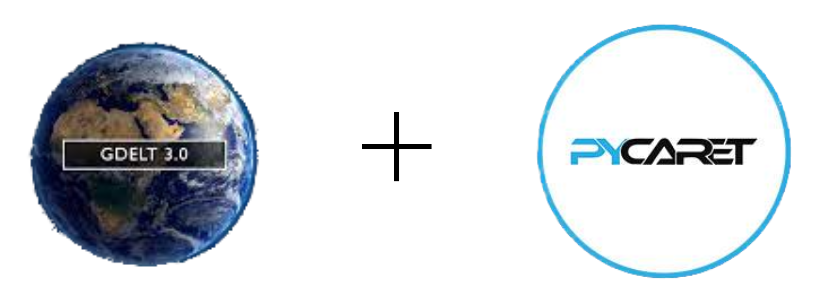

## Screenshots




# How low code can speed up your Machine Learning project

We use GDELT dataset with Pycaret to demonstrate how low code machine learning library to quickly prototype machine learning models.


## Introduction
The GDELT Project is an initiative to construct a catalog of human societal-scale behavior and beliefs across all countries of the world, connecting every person, organization, location, count, theme, news source, and event across the planet into a single massive network that captures what's happening around the world, what its context is and who's involved, and how the world is feeling about it, every single day.
## Data
The data is available in the following link: https://www.gdeltproject.org/data.html#rawdatafiles.
And the data dictionary is available in the following link: http://data.gdeltproject.org/documentation/GDELT-Event_Codebook-V2.0.pdf.


## Exploratory Data Analysis
## Machine Learning Applications
<details>
<summary markdown="span"><h2>Multi Classification</h2></summary>
<iframe
  src="Classification_Experiment.ipynb"
  style="width:100%; height:300px;"
></iframe>
</details>
<details>
<summary markdown="span"><h2>Regression</h2></summary>
<iframe
  src="Drift_Report.html"
  style="width:100%; height:300px;"
></iframe>
</details>
<details>
<summary markdown="span"><h2>Clustering</h2></summary>
**Machine Learning Models**
</details>
### Multi Classification 
Use classification models to predict the type of event that is going to happen.    
>> [Multi-Classification Experiment](Classification_Experiment.ipynb) 


### Regression
Use regression models to predict the number of mentions.   
>> [Regression Experiment](regression_Experiment.ipynb)

### Clustering
>> [Clustering Experiment](Clustering_Experiment.ipynb)

## Demo

To deploy this project run

```bash
    docker run -p 8888:8888 pycaret/full start.sh jupyter lab .
```


# Hi, I'm Ade! 👋


## 🔗 Links
[](https://katherineoelsner.com/)
[](https://www.linkedin.com/)
[](https://twitter.com/)


## Acknowledgements

 - [Awesome Readme Templates](https://awesomeopensource.com/project/elangosundar/awesome-README-templates)
 - [Awesome README](https://github.com/matiassingers/awesome-readme)
 - [How to write a Good readme](https://bulldogjob.com/news/449-how-to-write-a-good-readme-for-your-github-project)

